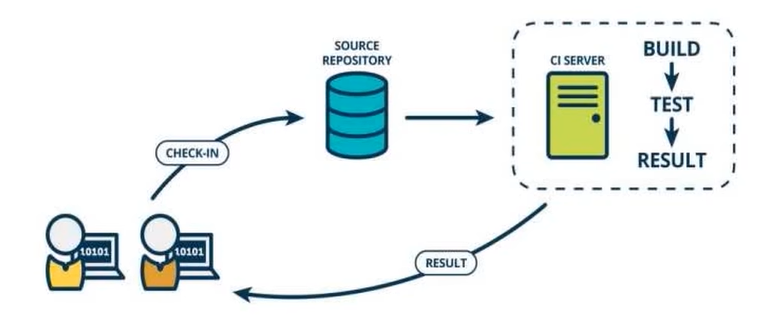
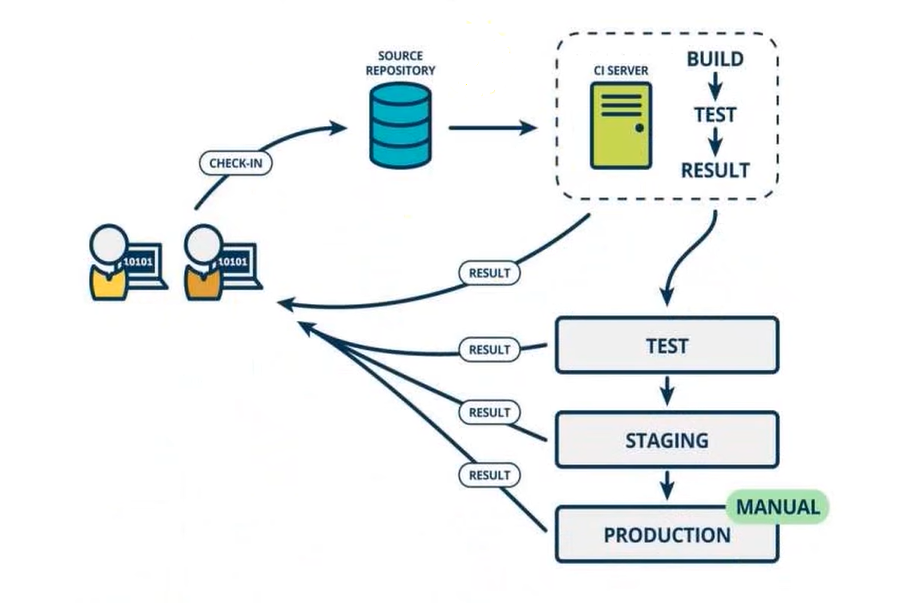
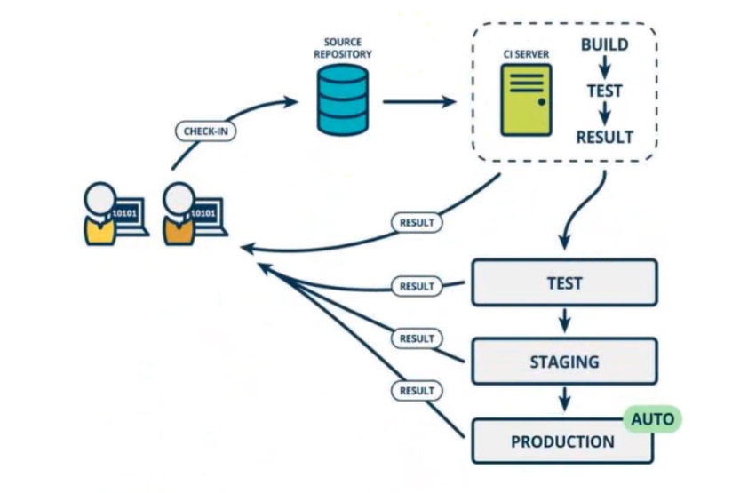
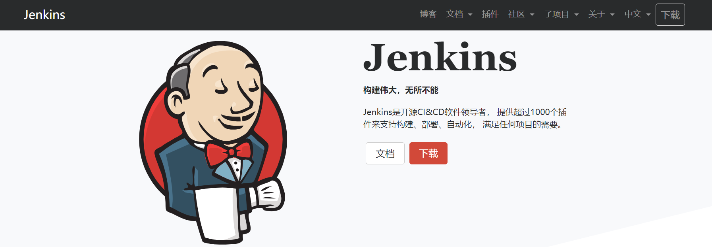
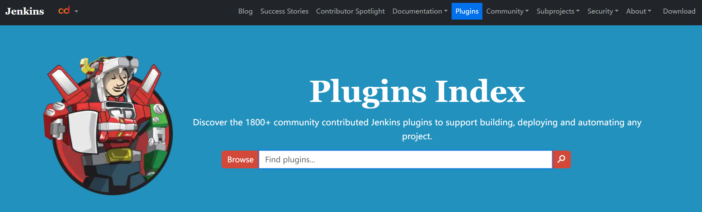

# CI&CD

2024.02.02

## 1. guide

- 持续集成
- 持续集成的流程
- Jenkins

## 2. 持续集成

### 2.1 持续集成

**持续集成**（Continuous integration）指的是频繁地（一天多次）将代码集成到主干。它的好处主要有两个：

- **快速发现错误**。每完成一点更新，就集成到主干，可以快速发现错误，**定位错误也比较容易**。

- **防止分支大幅偏离主干**。如果不是经常集成，主干又在不断更新，会导致以后集成的难度变大，甚至难以集成。

> Martin Fowler 说过，"持续集成并不能消除Bug，而是让它们非常容易发现和改正。"

**举例1**：

我们写一个项目，该项目里面有三个模块：用户模块，购物车模块（依赖于用户模块的某些功能），订单模块（依赖于购物车模块）。

- 第一种做法：完成某个模块之后提交，如果有bug，修改之后再次提交；没有问题再写下一个模块。

- 第二种：全部写完，集成到主干，然后测试；这个时候如果出现订单模块出现bug，我们就不确定是三个模块中的哪一个挂了。

**举例2**：

实际开发的时候，都是在分支上进行开发的；那么这个时候，主干实际上有可能也会在更新：比如主干版本2.0，同时开发了五个功能，就有五个不同的分支。那如果其他分支开发完毕合并到主干以后，主干的版本可能会变为2.1，2.2，2.3，...。而我们如果还是三个模块，用户、订单、购物车全部写完再去集成，主干版本已经变成3.0，我们这里还是2.0，可能就跨度太大，没有办法进行集成了。因此我们推崇持续集成，防止分支大幅度偏离主干。

上图中：

- 开发者将代码提交到仓库，如github或者公司内部的仓库；

- 这个时候就会触发CI（持续集成）服务，它会构建测试、返回结果；开发者就会确认集成是否成功。

> 持续集成强调开发人员提交了新代码之后，立刻进行构建、（单元）Ceshi。根据测试结果，我们可以确定新代码与原有代码是否能够正确集成在一起。

### 2.2 持续交付

**持续交付**（Continuous delivery）指的是频繁地将软件的新版本交付给质量团队或者用户，以供评审。如果评审通过，代码就进入生产阶段。

> - 为什么需要把代码交给质量团队或者用户？
>
> 因为我们程序员自己写的代码，怎么可能有bug（bushi）。
>
> 自己一般很难去发现，因此把代码交付给质量团队和用户来发现bug。

持续交付可以看作持续集成的下一步。它强调的是，**不管怎么更新，软件是随时随地可以交付的**。

持续交付在持续集成的基础上，将集成后的代码部署到更贴近真实运行环境的「类生产环境」(production-like environments）中。比如我们完成单元测试后，可以把代码部署到连接数据库的Staging环境中更多的测试。如果代码没有问题，可以继续手动部署到生产环境中。

注意上图的右下角：

1. Test：进入测试环境，跑我们的代码；【测试环境可以是任意的】
2. Staging：如果测试环境通过，进入类生产环境Staging，跑我们的代码；【类生产环境要求软硬件配置和实际生产环境是一模一样的】
3. Production：如果也没问题，那么手动部署到生产环境，跑我们的代码。

### 2.3 持续部署

持续部署（continuous deployment）是持续交付的下一步，指的是代码通过评审以后，**自动部署**（之前是手动）到生产环境。

持续部署的目标是，代码在任何时刻都是可部署的，可以进入生产阶段。持续部署的前提是能自动化完成测试、构建、部署等步骤。

## 3. 持续集成的操作流程

根据持续集成的设计，代码从提交到生产，整个过程有如下的步骤：

**提交**

流程的第一步，是开发者向代码仓库提交代码。所有后面的步骤都始于本地代码的一次提交（commit）。

**测试（第一轮）**

代码仓库对commit操作配置了钩子(hook)，只要提交代码或者合并进主干，就会跑自动化测试。测试的种类：

- 单元测试：针对函数或模块的测试
- 集成测试：针对整体产品的某个功能的测试，又称功能测试
- 端对端测试：从用户界面直达数据库的全链路测试

第一轮至少要跑单元测试。

**构建**

通过第一轮测试，代码就可以合并进主干，就算可以交付了。

交付后，就先进行构建（build），再进入第二轮测试。所谓构建，指的是将源码转换为可以运行的实际代码，比如安装依赖，配置各种资源（样式表、JS脚本、图片）等等。

常用的构建工具：

- Jenkins
- Travis
- Codeship
- Strider
- ...

Jenkins和Strider是开源软件，Travis和Codeship对于开源项目可以免费使用。它们都会将构建和测试，在—次运行中执行完成。

**测试（第二轮）**

构建完成，就要进行第二轮测试。如果第一轮已经涵盖了所有测试内容，第二轮可以省略，当然，这时构建步骤也要移到第一轮测试前面。

第二轮是全面测试，单元测试和集成测试都会跑，有条件的话，也要做端对端测试。所有测试以自动化为主，少数无法自动化的测试用例，就要人工跑。

需要强调的是，新版本的每一个更新点都必须测试到。如果测试的覆盖率不高，进入后面的部署阶段后，很可能会出现严重的问题。

**部署**

通过了第二轮测试，当前代码就是一个可以直接部署的版本(artifact)。将这个版本的所有文件打包( tarfilename.tar* ）存档，发到生产服务器。

生产服务器将打包文件，解包成本地的一个目录，再将运行路径的符号链接（symlink)指向这个目录，然后重新启动应用。这方面的部署工具有Ansible，Chef，Puppet等。

**回滚**

一旦当前版本发生问题，就要回滚到上一个版本的构建结果。最简单的做法就是修改一下符号链接，指向上一个版本的目录。

## 4. Jenkins

[Jenkins](https://www.jenkins.io/zh/)

开源的实现持续集成的软件工具。

Jenkins能够实时监控集成中存在的错误，提供详细的日志文件和提醒功能，用图表的形式形象地展示项目构建的趋势和稳定性。

- 提供友好的GUI配置界面
- 支持分布式构建：可以把集成构建登工作发到多台计算机中完成
- 文件指纹信息：会保存哪次构建产生了哪些jars文件，哪一次继承构建使用了哪个版本的jars文件等构建记录
- 第三方插件的支持：越来越强大

