# logging

@credits: http://www.atguigu.com

## tips：创建项目

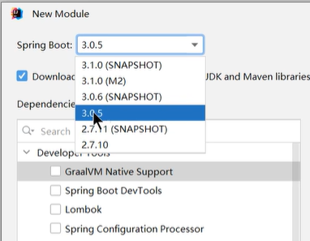

不要选择M（里程碑）或者快照，不稳定。

## 1. why日志

原因：

> 项目开发规范：不要编写`System.out.println()`，而是用**日志**记录信息。

整个日志的一套流程是怎么样的呢：

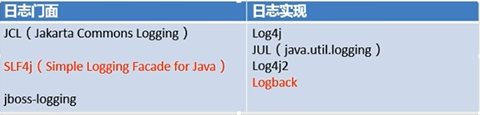

日志门面就相当于说是接口，比如jdbc；然后日志实现就好比说是MySQL驱动、oracle驱动。

Spring Boot默认就是上图红色的两种搭配。虽然日志框架很多，但是事实上Spring Boot默认的配置就能工作得很好。

## 2. How 日志

### 2.1 Spring Boot是如何将日志配置好的

1. 每个`starter`场景，都会导入一个核心场景`spring-boot-starter`
2. 核心场景引入了日志的所有功能：`spring-boot-starter-logging`
3. 你再点进去上面这个，就知道底层用的什么包了。默认使用`logback`+`sel4j`作为默认的底层日志
4. 日志是系统一启动就要用的，`xxxAutoConfiguration`是系统启动好了以后放好的组件，后来用的。相当于说日志启动的时间需要更早，因此利用的原理并不是`AutoConfiguration`，日志利用的是监听器机制配置好的——`ApplicationListener`。
5. 日志所有的配置都可以通过修改配置文件实现。以`logging`开始的所有内容为日志相关内容。

### 2.2 日志输出格式

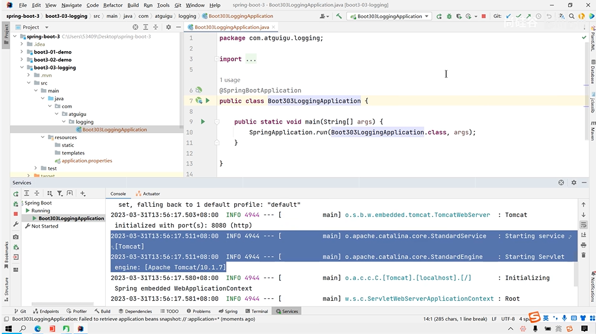

默认输出格式：

- 日期时间：精确到毫秒
- 日志级别：`ERROR`, `WARN`, `INFO`, `DEBUG`, `TRACE`
- 进程ID
- ---：消息分隔符
- [       XXXX]：线程名
- Logger名：通常是产生日志的类名
- 消息：日志记录的内容

想要改日志格式，直接去`application.properties`里面写配置即可。

## 3. 记录日志

首先创建了一个名为`logger`的日志记录器对象，然后使用`LoggerFactory.getLogger(getclass())`方法来获取一个与当前类相关联的日志记录器。

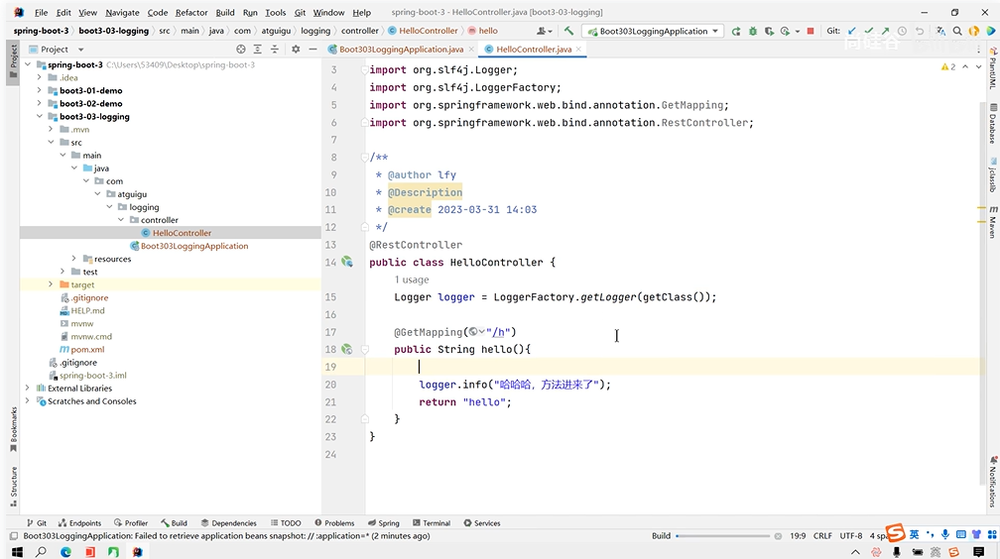

`LoggerFactory.getLogger(getclass())`方法通常会返回一个特定类的日志记录器实例，以便该类可以记录相关的信息。

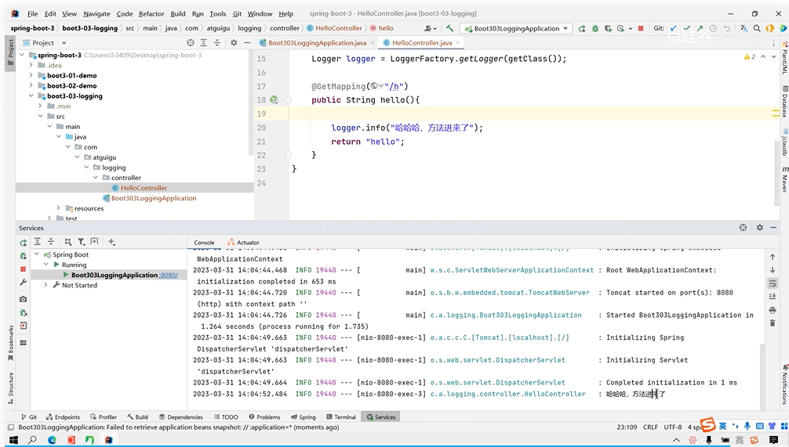

更简单的方法：我们导入了`lombok`，我们只需要使用`@Slf4j`注解，自动帮你导入`log`：

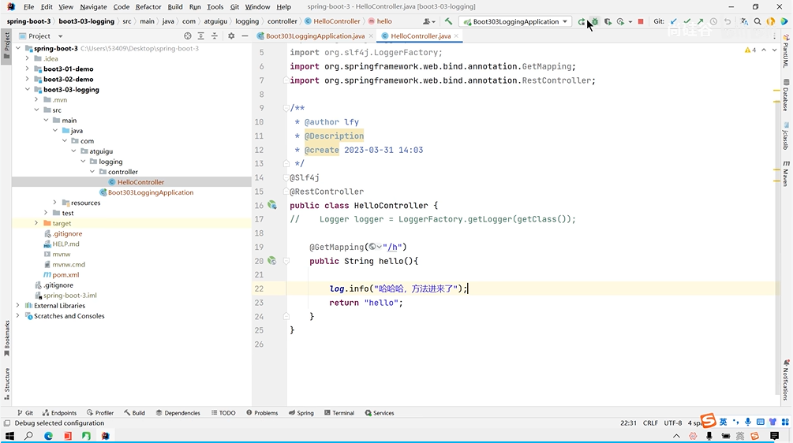

## 4. 日志级别

由低到高：`ALL,TRACE,DEBUG,INFO, WARN, ERROR,FATAL,OFF`

**只会打印指定级别以上的日志**

- ALL：打印所有日志
- TRACE：追踪框架详细流程日志，一般不适用
- DEBUG：开发调试细节日志
- INFO：关键，感兴趣信息日志
- WARN：警告但不是错误的信息日志，比如：版本过时
- ERROR：业务错误日志，比如出现各种异常
- FATAL：致命错误日志，比如jvm系统崩溃
- OFF：关闭所有日志记录

注意：

- 不指定级别的所有类，都使用root指定的级别作为默认级别
- Spring Boot日志默认级别是INFO

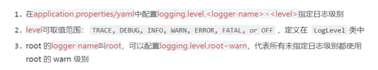

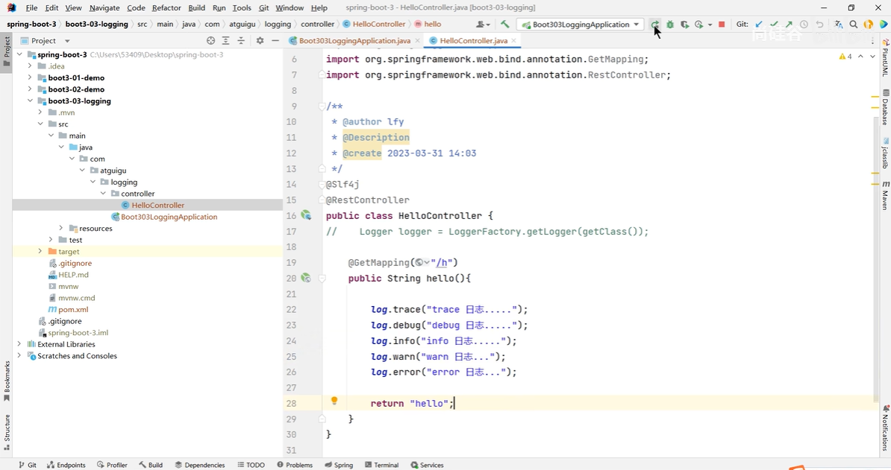

Root：

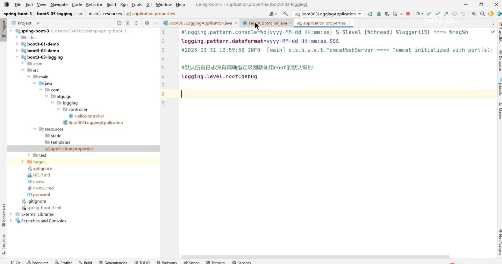

如果想指定某个类，写好包名：

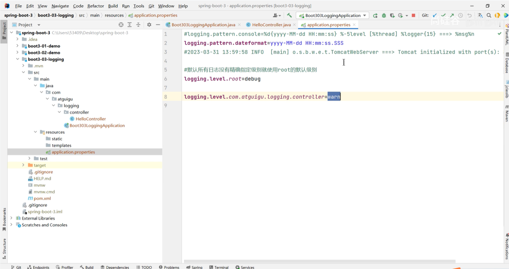

## 5. Useful trick: 日志分组

比较有用的技巧是：

将相关的`logger`分组在一起，统一配置。`Spring Boot`也支持。比如我有一堆包，我希望他们都是`DEBUG`：

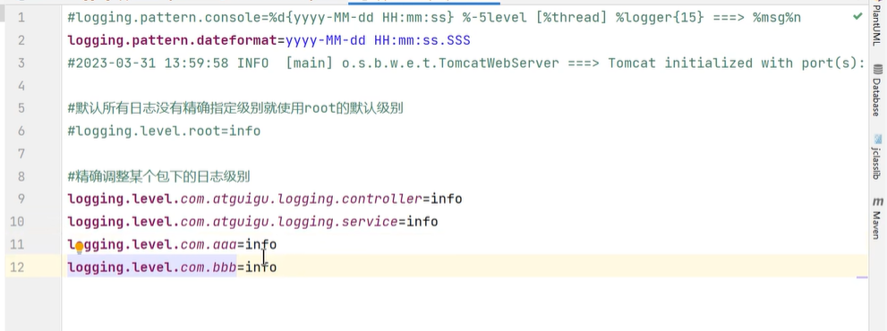

将四个人分为一组，叫做`abc`：

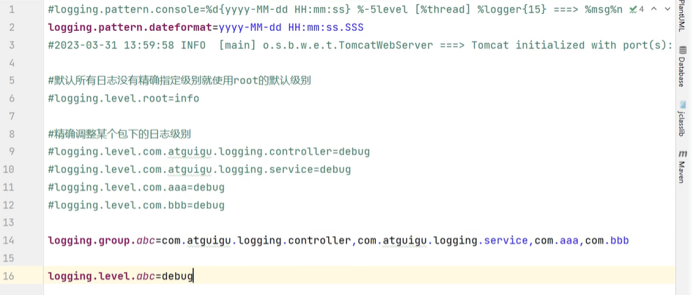

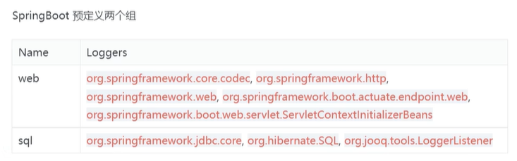

## 6. 文件输出

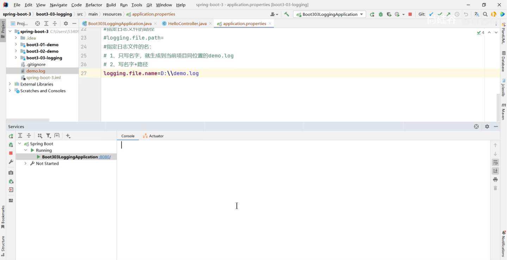

`file.path`和`file.name`同时存在的时候，以`file.name`为准。

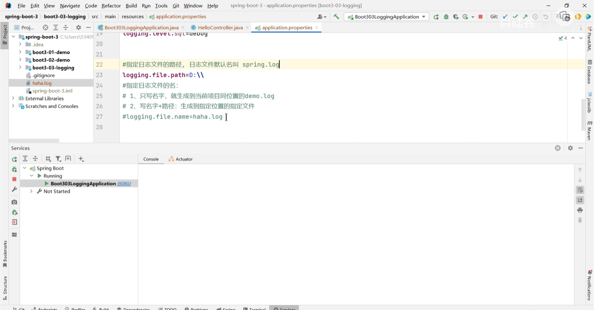

所以用`file.name`就完事了。

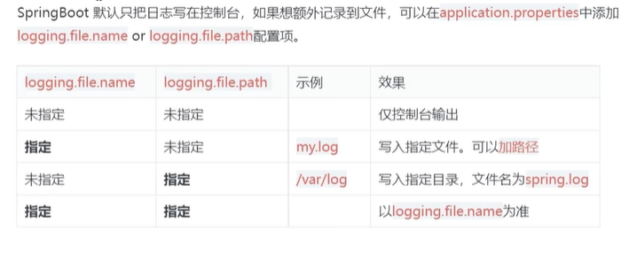

## 7. 日志：归档与切割

如果我这个项目运行了一年，这个日志文件就变得巨大！

> 归档：每天的日志单独存到一个文档中；
>
> 切割：每个文件我只要求10MB大小，超过就切割，分出来一个新文件——保证每一个文件都较小。

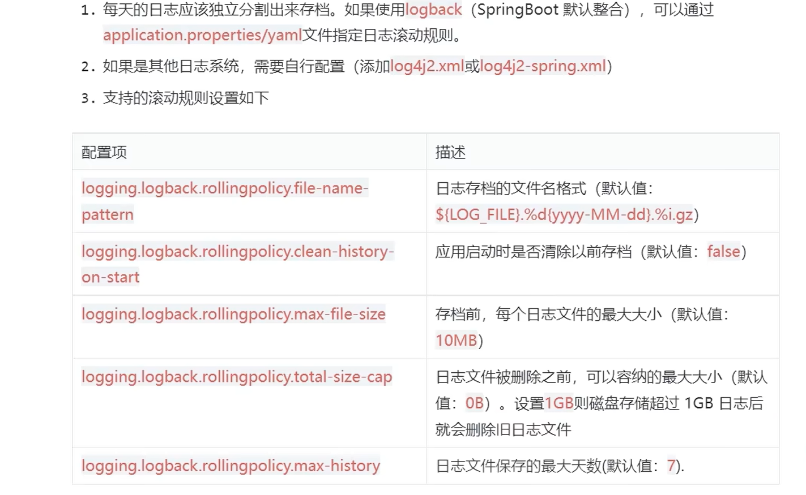