# web后端-Maven

apache旗下的一个开源项目，一款用于**管理和构建**java项目的工具。

2024.01.23

@credits: www.itheima.com

## 1. Maven的基本概念

### 1.1 什么是maven？

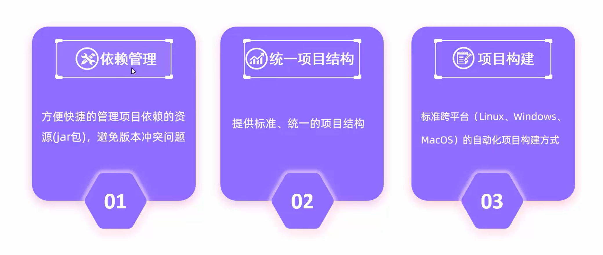

1. 依赖管理：管理项目依赖的资源（jar包），避免版本冲突的问题。

2. 提供标准、统一的项目结构：不管你用什么开发工具，只要你使用maven工程，那么你的项目结构就是标准的，统一的。

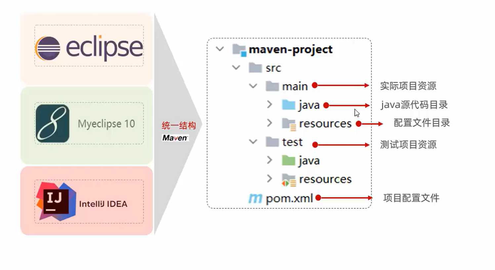

3. 标准化的项目构建流程：

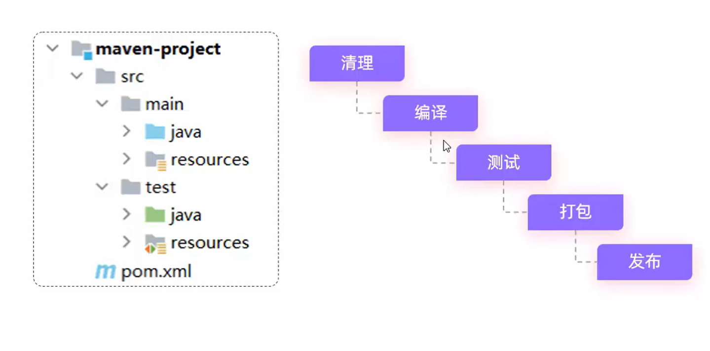
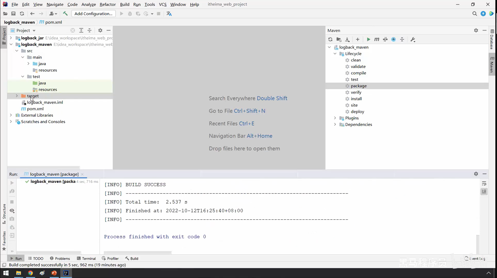

### 1.2 Maven的模型

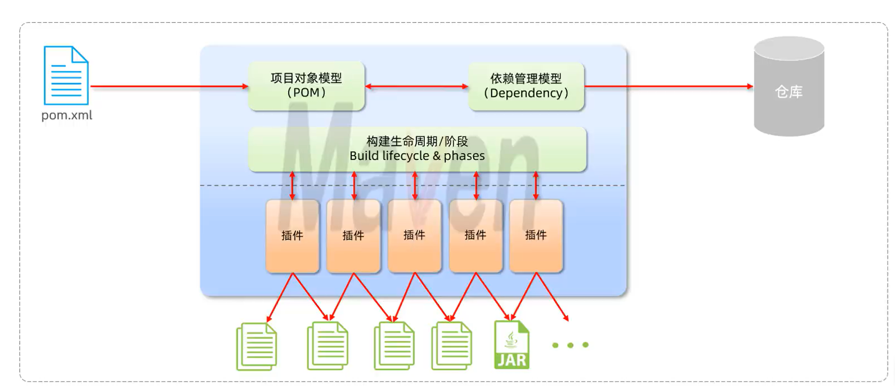

pom项目对象模型：可以通过pom.xml中配置的信息来描述当前的工程

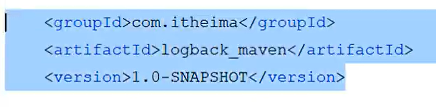

上面的这些描述信息就是描述当前maven工程的，唯一标识、定位你的项目；

如果你需要添加依赖，就需要用到dependency依赖管理模型。

maven仓库：存储资源，管理各种jar包。当然有本地仓库（自己计算机上的目录）和中央仓库（全球唯一的）和者私服（企业自己搭建的）。如果本地找不到，就去私服找，私服找不到，私服去中央仓库查找。

## 2. Maven的idea集成

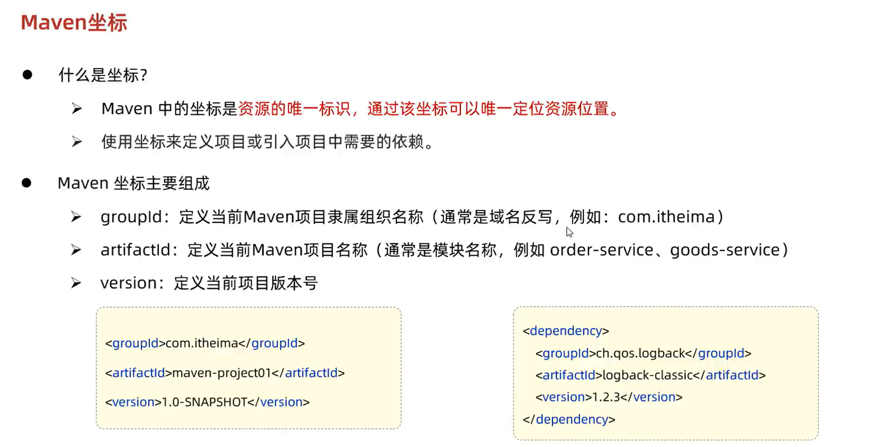

## 3. Maven的依赖管理

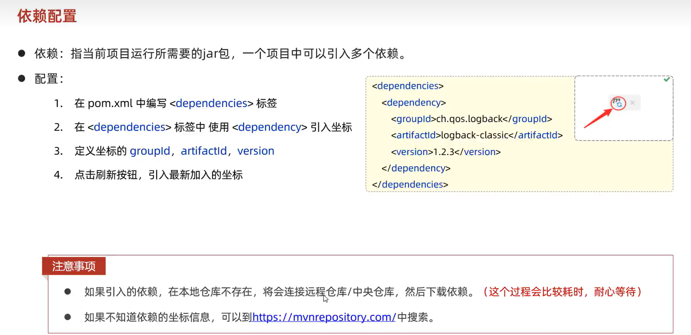

### 3.1 Maven依赖的传递性和依赖的排除

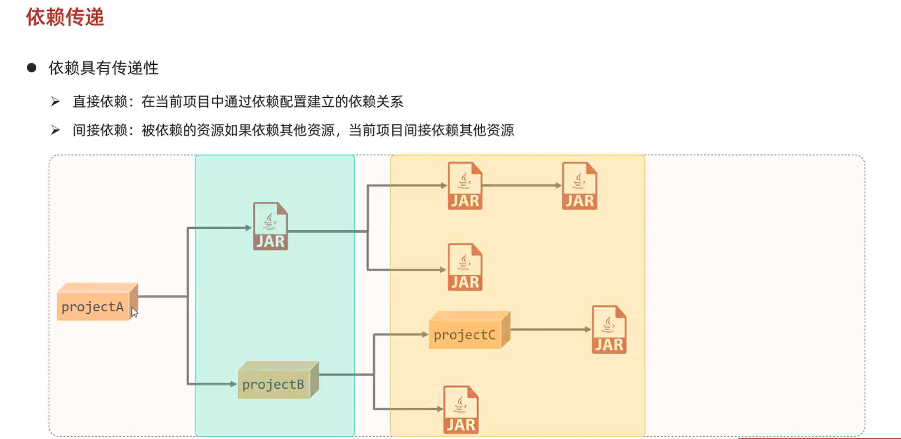
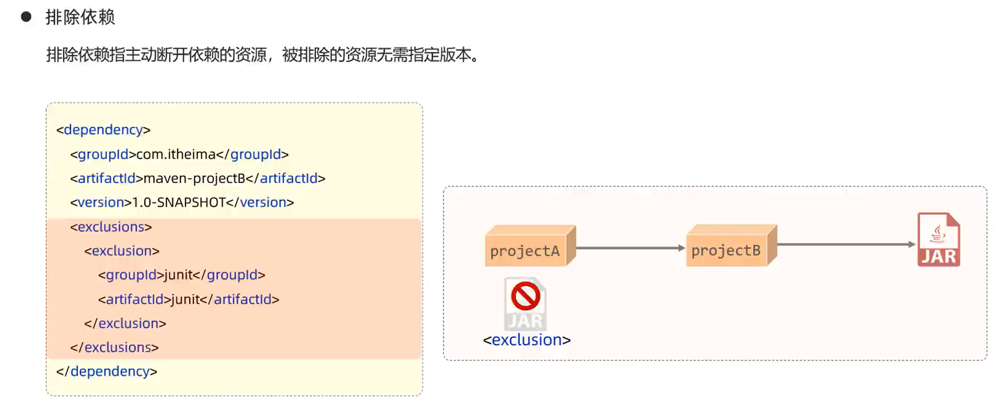
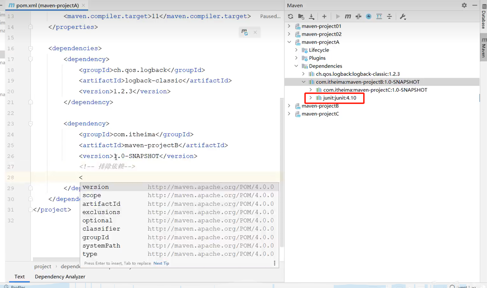
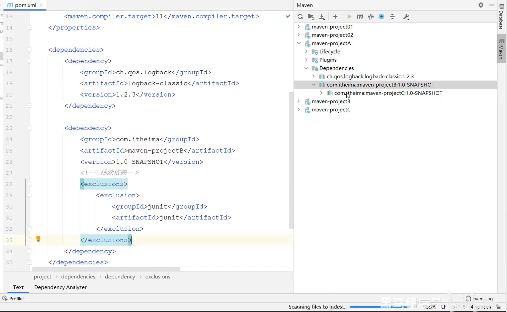

### 3.2 依赖范围

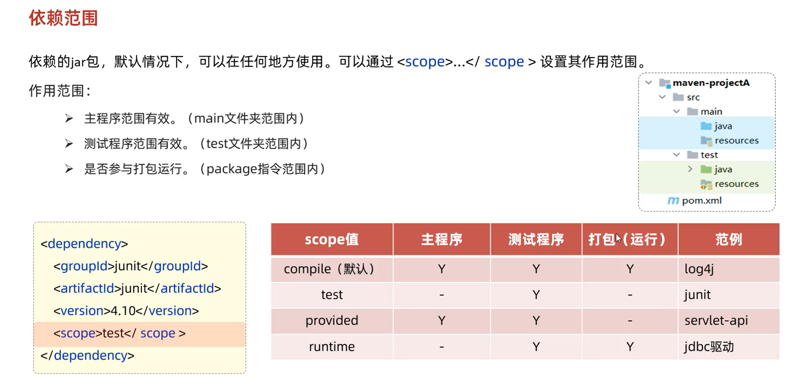

### ## 4. Maven的生命周期

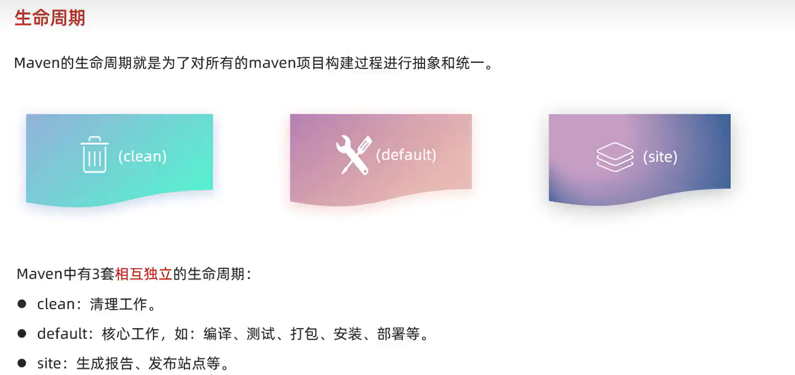
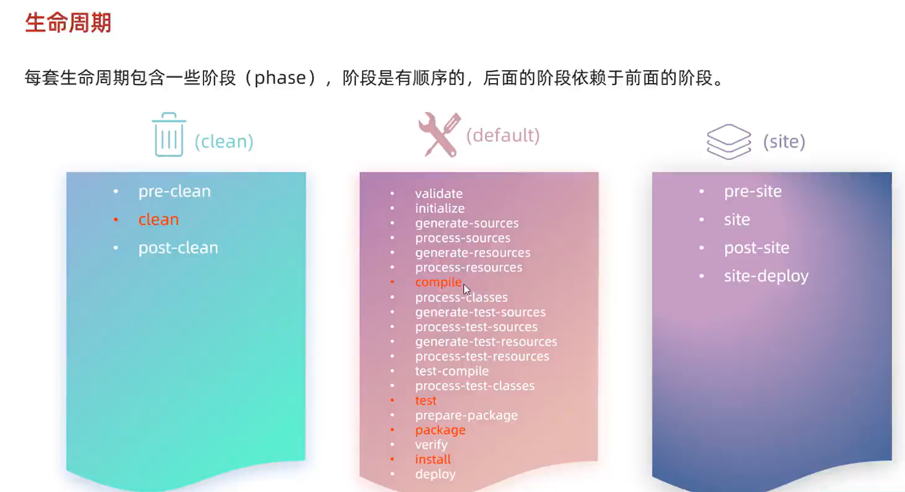
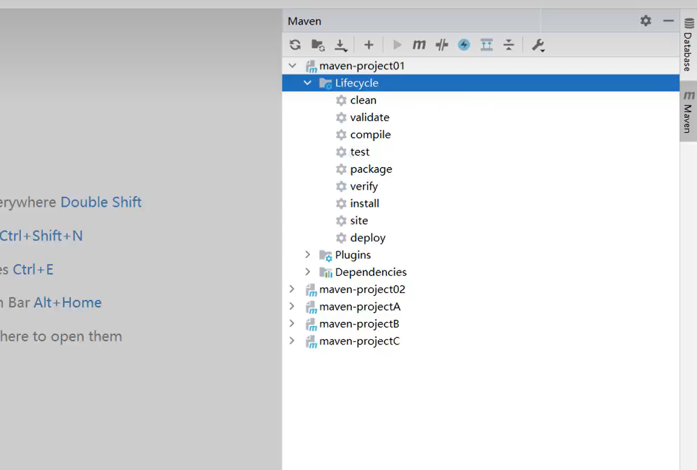
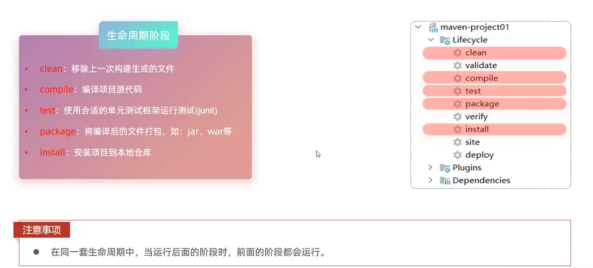