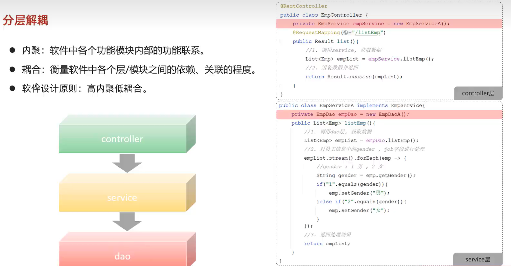

# Spring

2024.01.23

@credits: www.itheima.com

## 1. 分层解耦

### 1.1 多层架构

分层解耦：

- 内聚：员工相关的service类中，我们仅仅编写员工相关的东西，我们就说这个类内聚程度高。
- 下面我们看到这里的new导致的结果就是：耦合，如果我们在controller中想换一个service，就得重新写代码了，所以我们要做的就是层与层之间进行解耦。

所以如何进行层与层之间的解耦？

- 我们有一个容器；里面存储一些对象；假如我想使用empserviceA，我们就将其放到容器中，controller要使用empservice这个类型的对象，就去容器里面找，就能找得到empserviceA。
- spring框架的核心：**控制反转**和依赖注入

### 1.2 IOC 控制反转

**@Component注解什么时候使用**？

- 我们一般使用下面三个衍生注解；component注解使用的场景是，如果某些类你不能归到这三个类里面，那么你就用component；最典型的是一些工具类。

组件的扫描：这里需要注意的就是扫描范围，所以你把代码放在启动类的包的外面，就挂了，扫描不到了。

### 1.3 DI 依赖注入

这个出错的原因很好想，就是说两个bean的类型是一样的，我怎么知道拿哪一个呢

@Primary：你想让哪个bean生效，你就直接在上面加上这个注解就行。

@Qualifier就是显式地指定说，我要注入谁。

或者直接根源解决问题，用@Resource。

@Autowired是按照类型，@Resource是按照名称。

## 2. 配置优先级

如果我写了三个文件配置tomcat的端口号，谁会生效？

## 3. Bean的管理

spring ioc容器中bean的管理。

### 3.1 获取bean

示例：

但是这里有一个很tricky的点：

我们发现这三个对象的地址是完全一样的，说明ioc容器中这个对象只有一个！

也就是，默认情况下是单例模式。这就涉及到下一小节bean的作用域了。

### 3.2 bean的作用域

### 3.3 第三方bean的配置

这个值得好好谈一谈。

之前我们配置的bean，像controller，service或者dao，还有一部分工具类，这些都是项目中我们自己定义的类，我们声明bean对象是非常简单的，只需要加上@XXXX注解就行了。

但是还有一种情况是，这个类不是我自己写的，是第三方的依赖里面提供的：

比如我在这里引入了一个解析xml的依赖。那我们如果用的时候还用new，那每一次调用的时候都要新创建一个新的对象，不是很蠢吗？

所以如何将其交给spring IOC容器？

但这里显然是不能直接加注解的（显然那些文件是只读的，你加个毛线）。

但是这种方法不建议，因为我们最好保证启动类的纯粹性！建议自己再额外写一个配置类！

## 4. spring boot原理

我们先来回顾一下我们到现在走过的路：

所有spring框架的基础都是spring framework；但是我们直接基于这玩意开发就疯了，有两个非常恶心的点：

- 依赖
- 配置

所以spring官方整了个spring boot，来简化开发（注意并不是替代）。

之所以简单快捷，核心就是提供了：

- 起步依赖
- 自动配置

### 4.1 起步依赖

如果我们使用spring framework来开发，我们就要引入下面这么大一堆依赖：

而且这些依赖都要注意不能发生版本冲突。

spring boot的话，你只需要引入spring boot starter web这一个依赖就完事了！人家给你全包好了！（本质上其实就是maven的依赖传递）

### 4.2 自动配置

#### 4.2.1 什么是自动配置

我们可以发现，引入了dependency依赖，依赖jar包中的bean已经加载到ioc容器中了！

怎么做到的？

#### 4.2.2 自动配置原理（重要）

我们用utils来模拟第三方提供的一个依赖：

然后如果我们现在启动一下项目，我们发现util这个包里面的bean是找不到的！

为什么？

这一点其实之前讲ioc的时候讲到过，就是**启动类其实本质会做的事情就是包扫描，但是只能扫启动类自己在的包和它的子包**，那第三方包肯定不在这个路径里面啊。

解决方案：

注意，你这里显示指定要指定两个，一个是第三方你引入的util，还有一个是你当前的项目。

但这样不是很傻逼吗？我引入一百个第三方依赖呢？

**最终的解决方案是：@Enablexxx注解**。

一般第三方依赖都会给你提供一个注解，你想开启第三方依赖的自动配置，你只要加上一个注解就完事了：

所以你不需要自己再去记你具体需要什么了，直接用别人给你写好的注解，你引一下就行：

#### 4.2.3 源码跟踪

从@SpringBootApplication引导类开始看！

源码跟踪时，切记不要一行一行看，要抓住关键核心！

我们对红色框中的三个注解一一研究：

- @SpringBootConfiguration

  

  这个我们其实是非常熟悉的，也就是说明当前类也是一个配置类。所以，我们可以直接在启动类中声明第三方的bean对象，因为当前类也是一个配置类。

- @ComponentScan：之前我们一直说，spring的@SpringBootApplication注解具备了包扫描的功能，默认扫描当钱包和其子包，就说这个注解的效果。

- @EnableAutoConfiguration：前面刚说，enable底层就是封装了import！

  - 

  - 

  - DeferredImportSelector的父接口就是ImportSelector；上节课我们说，它里面有一个非常重要的方法：

    

    返回了哪些类string类型数组，哪些类我要导入到ioc容器。里面封装的就是这些类的全类名。

    

​				

可以研究一下这里的断言报错：

也就是spring启动的时候会自动加载下面两个配置文件中的信息，加载出来之后就会封装到List<String>中，然后最终就是加载到ioc中的配置类的名称了。

这俩在起步依赖里面。

这里面配置了巨多的类的全类名。

这些全类名最后都是AutoCorrelation，人家帮你自动配好了。

前面演示自动配置的时候，我们演示了gson，虽然我们没有配置这个bean对象，但是我们是可以直接使用的。但是到底是在哪里做了自动配置呢？

当前类是一个配置类（AutoConfiguration里面包了一个configuration）。

然后我们看下面的方法，我们就明白了：它里面create了一个gson，上面还有一个bean注解；所以我们在项目中直接autowired注入就可以用了。

**总结：**

到了spring boot3.X以后，这些都定义在.imports文件里面了，里面定义的都是全类名。Spring boot项目启动的时候，就会加载这些配置类，加载到string数组中，最终通过import AutoConfigurationImportSelector.class，将这些配置类全部加载到ioc容器中，由容器进行管理。

是所有bean都注册为容器的bean吗？并不是。这里就用到了Condition注解和条件装配。

#### 4.2.4 @ConditionalXX：条件装配

