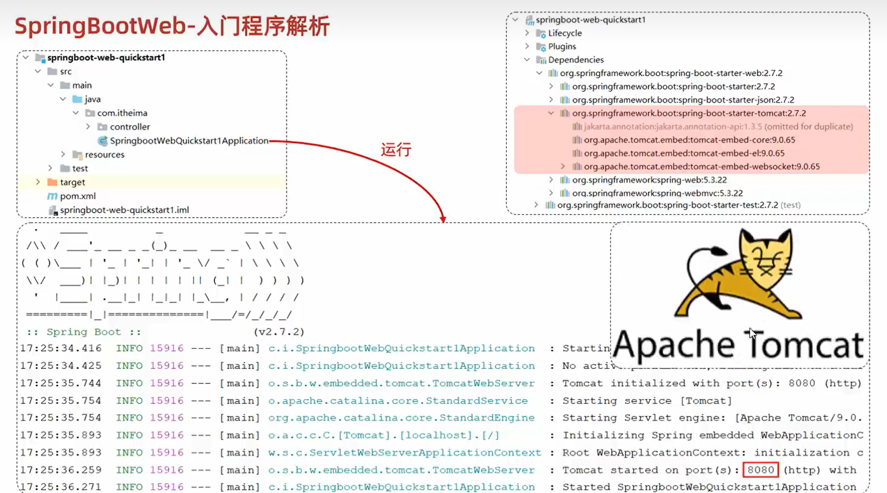

# Tomcat

@credite: www.itheima.com

## 1. 简介

### 1.1 什么是web服务器

web服务器是一个软件程序，对Http协议的操作进行封装，使得程序员不必直接对协议进行操作，让web开发更加便捷。

主要功能是：web服务器的主要作用是部署web项目，对外提供网上信息浏览服务。

## 2. 基本使用

会自动将tomcat服务器启动起来，并且占用tomcat默认端口号8080（这一台是内嵌的tomcat）：

