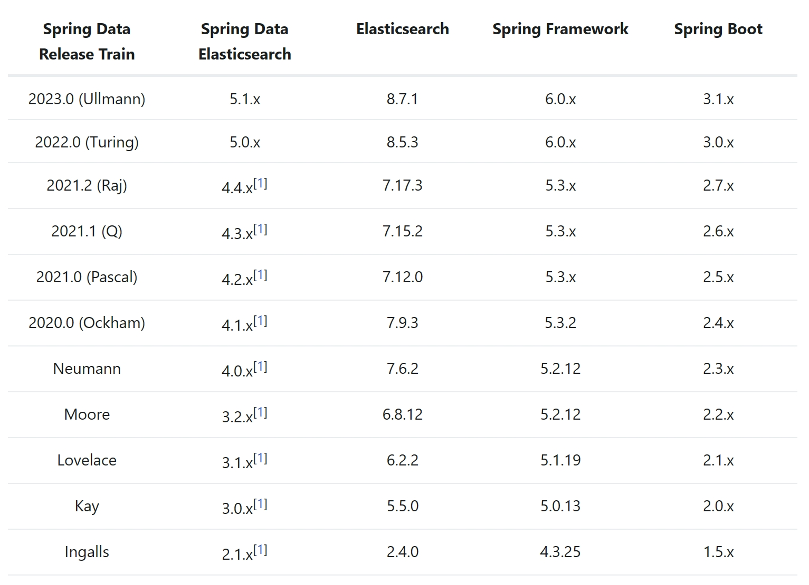

# Elasticsearch 全文搜索

2023.10.11

> 从何时开始忌讳空山无人 从何时开始怕遥望星尘
原来神仙鱼横渡大海会断魂 听不到世人爱听的福音
曾迷途才怕追不上满街赶路人 无人理睬如何求生
顽童大了没那么笨 可以聚脚于康庄旅途然后同沐浴温泉
为何在赤地上独行
———《任我行》 陈奕迅

## 1. 链接

下载地址：https://www.elastic.co/cn/downloads/elasticsearch

### 1.1 版本号的查询

查阅版本号：
- spring　data release:https://spring.io/projects/spring-data-elasticsearch#learn
- 选中eleasticsearch的某一个版本号，点击进入reference doc：https://docs.spring.io/spring-data/elasticsearch/docs/current/reference/html/#preface.requirements



如何查询自己的spring framework和spring boot的版本号？

一种方法是看maven；还有一种办法是在终端中输入：

```bash
./mvnw dependency:tree
```

这样就会输出当前项目的依赖树，其中就有spring framework和spring boot的版本号：

```bash
[WARNING] The artifact mysql:mysql-connector-java:jar:8.0.32 has been relocated to com.mysql:mysql-connector-j:jar:8.0.32: MySQL Connector/J artifacts m
oved to reverse-DNS compliant Maven 2+ coordinates.
[INFO] com.example:hw4-backend:jar:0.0.1-SNAPSHOT
[INFO] +- org.springframework.boot:spring-boot-starter:jar:3.0.5:compile
[INFO] |  +- org.springframework.boot:spring-boot:jar:3.0.5:compile
[INFO] |  +- org.springframework.boot:spring-boot-autoconfigure:jar:3.0.5:compile
[INFO] |  +- org.springframework.boot:spring-boot-starter-logging:jar:3.0.5:compile
[INFO] |  |  +- ch.qos.logback:logback-classic:jar:1.4.6:compile
[INFO] |  |  |  \- ch.qos.logback:logback-core:jar:1.4.6:compile
[INFO] |  |  +- org.apache.logging.log4j:log4j-to-slf4j:jar:2.19.0:compile
[INFO] |  |  |  \- org.apache.logging.log4j:log4j-api:jar:2.19.0:compile
[INFO] |  |  \- org.slf4j:jul-to-slf4j:jar:2.0.7:compile
[INFO] |  +- jakarta.annotation:jakarta.annotation-api:jar:2.1.1:compile
[INFO] |  +- org.springframework:spring-core:jar:6.0.7:compile
[INFO] |  |  \- org.springframework:spring-jcl:jar:6.0.7:compile
[INFO] |  \- org.yaml:snakeyaml:jar:1.33:compile
[INFO] +- net.sf.json-lib:json-lib:jar:jdk15:2.4:compile
[INFO] |  +- commons-beanutils:commons-beanutils:jar:1.8.0:compile
[INFO] |  +- commons-collections:commons-collections:jar:3.2.1:compile
[INFO] |  +- commons-lang:commons-lang:jar:2.5:compile
[INFO] |  +- commons-logging:commons-logging:jar:1.1.1:compile
[INFO] |  \- net.sf.ezmorph:ezmorph:jar:1.0.6:compile
```

可以看出，我的版本号是：
- spring framework: 6.0.7
- spring boot: 3.0.5

对应elasticsearch的版本号是：8.5.3

https://www.elastic.co/cn/downloads/past-releases/elasticsearch-8-5-3