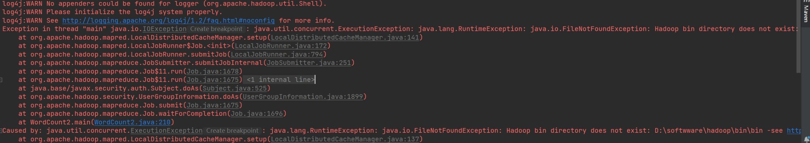

# Hadoop

> It's not time to make a change, just relax and take it easy.
> You're still young, that's your fault, there's so much you have to know.
> ——Father and Son, Cat Stevens

## 环境

1. hadoop：hadoop-3.3.6
2. 本机：windows 10
3. jdk：1.8

## 安装

这个印度老哥的流程基本上是对的：
https://www.youtube.com/watch?v=knAS0w-jiUk

但是有一个小问题，我（包括几个其他同学）都遇到了如下bug：

只要把环境变量里面的D:/hadoop-3.3.6/bin改为D:/hadoop-3.3.6就可以了。

同时：
1. 记得在idea中，手动修改confiuration里面的hadoop home；很可能这玩意不会主动更新，即便你清除缓存，也不会主动更改——是的，就是如此sb。
2. 实在不行，重启windows。

## 其他参考链接

1. https://blog.csdn.net/tttzzzqqq2018/article/details/131928028