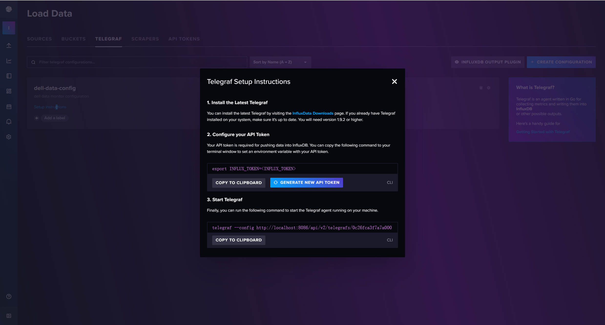

# InfluxDB

> 我怎么会让自己舍身不断涉险
> 你怎么会对我的心不断的拒绝
> 爱失去你的包围 每次退后又错过你的世界一点
> 我没有办法清醒应付新的对决
> 你却轻易让我的心委屈到极限
> 爱有了你却失去了我的一切
> 衡量你的心直线到我之间 没有跨越的机会
> ——《心的距离》 陈奕迅

参考资料：
1. 官网：https://docs.influxdata.com/influxdb/v2/install/?t=Windows#install-influxdb-v21

## 安装

1. 安装influxDB for windows：[Install InfluxDB | InfluxDB OSS v2 Documentation (influxdata.com)](https://docs.influxdata.com/influxdb/v2/install/?t=Windows#install-influxdb-v21)

2. 安装telegraf：Telegraf 是一个用于采集、处理和传输指标和事件数据的开源代理程序。
   1. 在这儿看整个流程：[Automatically configure Telegraf for InfluxDB | InfluxDB OSS v2 Documentation (influxdata.com)](https://docs.influxdata.com/influxdb/v2/write-data/no-code/use-telegraf/auto-config/?t=Windows#start-the-telegraf-service)（当然，我觉得他整个流程写的实在是不怎么样……）
   2. 在这里下载：https://www.influxdata.com/downloads/

## 配置与运行



跟着上面的setup instruction走就好了，首先在powershell里面配置环境变量，token就是你的influxdb的token（用于连接获取config鉴权）；然后就是修改一下配置文件，当时在选择插件的时候，我就已经选择了win_perf插件了，需要做的就是把里面的你想要检测的一部分给取消注释（如果检测太多内容，可能会导致没有办法在采样间隔内采集完成所有信息的情况，因此我只检测cpu了）

【当然，他上面的两个指令都是linux下的！powershell里面得改改】

当然别忘了运行之前先跑起来influxDB，这个就直接powershell里面把那个executable file跑起来就完事了。

然后就可以在bucket里面查看具体采集的数据了！

```shell
.\telegraf --config http://localhost:8086/api/v2/telegrafs/0c26fca3f7a7a000
```