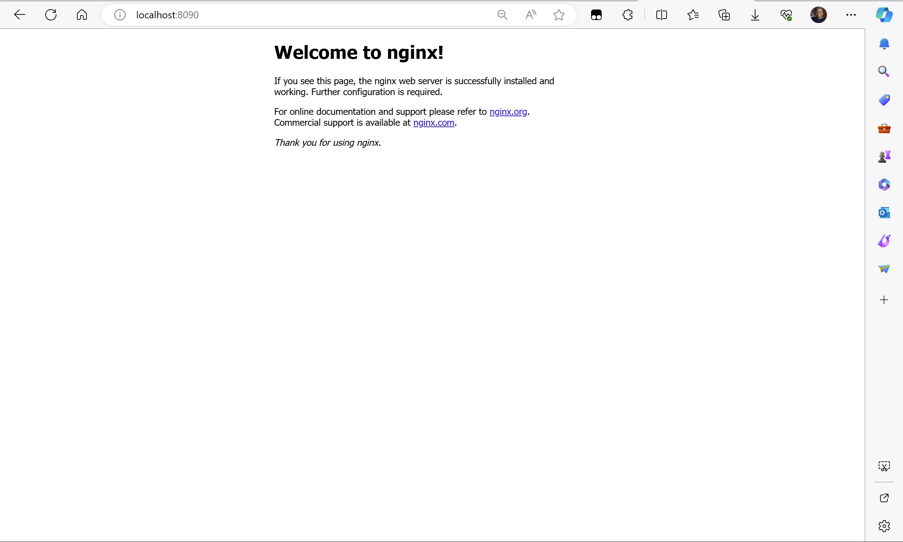

# nginx安装指南

windows版下载地址：
1. http://nginx.org/en/download.html

特别鸣谢：
1. https://blog.csdn.net/weixin_53060366/article/details/129670125
2. https://blog.csdn.net/xsq123/article/details/125467426?utm_medium=distribute.pc_relevant.none-task-blog-2~default~baidujs_baidulandingword~default-0-125467426-blog-129670125.235^v38^pc_relevant_sort_base2&spm=1001.2101.3001.4242.1&utm_relevant_index=3

## 1. 安装步骤

1. 下载windows版nginx，解压即可

## 2. 启动nginx

运行powershell，进入nginx目录，执行命令：

```bash
.\nginx.exe
```

然后挂了：

```bash
PS D:\softwware\nginx-1.24.0> ./nginx.exe
nginx: [emerg] bind() to 0.0.0.0:80 failed (10013: An attempt was made to access a socket in a way forbidden by its access permissions)
PS D:\softwware\nginx-1.24.0>
```

这个错误表明 Nginx 在尝试绑定到 IP 地址 `0.0.0.0` 和端口 `80` 时遇到了问题，错误代码是 `10013`，表示尝试访问一个由其访问权限禁止的套接字。这通常是由于端口 `80` 已经被另一个应用程序占用，或者是由于权限问题而导致 Nginx 无法绑定到指定的 IP 地址和端口。

当然，具体的错误可以去看日志文件，日志文件在`logs`目录下，打开`error.log`文件，可以看到错误。

**解决方法：**

1. **端口占用：** 确保端口 `80` 没有被其他应用程序占用。你可以使用 `netstat` 命令来查看端口的占用情况。在命令提示符或 PowerShell 中执行以下命令：
   
    ```bash
    netstat -ano | findstr :80
    ```

    如果该端口已被占用，你可以选择更改 Nginx 配置文件中的监听端口，或者停止占用该端口的应用程序。

2. **使用管理员权限运行 Nginx：** 以管理员权限运行 Nginx。在启动 Nginx 之前，以管理员身份运行命令提示符或 PowerShell。可以通过右键点击命令提示符或 PowerShell 的图标，然后选择 "以管理员身份运行"。

解决方案：改端口到8090，然后以管理员权限运行nginx，成功。

如何查看nginx是否正在成功运行呢？很简单，浏览器输入：http://localhost:8090/，如果出现如下界面，说明nginx已经成功运行了：



## 3. 总结：看这里

启动和停止nginx的命令：

```bash
PS D:\softwware\nginx-1.24.0> ./nginx.exe
PS D:\softwware\nginx-1.24.0> ./nginx.exe -s stop
```