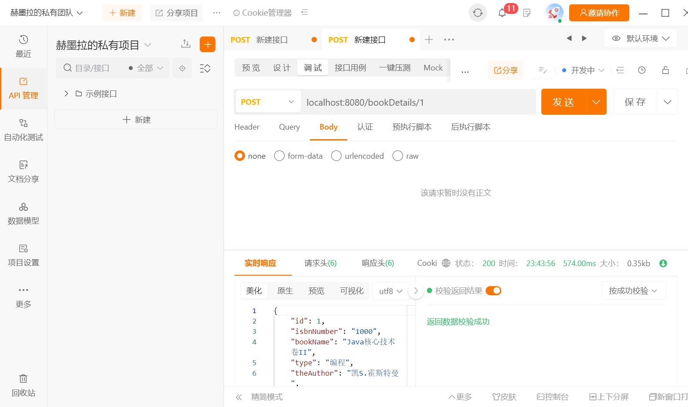
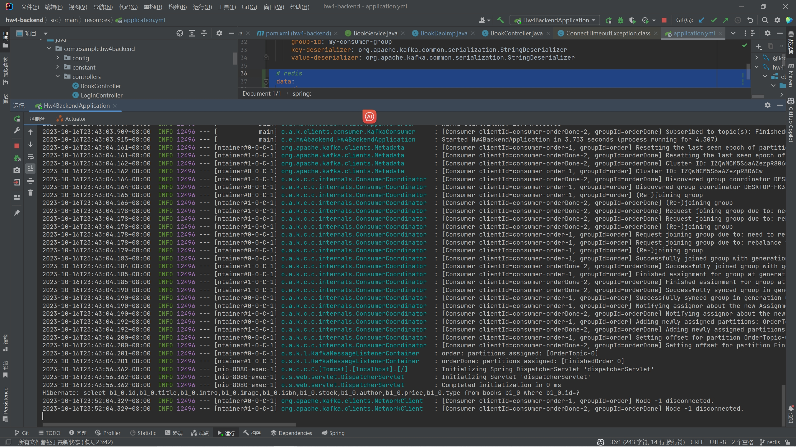

# Redis配置日志

by [PeterTheSparrow](www.github.com/PeterTheSparrow)

2023.10.16

背景：
- 由于我的os是高（sha3）贵（bi1）的windows，所以我使用了WSL2（ubuntu22.04）来安装redis。
- 然后我发现，wsl2的ip是动态的，这……是人能接受的吗？？？（总不见得每次springboot启动都要去改配置吧？）
- 然后我试图fix这个bug，折腾了很久，终于蚌埠住了，直接转投ubuntu22.04虚拟机！

记录了各种意义上我踩的坑……

- 关于是不是要搞vmware ubuntu22.04静态ip，再说……

## 1. 安装redis指南

参考文档：
1. 官方文档：https://redis.io/docs/getting-started/installation/install-redis-on-linux/

写得非常好，照着干就完了。


## 2. 配置redis：关于如何在物理机里面访问虚拟机的redis？

参考文档/博客：
1. 连接虚拟机中Redis失败（问题排查）：https://cloud.tencent.com/developer/article/2171848
2. Windows连接虚拟机中Linux的redis，详细步骤：https://blog.csdn.net/weixin_43845164/article/details/115586776
3. 如何持久化开放ubuntu端口：https://www.ljczero.top/article/2020/11/21/58.html
4. 如何查看虚拟机的ip地址：https://blog.csdn.net/u011318077/article/details/104627076

注：
- 下面这些操作不一定都是必要的，但反正……我都做了，基本逻辑应该差不多。

### 2.1 查看虚拟机的ip地址

- 下载net-tools: `sudo apt-get install net-tools`
- 输入命令: `ifconfig`
- 如果是普通用户，需要使用超级用户则使用以下命令：`sudo ifconfit -a`

### 2.2 修改redis的配置文件

首先，我们需要修改redis的配置文件，使得redis可以被外部访问。

配置文件地址：`/etc/redis/redis.conf`

原先是：
```bash
bind 127.0.0.1 -::1
```

改为：
```bash
bind 0.0.0.0
```

然后，我们需要修改一下redis的保护模式，使得redis可以被外部访问。

原先是：
```bash
protected-mode yes
```

改为：
```bash
protected-mode no
```

### 2.3 开放端口


开放端口：

```bash
#安装iptables
sudo apt-get install iptables
#开放端口
sudo iptables -I INPUT -p tcp --dport 端口 -j ACCEPT
#保存规则
sudo iptables-save
#注意，以上规则每次重启都要重新配置，可以使用以下方法持久化
#安装iptables-persistent
sudo apt-get install iptables-persistent
#持久化规则
sudo netfilter-persistent save
sudo netfilter-persistent reload
```

## 3. redis，启动！

### 3.1 启动redis

请注意，我们之前修改了配置文件，所以我们启动redis的时候，需要指定配置文件的路径，如果直接使用下面的方式：

```bash
# 这是错误的！
sudo redis-server
```

实际上是这样的：

```bash
cdm@cdm-virtual-machine:~/桌面$ redis-cli
127.0.0.1:6379> CONFIG SET protected-mode no
OK
127.0.0.1:6379> CONFIG REWRITE
(error) ERR The server is running without a config file
```

所以我们需要这样启动：

```bash
cdm@cdm-virtual-machine:~/桌面$ sudo redis-server /etc/redis/redis.conf
cdm@cdm-virtual-machine:~/桌面$ 
```

检查一下：

```bash
cdm@cdm-virtual-machine:~/桌面$ sudo service redis-server status
○ redis-server.service - Advanced key-value store
     Loaded: loaded (/lib/systemd/system/redis-server.service; disabled; vendor preset: enab>
     Active: inactive (dead)
       Docs: http://redis.io/documentation,
             man:redis-server(1)
lines 1-5/5 (END)
```

非常好！

### 3.2 在windows上测试连接

打开wsl（我装了ubuntu22.04）：

```bash
PS C:\Users\zqjpeter> wsl
cdm@DESKTOP-FK33F9A:/mnt/c/Users/zqjpeter$ redis-cli -h 192.168.174.132 -p 6379
192.168.174.132:6379> ping
PONG
192.168.174.132:6379> ping
PONG
192.168.174.132:6379>
```

## 4. Spring！

```yml
spring:
  # redis
  data:
    redis:
      database: 0
      host: 192.168.174.132
      port: 6379


      lettuce:
        pool:
          max-active: 8
          max-idle: 8
          min-idle: 0
          max-wait: 100ms
```




看一看时间就知道我们的缓存成功了！

再看一看后端：



可以发现，查了一次数据库，后面就没有查数据库了！

## 5. 关闭连接

在client里面关闭：（以下为wsl2中）

```bash
cdm@DESKTOP-FK33F9A:/mnt/c/Users/zqjpeter$ redis-cli -h 192.168.174.132 -p 6379
192.168.174.132:6379> ping
PONG
192.168.174.132:6379> shutdown
not connected>
```