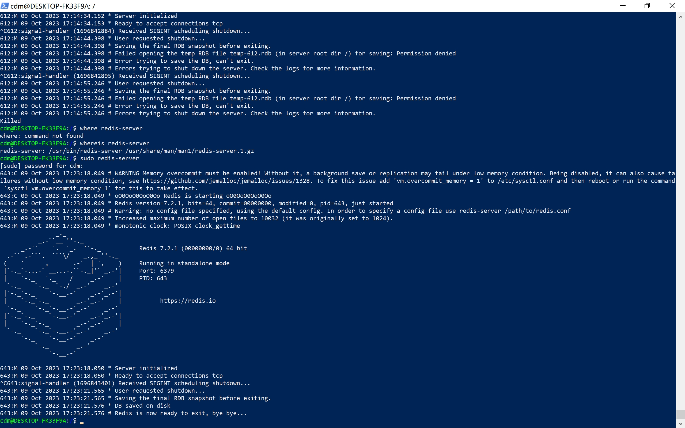
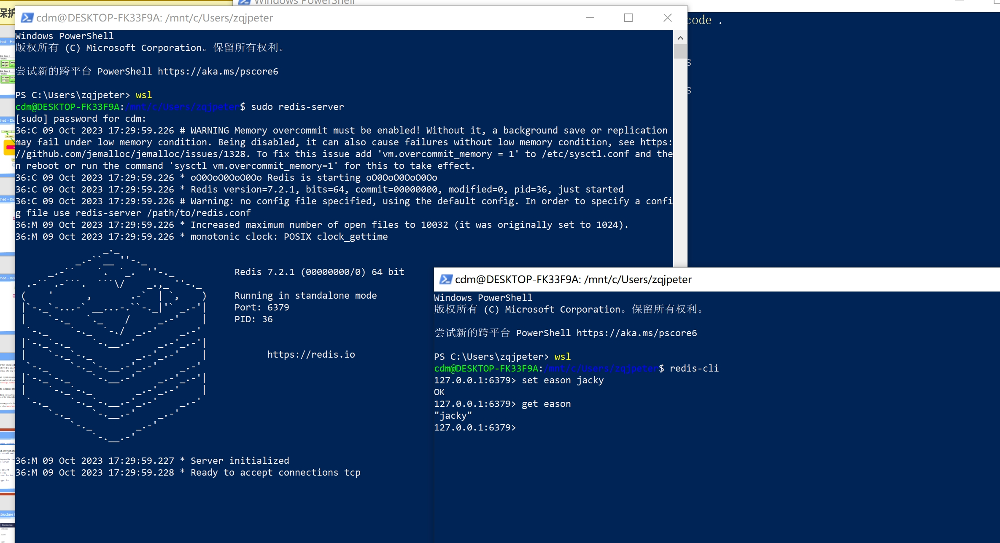

# Redis：兼WSL的一些操作

2023.10.09

> 高峰的快感 刹那失憾
风花雪月不肯等人 要献便献吻
好风景多的是 夕阳平常事
然而每天眼见的 永远不相似
> ——《夕阳无限好》 陈奕迅

不想用linux虚拟机，所以使用了WSL2（ubuntu22.04）来安装redis。

参考：[官方文档：WSL2安装redis](https://redis.io/docs/getting-started/installation/install-redis-on-windows/)

高（sha3）贵（bi1）的windows！

## 0. WSL

### 0.1 运行WSL

非常简单：

```bash
PS C:\WINDOWS\system32> wsl
cdm@DESKTOP-FK33F9A:/mnt/c/WINDOWS/system32$
```

### 0.2 退出WSL

要退出WSL（Windows Subsystem for Linux），你可以执行以下操作：

1. 关闭所有终端窗口：
   如果你在WSL中打开了一个或多个终端窗口，可以通过关闭这些窗口来退出WSL。这将终止所有与WSL相关的进程。

2. 在终端中使用 `exit` 命令：
   如果你只在一个终端窗口中工作，可以在该窗口中输入 `exit` 命令，然后按回车键。这会关闭当前终端窗口并退出WSL。

3. 使用 `wsl.exe` 命令退出：
   如果你想要通过命令行退出WSL，可以按以下步骤操作：

   - 打开命令提示符（Command Prompt）或 PowerShell。
   - 运行以下命令来列出当前正在运行的WSL发行版：

     ```bash
     wsl -l
     ```

   - 选择要退出的WSL发行版，然后运行以下命令，将 `YourDistroName` 替换为实际的发行版名称：

     ```bash
     wsl --terminate YourDistroName
     ```

   这将关闭指定的WSL发行版。

无论你选择哪种方法，退出WSL后，你将返回到Windows的命令行界面或GUI界面，取决于你的当前环境。


### 0.3 windows和wsl通信

默认情况下，WSL分配了一个IP地址给每个WSL发行版。

```bash
cdm@DESKTOP-FK33F9A:/$ ip addr show eth0 | grep -oP '(?<=inet\s)\d+(\.\d+){3}'
172.27.104.20
```

## 1. 一些前期准备

### 1.1 install redis

```bash
curl -fsSL https://packages.redis.io/gpg | sudo gpg --dearmor -o /usr/share/keyrings/redis-archive-keyring.gpg

echo "deb [signed-by=/usr/share/keyrings/redis-archive-keyring.gpg] https://packages.redis.io/deb $(lsb_release -cs) main" | sudo tee /etc/apt/sources.list.d/redis.list

sudo apt-get update
sudo apt-get install redis
```

### 1.2 run redis：跑server

```bash
sudo service redis-server start
```

跑起来居然是这个死样子，没有显示redis的图标，我还以为挂了呢：

```bash
cdm@DESKTOP-FK33F9A:/$ sudo service redis-server start
Starting redis-server: redis-server.
cdm@DESKTOP-FK33F9A:/$ sudo service redis-server status
 * redis-server is running
```

——分割线——

额，换了一种方法启动，就有redis的图标了：



请注意一定要用sudo来启动redis！否则ctrl+c退出的时候会出现权限的问题！（我还是用kill -9杀死的，册那）。

### 1.3 connect to redis：client

```bash
cdm@DESKTOP-FK33F9A:/$ redis-cli
127.0.0.1:6379> ping
PONG
127.0.0.1:6379>
```

可以看出：
- Redis 服务器默认监听本地主机（127.0.0.1）上的端口 6379，这是为了提供本地访问，并确保安全性。



### 1.4 shutdown redis

方法：
- 通过redis-cli连接服务器后执行shutdown命令，则执行停止redis服务操作。

```bash
cdm@DESKTOP-FK33F9A:/$ sudo service redis-server status
[sudo] password for cdm:
 * redis-server is running
cdm@DESKTOP-FK33F9A:/$ redis-cli
127.0.0.1:6379> shutdown
not connected>
cdm@DESKTOP-FK33F9A:/$ sudo service redis-server status
 * redis-server is not running
```

当然，如果你在redis-server的窗口中，直接ctrl+c也可以停止redis服务。

## 2. redis-client的一些基本概念

对redis-cli有个基本概念。

参考文档：[官方文档](https://redis.io/docs/ui/cli/)

redis-cli 是Redis命令行界面，一个简单的程序，允许直接从终端向Redis发送命令，并读取服务器发送的回复。

- redis数据库对命令大小写不敏感，ping、Ping、PING是同一个命令
- redis数据库对变量大小写敏感，A、a是两个变量
- 默认情况下redis-cli，通过127.0.0.1 端口 6379 连接到服务器。