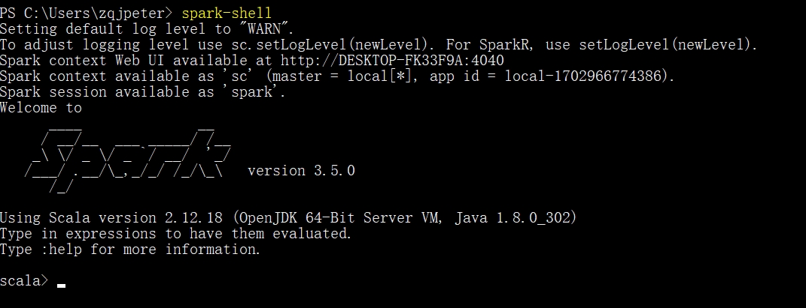

# Spark

> Is this the real life? Is this just fantasy?
Caught in a landslide, no escape from reality
Open your eyes, look up to the skies and see
I'm just a poor boy, I need no sympathy
Because I'm easy come, easy go, little high, little low
Any way the wind blows doesn't really matter to me, to me
——Bohemian Rhapsody, Queen

## 环境

1. os：windows 10
2. spark：3.5.0

参考链接：https://blog.csdn.net/tttzzzqqq2018/article/details/132052374

这个链接基本没啥问题；唯一的问题是和安装hadoop的时候是一样的，网上的博客环境变量都带上了D:/hadoop/bin，实测不行，要把bin去掉，只留D:/hadoop。

然后就顺利跑起来了。

## 如何运行程序？

1. 通过脚本，把任务提交到集群上运行