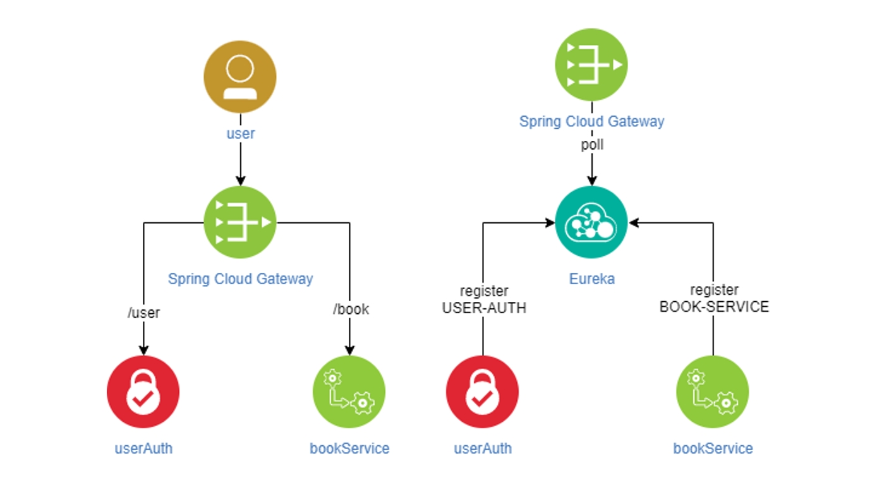
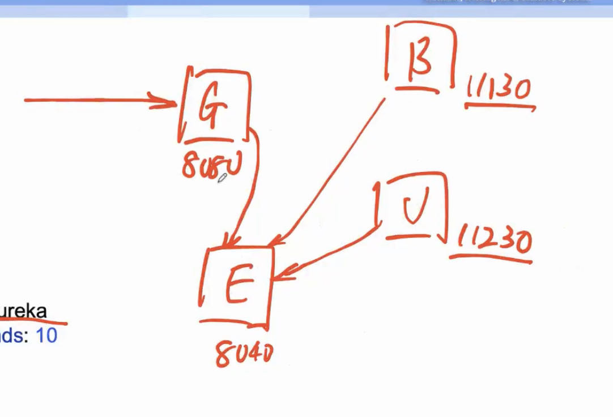

# 第10章 微服务

2023.10.02

> 难离难舍想抱紧些
茫茫人生好像荒野
如孩儿能伏于爸爸的肩膊
哪怕遥遥长路多斜
>——《单车》 陈奕迅

## 1. 什么是微服务

- 我们构建的不是一个完整的系统，而是多个小的、自包含（比如有自己的数据库、缓存……）、互不干扰的（比如一个崩溃了不干扰另外一个系统）小模块构成。每个小模块都可以单独的独立的运行。这样就使得我们的代码有弹性。

总之微服务就是把一个大型的应用切分成几个小的应用模块，每个块都独立与其他的服务。

为什么用微服务：
- 便于维护（单个服务器出问题了针对性解决，而不需要把所有的服务停机）、彼此隔离（微服务的每个小模块之间彼此隔离不影响）
- 提高生产力（彼此之间没有直接交互，开发的时候效率++）
- 更高的容错性（一个坏了别的不会坏）
- 更好的业务提供（容错性好也保证服务的稳定性）

前端不需要硬编码端口（或者机器ip，因为也不一定是同一台机器呀）；我在微服务里面加一个Gateway网关来转发；这样我微服务集群里面哪怕一个机器崩了，把相关服务迁移到另一个机器，IP地址、端口什么的都改变了，前端代码不需要改变，因为GateWay会处理转发。

缺点：
1. 如果GateWay崩溃了那么就有些困难，什么事情都做不了了；
2. 成本增加，运维的复杂度增加，原先所有的都在一个机器上，但是现在可能变成了多个机器。


## 2. 各部分的作用解释

- **GateWay**：作为一个统一访问的网关。应用程序（前端）不需要知道具体的是哪个服务器处理对应的服务，只需要对GateWay发送请求就可以。此外，GateWay还可以起到负载均衡的作用，比如登录服务有三个服务器，他们的key名字都是完全一样的，GateWay就会采用相关的负载均衡的策略，提高并发性能。
- **注册中心**：（Euraka为例）相当于一个注册表（key-value存储，key代表服务名字，value代表服务器地址，这可能会发生改变），当一个微服务的服务器启动的时候（包括GateWay），他会到Service Registry这个注册表上注册自己的服务，这样Gateway在面对客户端请求到来的时候，就会根据这个注册表来把请求转发给相关的微服务的服务器。

## 3. 无服务（Serverless Application）

无服务器应用程序利用现代云计算功能和抽象，让人专注于逻辑而不是基础设施。在无服务器环境中，您可以专注于编写应用程序代码，而底层平台负责扩展、运行时、资源分配、安全性和其他“服务器”细节。

什么是无服务：无服务器工作负载是“与服务器基础架构通常处理的方面无关的事件驱动工作负载”，诸如“要运行多少实例”和“要使用什么操作系统”之类的问题都由函数即服务平台（或FaaS）管理，让开发人员可以自由地专注于业务逻辑。

无服务器应用程序具有许多特定特性，包括：带有触发器的事件驱动代码执行；平台处理所有启动、停止和缩放事务；可扩展到零，闲置时成本低到零；无状态
函数式服务：类比$y=f(x)$，给定一个输入，得到一个输出结果。此外两次或者多次的函数计算之间没有关系，上次请求计算的结果计算完返回就结束，跟后面的没有任何关系，体现出一个无状态。

## 4. 实际部署

- **首先需要启动注册表服务器**，因为其他的服务器启动的时候都要到服务注册这里来注册一下，所以必须要最先启动Eureka的这个服务。
- **然后启动微服务具体的服务器**，在这个服务器启动的时候会自动到注册表服务器里面注册一下，便于后面的GateWay能够找得到。
- **最后启动GateWay**，因为具体的业务服务器已经启动了，启动GateWay之后，用户的请求就可以转发到对应的微服务，如果先启动GateWay而没有启动具体的业务服务器，如果有请求发来就会导致GateWay找不到对应的微服务的服务器，然后出现报错。

## 5. 微服务状态

**微服务怎么记录用户的登录状态？**

**肯定不能用session**，比如微服务集群里面一个服务器用来登录，如果用这个服务器存储session，那么他**下次下单的时候，可能是另外一个服务器处理的**，而另外的服务器不知道用户的登录状态，因此解决方案就是jwt。

用户使用一个jwt token传入，服务器的GateWay对于需要登录授权的请求加一个过滤器，然后解析和这个jwt，再把解析获取到的用户信息放入请求的header里面，如果解析失败就直接拦截不转发给后面的，这样也增加了安全性。

## 6. 举一只栗子

这是一个书籍服务的微服务架构。



### 6.1 配置文件一览

下面是几个服务的配置文件。

`Eureka`的配置文件：

```yaml
server:
  port:
    8040
spring:
  application:
    name: Eureka
eureka:
  instance:
    prefer-ip-address: true
  client:
    fetch-registry: false
    register-with-eureka: false
    serviceUrl:
      defaultZone: http://localhost:8040/eureka
```

`Book`的配置文件：

```yaml
# 服务名字
spring:
  application:
    name: book-service

# 我要注册到Eureka上面去，Eureka的信息
eureka:
  instance:
    prefer-ip-address: true
    ip-address: localhost
  client:
    registerWithEureka: true
    fetchRegistry: true
    serviceUrl:
      defaultZone: http://localhost:8040/eureka
server:
  port: 11130
```

`auth`服务的配置文件：

```yaml
#mybatis:
#  config-location: classpath:mybatis/mybatis-config.xml  #全局配置文件位置
#  mapper-locations: classpath:mybatis/mapper/*.xml  #sql映射文件位置
spring:
  datasource:
    url: jdbc:mysql://localhost:3306/bookstore
    username: root
    password: reins2011!
    driver-class-name: com.mysql.cj.jdbc.Driver
  application:
    name: user-auth
  jpa:
    hibernate:
      ddl-auto: update

eureka:
  instance:
    prefer-ip-address: true
    ip-address: localhost
  client:
    registerWithEureka: true
    fetchRegistry: true
    serviceUrl:
      defaultZone: http://localhost:8040/eureka
server:
  port: 11230

```

`Gateway`的配置文件：

```yaml
server:
  port: 8080
  error:
    include-message: always
spring:
  cloud:
    gateway:
      globalcors:
        cors-configurations:
          '[/**]':
            allowedOrigins: "*"
            allowedMethods:
              - GET
              - POST
  application:
    name: gateway
eureka:
  instance:
    prefer-ip-address: true
    ip-address: localhost
  client:
    registerWithEureka: true
    fetchRegistry: true
    serviceUrl:
      defaultZone: http://localhost:8040/eureka
    eureka-service-url-poll-interval-seconds: 10
```



`Gateway`，`auth`，`book`都注册到了`Eureka`上面去了。

### 6.2 `Eureka`

`Eureka`其实是很被动的，它啥也不知道，都是别人来找他注册。

代码就没啥需要自己写的：

```java
package org.reins.se3353.eureka;

import org.springframework.boot.SpringApplication;
import org.springframework.boot.autoconfigure.SpringBootApplication;
import org.springframework.cloud.netflix.eureka.server.EnableEurekaServer;

@EnableEurekaServer
@SpringBootApplication
public class EurekaApplication {

    public static void main(String[] args) {
        SpringApplication.run(EurekaApplication.class, args);
    }

}

```

### 6.3 `Gateway`

`Gateway`就核心得多了，下面仅仅展示`GatewayApplication`的代码：

```java
package org.reins.se3353.gateway;

import org.reins.se3353.gateway.filters.JwtCheckFilter;
import org.springframework.beans.factory.annotation.Autowired;
import org.springframework.boot.SpringApplication;
import org.springframework.boot.autoconfigure.SpringBootApplication;
import org.springframework.cloud.client.discovery.EnableDiscoveryClient;
import org.springframework.cloud.gateway.route.RouteLocator;
import org.springframework.cloud.gateway.route.builder.RouteLocatorBuilder;
import org.springframework.context.annotation.Bean;

@SpringBootApplication
@EnableDiscoveryClient
public class GatewayApplication {

	public static void main(String[] args) {
		SpringApplication.run(GatewayApplication.class, args);
	}

	@Autowired
	JwtCheckFilter jwtCheckFilter;
	@Bean
	public RouteLocator myRoutes(RouteLocatorBuilder builder) {
		return builder.routes()
				.route(r -> r.path("/book/**")
						.filters(f -> f.rewritePath("/book","").filter(jwtCheckFilter))
						.uri("lb://BOOK-SERVICE")
				).route(r->r.path("/user/**")
						.filters(f->f.rewritePath("/user",""))
						.uri("lb://USER-AUTH")
				)
				.build();
	}
}

```

`Gateway`做的事情是：
客户端发过来的请求，比如`8080/user/login`，或者`8080/book/buyBook`，`Gateway`会知道说根据`/user`或者`/book`来转发到对应的微服务上面去，至于那个微服务的ip和端口，`Gateway`不需要知道，因为`Gateway`会去`Eureka`上面去找，然后转发过去。