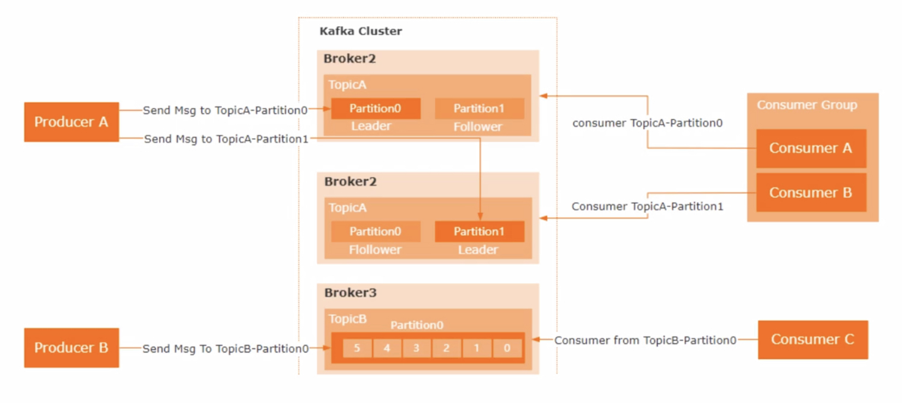

# 第2章 Message和Kafka

## 1. 同步客户端-服务器模型

- 最早的通信全部都是同步的的通信，比如系统A和系统B之间通信，需要两个系统提供API
- 同步的通信需要客户端一直等待相应，但是可能需要等很久
- 当需要通讯的模块多了之后，不然四五个通讯系统的时候都要交互的时候，比如A系统要对B、C、D都开发一套API，这很麻烦。API的数量会大量增加
- 紧耦合，一旦有一个地方的函数参数或者返回类型要修改，大量的代码都需要修改，非常麻烦。
- 假如有一个系统暂时挂掉了，能不能反复多尝试几次呢——传统的方法不行
- 通讯不可靠，过于依赖请求响应的模式。
- 没有缓冲区。

## 2. 异步客户端-服务器模型

- 在所有的系统里面有一个通讯的媒介，系统不直接交互，而是通过中介来通讯。
- 系统之间约定统一的通讯模式，topic相当于信箱，每次通讯的时候就把信息往信箱里面发，然后另外一个系统可能会监听这个信箱，一旦有新的内容接受，就开始处理
- 站在Kafka消息中间件的角度，所有系统都是对等的，不存在客户端-服务器的模型，所有的系统都可以收发信息。
- 实现解耦，哪怕有一个系统崩了，消息中间件会多次发送

## 3. Kafka

Kafka是一种消息队列；主要用来处理大量数据状态下的消息队列，一般用来做日志的处理。

Kafka的作用有：
- 解耦合
- 异步处理
- 流量削峰

然后来看一些关于kafka的基本概念：
1. broker：kafka集群包含一个或多个服务器，这种服务器被称为broker
2. producer：负责发布消息到kafka broker
3. consumer：消息消费者，向kafka broker读取消息的客户端

然后往broker里面细看，我们能看到topic，topic里面有很多partition；我们来一个一个解释：
1. topic：可以理解为一个队列，生产者和消费者都是面向一个topic
2. partition：为了实现扩展性，一个非常大的topic可以分布到多个broker上，一个topic可以分为多个partition，每个partition是一个有序的队列
3. leader：每个partition多个副本的主角色，生产者发送数据的对象，以及消费者消费数据的对象都是leader
4. follower：每个partition多个副本的从角色，实时的从leader中同步数据，保持和leader数据的同步，leader发生故障的时候，某个follower会成为新的leader

> **概念：Topic**
> 在Apache Kafka中，**Topic（主题）** 是一种用于组织和分类消息的基本单元。Topic是Kafka消息系统中的重要概念，它可以看作是一个消息类别或通道，用于将消息进行逻辑上的划分和分类。
以下是关于Kafka Topic的一些关键特点和作用：
> 1. **消息分类**：Topic允许你将消息分组成不同的类别或主题，每个主题都有一个唯一的名称。这有助于组织和管理消息，使得消息可以根据其内容或用途进行逻辑上的分类。
> 2. **发布与订阅**：生产者（Producer）将消息发布到一个或多个Topic，而消费者（Consumer）可以订阅一个或多个Topic以接收相关的消息。这种发布-订阅模式使得消息的发送和接收可以相互独立，生产者和消费者不需要直接通信。
> 3. **多订阅者**：一个Topic可以有多个订阅者，这意味着多个消费者可以同时订阅相同的Topic并独立地处理消息。这种多订阅者模式支持并行和分布式处理。
> 4. **消息保留**：Kafka支持消息保留策略，允许你配置消息在Topic中保留的时间。这样，消费者可以消费最新的消息，而旧的消息会根据策略自动删除。
> 5. **分区**：每个Topic可以分为多个分区，每个分区可以视为该主题的一个子集。分区允许Kafka在不同的节点上并行处理消息，从而提高了可伸缩性和性能。
> 6. **消息顺序性**：Kafka保证在单个分区内的消息是有序的，这意味着如果消息按照一定的顺序发送到同一个分区，它们将以相同的顺序被消费。
总之，Kafka中的Topic是一种用于组织和管理消息的重要机制，它允许将消息分类、分发、保留和处理。每个Topic都有一个唯一的名称，允许多个生产者和消费者在分布式环境中高效地交换数据。 Kafka的分区机制使得消息处理具有高度的可伸缩性和性能。

### 3.1 Kafka的原理

- kafka的数据存储在log里面，数据往文件后面不断追加，追加的速度更快，如果是随机访问反而效率低
- log里面都是有序的事件，每个事件都有位移，偏移量
- 当然有很多个消费者，把消费者分成不同的组。当一个消息被所有的消费者读走了之后，这个消息才会被删除掉；多个用户可以读取同一个log，并且维护他们各自的文件位置（都到哪里了）
- 这样就能保证log文件不可能无限制的增长

### 3.2 Kafka的数据类型

- Topic里面存储的都是同构的数据类型，数据类型统一（访问效率高，推导出偏移量为X的时候直接就可以推出）
- Topic里面存储的都是异构的数据类型，数据类型不一样（访问效率低，不好推出某个偏移量的消息）
- Topic可能会分成几个Partition，假设某个Topic非常大，就可以分区。最终会使用某种hash算法，kafka自己会决定放到哪一个具体的区域里面。
- 分的区域越多，管理的复杂性增加，但是并行处理，也增加了处理的效率。
- 卡夫卡的消息（event）是一个带有时间戳的key-value对，他会记录一些发生的事情。key可以作为分类的依据，value最好不要作为分类的依据。此外，key也不是必须的，value

### 3.3 集群的容灾

- 用空间换可靠性，比如每个数据存储两个副本，这样比如有一个卡夫卡服务器崩溃了，还有一个备份能够使用
- 需要一个协调器在卡夫卡集群里面，比如有多个消费者订阅了集群的topic，他们都在处理topic里面的内容。consume会不断的给协调器发心跳包，表明自己正在处理，如果某个consumer不发了说明故障了，协调器就不会把消息发给故障的。

