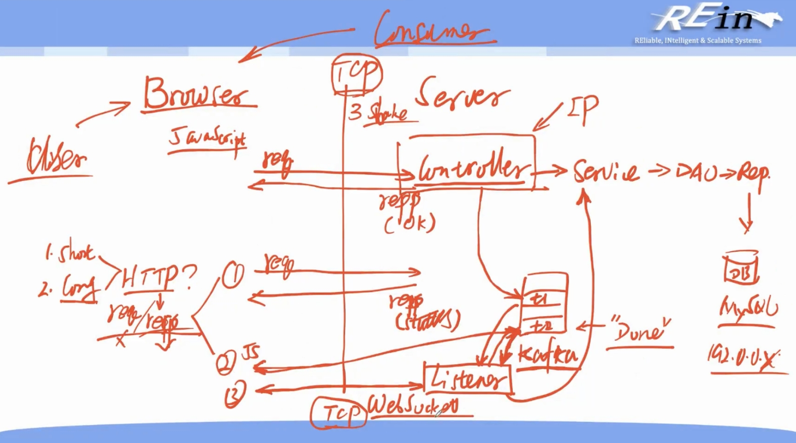

# 第3章 WebSocket

2023.09.17

我们先来看一下目前的一整套流程逻辑：

## 3.1 前端获得数据的方式

### 3.1.1 Basic ways

首先我们来看两种最基本的方式：

1. 在前端工程中，使用**JavaScript脚本监听后端kafka**的存储订单处理结果消息的Topic；
   - 优点就是直接交互，简洁明了，降低了后端Spring的压力(不需要单独写一个接口，单独运行相关的Kafuka查询组件的信息)。
    - 缺点也是直接交互，使用JS监听，相当于用户客户端直接和信箱交互，这就会导致我的**卡夫卡Topic信箱直接暴露**。卡夫卡信箱里面涉及到用户的订单数据，所以使用后端直接交互，然后后端Spring暴露访问接口，更加安全。

2. 在**前端发送Ajax请求**获取订单的最新状态，后端接收到请求后将订单状态返回给前端去显示；
    - 如果前端轮询，消耗资源和时间。

> 前面两种都是所谓的“请求-响应”模式，因为我们走的都是Http协议。
> websocket就是要突破这种模式，产生“双工”——谁来发起都可以。
> 
> **websocket是一种应用层的协议，和http协议一样，都是基于TCP（传输层）的协议**。

### 3.1.2 WebSocket

后端的消息监听器类监听到消息处理结果Topic中的消息后，通过WebSocket发送给前端。

- 优点：

    - 推送功能：支持服务器端向客户端推送功能。**服务器可以直接发送数据而不用等待客户端的请求**。

    - 减少通信量：只要建立起websocket连接，就一直保持连接，在此期间可以源源不断的传送消息，直到关闭请求。也就**避免了HTTP的非状态性**。和http相比，不但每次连接时的总开销减少了，而且websocket的首部信息量也小 ，通信量也减少了。

    - 减少资源消耗：如果用AJax轮询的话，我们需要专门设置一个接口，运行相关的查询代码，而且由于前端是定时的不断的发请求来查询，相关的查询结果的代码要运行很多次，这浪费了资源，反而**如果只用WebSocket，推送代码只用运行一次**。

- 缺点
    - 比如需要浏览器支持WebSocket，例如我的Safari浏览器在WebSocket的测试中出现了一些问题（由于一些安全性的原因，但是Edge浏览器就可以正常保证WebSocket的连接），同时如果只是单页面涉及到WebSocket还好，涉及到多页面，定时推送，复杂的推送，就非常容易出问题了，不管是前端，还是后端都会遇到一些问题。

## 3.2 WebSocket的具体使用

### 3.2.1 一些概念

1. endpoint

在WebSocket中，**endpoint** 是指WebSocket通信的目标或终点。它是WebSocket连接的另一端，可以是服务器或客户端，用于接收或发送WebSocket消息。

在WebSocket通信中，有两种类型的endpoint：

1. **WebSocket服务器端(endpoint)**：这是WebSocket通信的服务器端，它等待客户端的连接请求并处理它们。一旦连接建立，服务器端就会监听来自客户端的消息，并可以向客户端发送消息。WebSocket服务器通常用于实时通信、在线游戏、聊天应用等场景。

2. **WebSocket客户端(endpoint)**：这是WebSocket通信的客户端，它与WebSocket服务器建立连接，并可以向服务器发送消息，同时接收服务器发送的消息。WebSocket客户端通常用于与服务器进行双向通信，以获取实时数据或与服务器进行交互。

无论是服务器端还是客户端，endpoint都是WebSocket通信的重要组成部分，它们通过WebSocket协议进行通信，实现了实时、双向的数据交换。WebSocket协议允许这些endpoint之间建立持久性连接，以便在不断开连接的情况下传输数据。这使得WebSocket在实时应用程序中非常有用，因为它减少了与HTTP请求/响应模型相关的开销，并提供了更快的数据传输和更低的延迟。

2. 消息代理（Message Broker）

在WebSocket通信中，**消息代理** 是指WebSocket服务器和客户端之间的中间件，用于转发WebSocket消息。它充当了WebSocket服务器和客户端之间的桥梁，使它们可以相互通信。消息代理可以是一个独立的服务器，也可以是WebSocket服务器本身。

### 3.2.2 Using WebSocket in Spring Application

