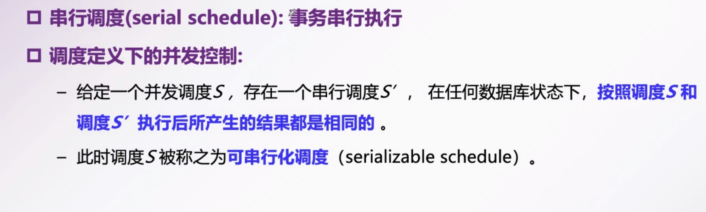
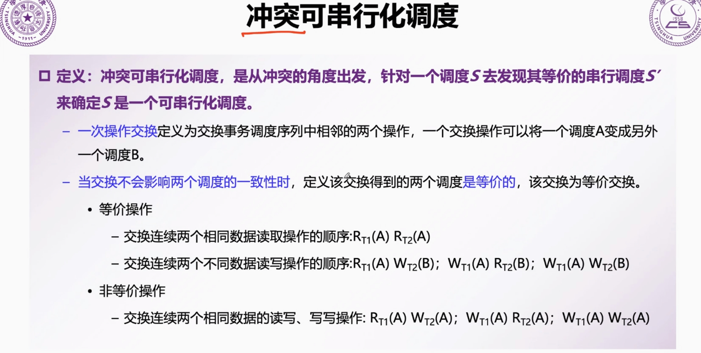
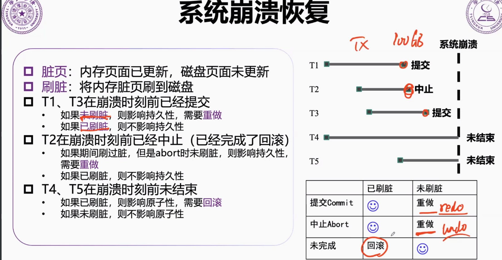
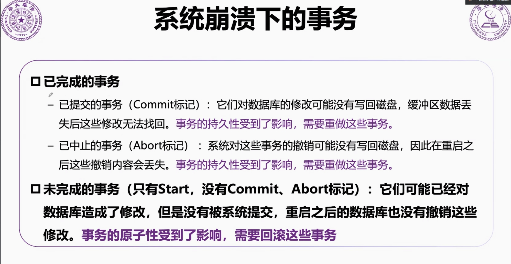
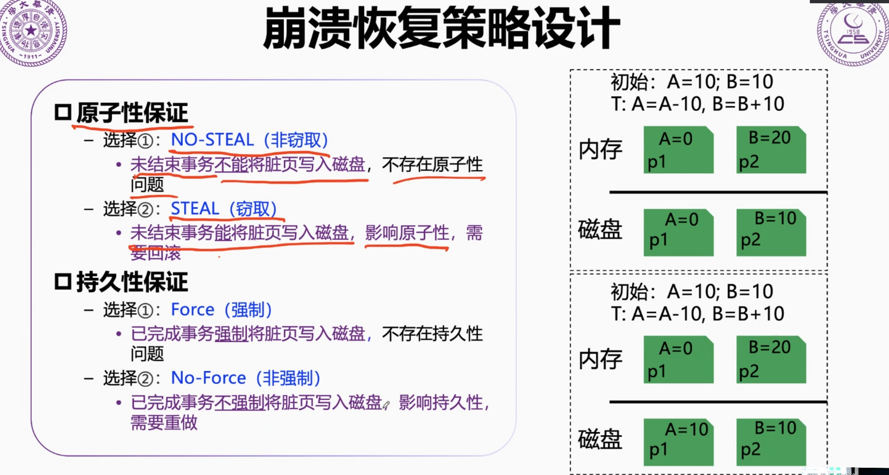
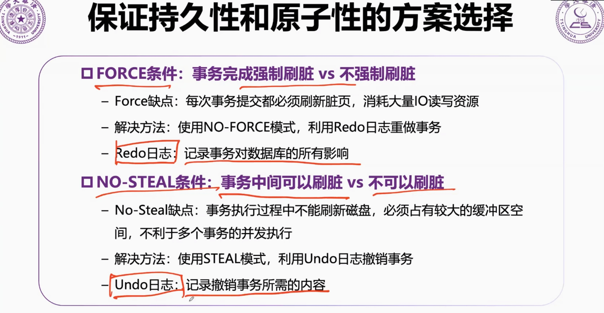
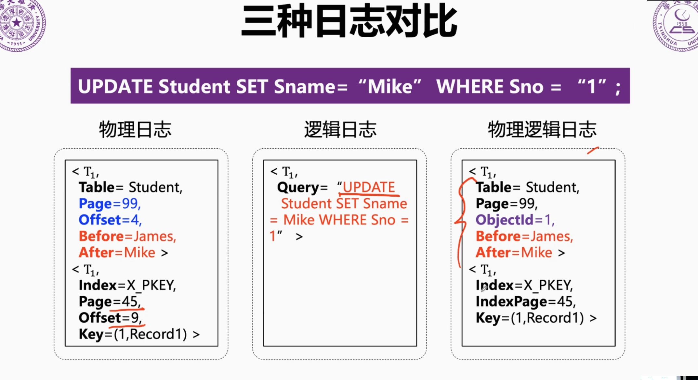
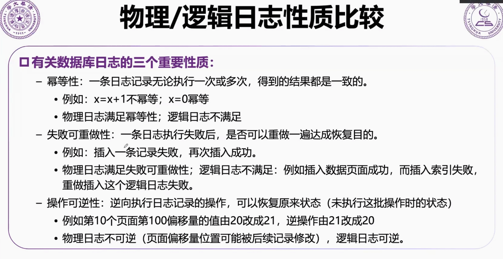
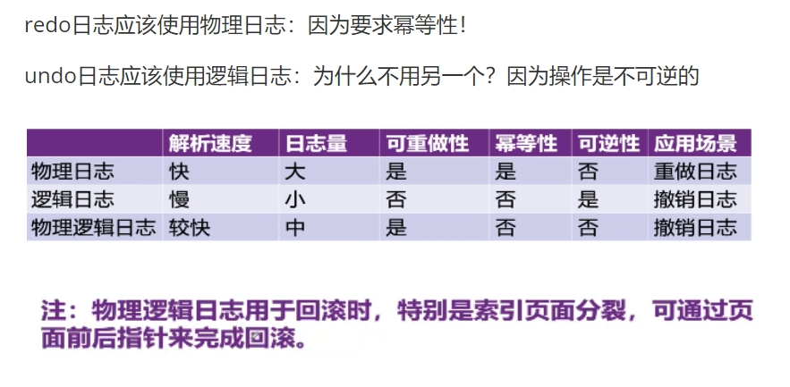

# 第5讲 事务管理

2023.12.30

> 不开心就不开心
也别勉强的慰问
但求随着我的心
洒脱地尊重我的伤感
别要不开心便找开心
去避过我的良心
消化忧郁后
才令我拾回自信心
> ——《开不了心》 陈奕迅

上节课我们关注的点在于应用的角度（比如你要写一个spring），你如何管理事务；但是事务最终我们还是要落实到数据库层面，因为数据库是事务的最终实现者。

## 1. 可串行化调度

调度：事务的并发过程中，决定事务中每个操作的执行顺序。

## 2. 系统崩溃的恢复

事务很大，在过程中会不断刷到硬盘，因此中止崩溃会有undo。

来点CSE：其实这就是cse讲的all or nothing atomicity。

## 3. 日志记录方案

**逻辑日志**：
- 记录事务中高层抽象的逻辑操作
- 举例：记录日志中UPDATE,DELETE,INSERT的文本信息；例如小明的年龄由20改为21

**物理日志**：
- 记录数据库具体物理变化
- 距离：记录一个被查询影响的数据前后的值
  - 例如第10个页面第100偏移量的值由20改为21

**物理逻辑日志**
- 一种结合了物理日志和逻辑日志的混合方法
- 日志记录中包含了数据页面的物理信息，但是页面以内目标数据项的修改信息则是以逻辑方式记录
  - 例如第100个页面（物理）的小明年龄值由20改为21（逻辑）

