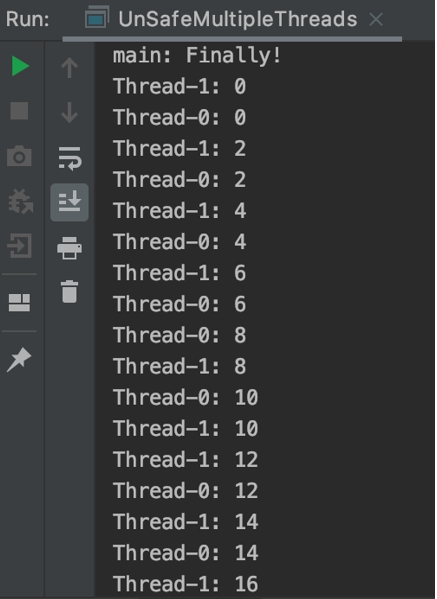

# 第6章 多线程

2023.09.20

> No matter where you go, no matter what you do, I know you will be ambitious. You wouldn’t be here today if you weren’t. Match that ambition with humility – a humility of purpose.

- introduction to thread
- thread in Java

## 1. 定义


- **进程**：有独立的内存空间；两个进程的环境是完全隔离开来的，互相访问不到对方的内存空间（需要进程间通信）；
- **线程**：轻量级的进程；进程和线程都提供了一个执行环境，但创建新线程所需的资源比创建新进程少。线程存在于一个进程中-每个进程至少有一个线程。线程共享进程的资源，包括内存和打开的文件。这有助于通讯高效但可能存在潜在的问题。

## 2. ICS限时返场：基础概念一览

### 2.1 interrupt

中断是对线程的一种指示，告诉线程应该停止正在做的事情，做其他事情。线程如何响应中断取决于程序员，但是线程终止是很常见的。

### 2.2 join

join方法允许一个线程等待另一个线程的完成。
- 如果t是一个正在执行的线程，t.join()会导致当前线程暂停执行，直到t的线程终止。
- join的重载允许程序员指定一个等待时间。然而，和sleep一样，join依赖于操作系统的时间，所以你不应该假设join会等待你指定的时间。和sleep一样，join响应中断会抛出InterruptedException。

我们来看一个例子：

```java
package CSDN;
public class TestJoin {
 
 public static void main(String[] args) throws InterruptedException {
  ThreadTest t1=new ThreadTest("A");
  ThreadTest t2=new ThreadTest("B");
  t1.start();
  t2.start();
 }
 
 
}
class ThreadTest extends Thread {
 private String name;
 public ThreadTest(String name){
  this.name=name;
 }
 public void run(){
  for(int i=1;i<=5;i++){
    System.out.println(name+"-"+i);
  }  
 }
}

```

输出结果：

```bash
A-1
B-1
B-2
B-3
A-2
B-4
A-3
B-5
A-4
A-5
```

可以看出，两个线程是交替执行的。如果我们想要让线程A执行完之后再执行线程B，我们可以使用join方法：

```java
package CSDN;
public class TestJoin {
 
 public static void main(String[] args) throws InterruptedException {
  ThreadTest t1=new ThreadTest("A");
  ThreadTest t2=new ThreadTest("B");
  t1.start();
  t1.join();
  t2.start();
 }
}
```

输出结果：

```bash
A-1
A-2
A-3
A-4
A-5
B-1
B-2
B-3
B-4
B-5
```


## 3. 创建线程

- **方法一：手动创建一个线程**，这个线程执行完就结束了。（人为的管理、控制线程）
    - 一种方法是继承Thread类（Java是单根继承，和cpp不一样，所以这种方法不推荐）
    - 一种方法是实现Runnable这个接口（推荐使用这个，因为Java里面只能继承一个类，但是实现可以实现多个接口）
- **方法二：通过线程池**，如果有需要获取线程就在池子里面找一个，用完之后收回，还是放在在线程池里面。节约资源，因为创建线程的时候需要消耗资源。（不需要考虑线程的管理，线程是新创建的还是已有的使用者不需要知道，由线程池管理）

## 4. 多线程问题

sharing access to fields会造成两个问题：

## 4.1 线程干涉

（两个线程都在写）A线程写入之后，B线程再次写入，然后导致A写的丢失了，这就是线程干涉。


If the initial value of c is 0, their interleaved actions might follow this sequence:
- Thread A: Retrieve c.
- Thread B: Retrieve c.
- Thread A: Increment retrieved value; result is 1.
- Thread B: Decrement retrieved value; result is -1.
- Thread A: Store result in c; c is now 1.
- Thread B: Store result in c; c is now -1.


## 4.2 内存一致性错误

因为一个线程在写，一个线程在读。当**不同线程对应该是相同数据的看到的不一致**时，就会发生内存一致性错误。避免内存一致性错误的关键是理解**先发生后发生的关系**。这种关系只是保证一个特定语句的内存写入对另一个特定的语句可见。（总之就是**不能线程交替读和写**，要么专门读，要么专门写）


Suppose a simple int field is defined and initialized:
- int counter = 0; 
- The counter field is shared between two threads, A and B.

- Suppose thread A increments counter:
      counter++; 
- Then, shortly afterwards, thread B prints out counter:
      System.out.println(counter); 

If the two statements had been executed in the same thread, it would be safe to assume that the value printed out would be "1".

But if the two statements are executed in separate threads, the value printed out might well be "0", because **there's no guarantee that thread A's change to counter will be visible to thread B** — unless the programmer has established a happens-before relationship between these two statements.


再来看一个例子：

```java
public class UnSafeMultipleThreads<Static, c> {
    static void threadMessage(String message) {
        String threadName = Thread.currentThread().getName();
        System.out.format("%s: %s%n",
                threadName,
                message);
    }

    Counter c = new Counter();

    private class CounterLoop implements Runnable {
        public void run() {
            try {
                for (int i = 0; i < 100; i++) {
                    // Pause for 1 seconds
                    Thread.sleep(1000);
                    // Print a message
                    threadMessage(String.valueOf(c.value()));
                    c.increment();
                }
            } catch (InterruptedException e) {
                threadMessage("I wasn't done!");
            }
        }
    }
}

public static void main(String args[]) throws InterruptedException {
        // Delay, in milliseconds before
        // we interrupt MessageLoop
        // thread (default one hour).
        long patience = 1000; // * 60 * 60;

        threadMessage("Starting MessageLoop thread");
        long startTime = System.currentTimeMillis();

        UnSafeMultipleThreads s = new UnSafeMultipleThreads();
        Thread t1 = new Thread(s.new CounterLoop());
        t1.start();
        Thread t2 = new Thread(s.new CounterLoop());
        t2.start();
        threadMessage("Waiting for MessageLoop thread to finish");
    }

```

输出可能是：
    
<!--  -->
<!-- 宽度30% -->


## 5. 解决办法

### 5.1 `Synchronized` 同步修饰函数名

假设有一个线程在调用第一个方法，其他所有的线程都不能调用同一个对象的同步方法！注意是**三个函数只要有一个在被调用，剩下的包括自己就都不允许其他的线程调用**；注意是同一个对象，两个对象就没事。
  - 原理：任何一个对象有一个“内部锁”，而每一个`synchronized`方法执行的前提是要获取这个锁；
  - 问题：`static`静态方法能不能使用同步方法呢？不会，因为每一个静态方法和类关联而不是一个对象，其实每一个class都对应关联着一个class Object，所以这个class Object也有锁，所以即使是静态方法也适用。

```java
public class SynchronizedCounter {
    private int c = 0;
    public synchronized void increment() { c++; } 
    public synchronized void decrement() { c--; } 
    public synchronized int value() { return c; } 
}
```

### 5.2 同步语句——细粒度的控制

5.1中，我们把同步放在了方法上面；我们是否可以把同步放在语句上面呢？答案是可以的。

```java
// 注意看这个方法里面，有三个语句，我们只同步了其中的两个语句
public void addName(String name) {
  synchronized(this) {
    lastName = name;
    nameCount++; 
  } 
  nameList.add(name); 
}
```

再来看一个例子：

```java
public class MsLunch {
  private long c1 = 0;
  private long c2 = 0;

  private Object lock1 = new Object();
  private Object lock2 = new Object();

  public void inc1() {
     // 这里获得了lock1的锁（lock1是一个对象！）
     synchronized(lock1) 
       { c1++; } 
  } 
  public void inc2() {
     // 这里获得了lock2的锁
     synchronized(lock2) 
       { c2++; }
  } 
} 

```

### 5.3 可重入的锁：`ReentrantLock`

我们有一个类`C`，它有一个Synchronized方法`m`，`m`里面调用了另外一个Synchronized方法`n`，`n`也在`C`里面；这个时候我们发现按照我们前面的逻辑就蚌埠住了。调用`n`的时候，发现这个对象的锁在`m`手里呢！

也有可能`m`是一个递归的方法……

引入概念：**可重入的锁**。可重入的锁意味着：
- 一个线程不能获得一个被其他线程占据的lock；但是它能够获得一个它已经拥有的锁。


### 5.4 原子变量

对于Java来说，除了`long`和`double`之外，其他的基本类型都是原子的。如果我们想要把一个变量变成原子变量，只需要在变量定义的前面加一个`volatile`修饰就可以了。

前提是这个变量很容易出现内存一致性错误的问题，就需要加一个原子变量，这样编译器就会识别，保证这个变量的线程安全。但是不要把所有的变量都变成原子变量，这样会降低性能，矫枉过正。

### 5.5 Liveness：多线程碰到的各种问题

- **死锁**：A线程等待B，B等待A，这样就会陷入死锁的循环。

- **饿死**：A想要访问一个共享资源，但是一直获取不到，就像被饿死了一样。（需要消除那些贪婪的线程，避免一个线程长期贪婪的占用资源；所以tomcat里面用了连接池，避免一个连接长期占用资源）

- **活锁**：假设有AB两个线程，A产生数据发给B，如果A产生的数据特别多，导致B无法处理，传来的数据太多了导致B忙不来，也就是A得不到响应或者回复答复。

## 6. 不可变对象

推荐使用不可变对象，定义是：如果对象在构造后其状态不能改变，则该对象被认为是不可变的。最大程度地依赖不可变对象被广泛接受为创建简单、可靠代码的可靠策略。不可变对象在并发应用程序中特别有用。因为它们不能改变状态，所以它们不能被线程干扰破坏或在不一致的状态下观察到。
不可变对象的话那我想要修改怎么办？创建一个新对象
为什么需要不可变对象：线程干涉是因为（两个线程都在写W/W）,内存不一致是因为一个在写一个在读（W/R）,如果我们禁止掉写操作，就避免了这个问题。
缺点：创建新对象的代价很大，但是其实Java的JVM让这个代价不是很大
为什么要选择线程安全的集合类型来维护客户端 Session？

如果有⼤量的⽤户（或者说客户端进⼊到Websocket连接），那么这个时候要做的动作就是把Session放⼊⼀个集合中【我⽤的集合是ConcurrentHashMap】，也就是在往集合⾥⾯写⼊内容，如果不能保证线程安全，由于在往集合中写⼊内容这⼀个操作不是原⼦操作，甚⾄涉及到很多复杂的过程，也就是说这些线程直接会相互⼲扰影响（我们可以举⼀个最简单的例⼦，哪怕i++这⼀⾏代码从汇编来看都涉及到三个操作，从内存拷⻉、⾃加、然后复制回去内存），最终导致的结果就是：可能同时有100个⽤户涌⼊进来，但是由于线程之间的⼲扰，最终能够维持的Session就只有80或者90多个，会有遗漏。为此，我们需要使⽤线程安全的集合来维护Sessions集合。

## 7. 线程池

- 执行器就是一个线程池，包含很多线程，线程池以池的方式进行管理
- 使用工作线程可以最大限度地减少线程创建带来的开销。一种常见的线程池类型是固定数量线程池（没有创建线程的开销）。这种类型的池始终有指定数量的线程在运行。固定线程池的一个重要优点是，使用它的应用程序可以优雅地降级（我写的代码崩溃了但是不会影响线程池，独立的）。
- 创建使用固定线程池的执行器的简单方法是调用java.util.concurrent.Executors中的newFixedThreadPool工厂方法此类还提供以下工厂方法：newCachedThreadPool方法创建具有可扩展线程池的执行器。此执行器适用于启动许多短期任务的应用程序。newSingleThreadExecutor方法创建一个执行器，一次执行一个任务。