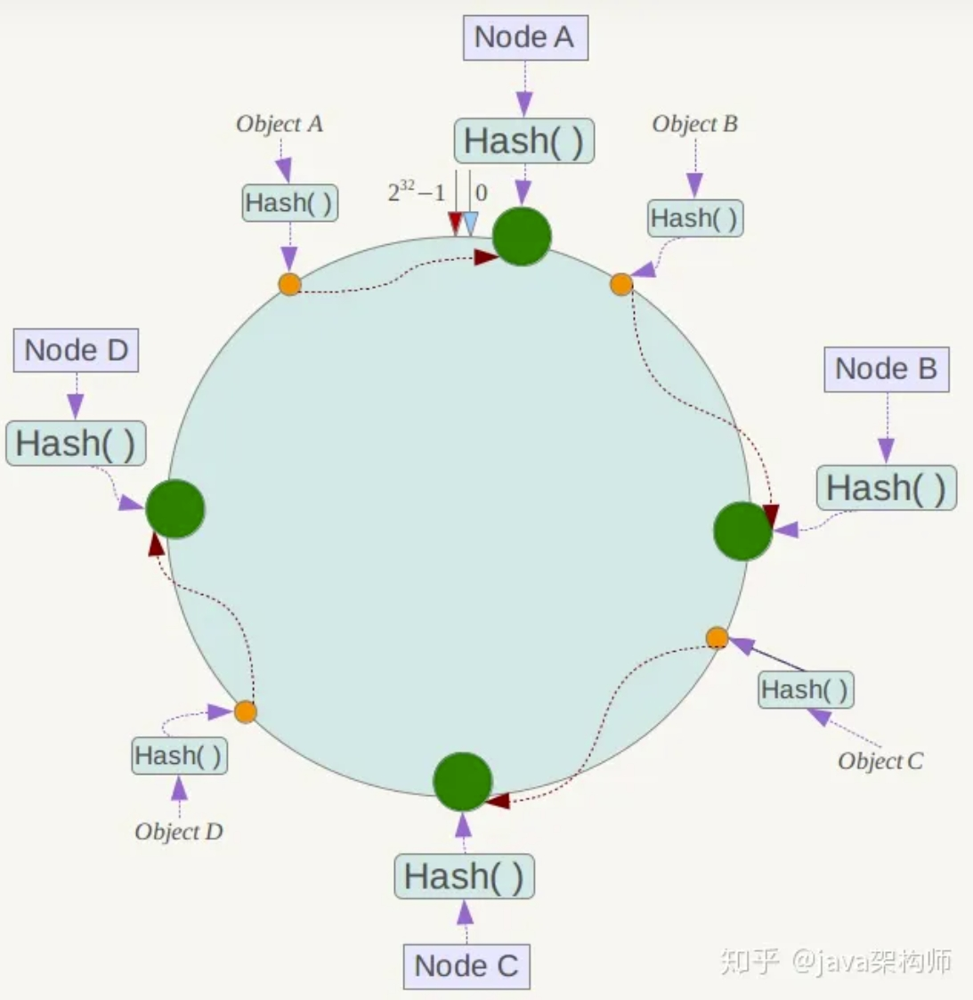
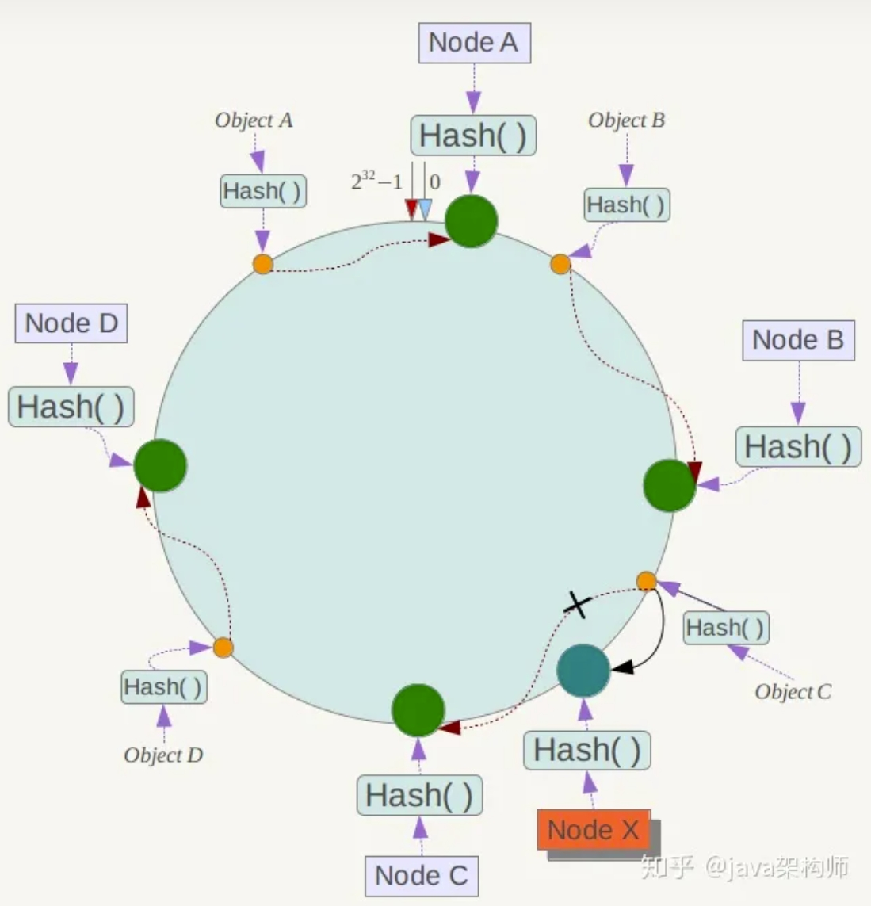
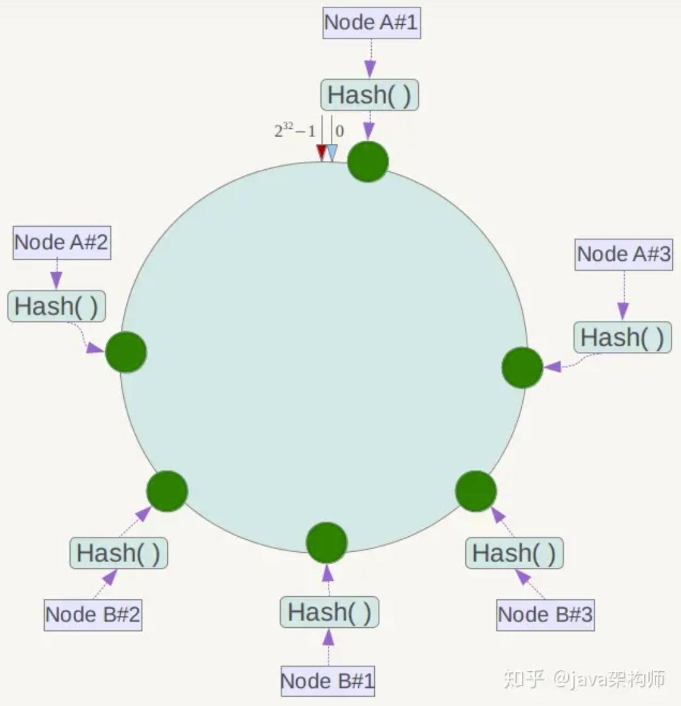

# 第7章 缓存

2023.10.02

目标：根据业务需求，设计实现基于分布式缓存的数据访问方案。

> 完全明白是放纵
但是只得这刻可相信
未来又怕会
终于都扑空
——《抱拥这分钟》 陈奕迅

## 1. 为什么缓存

> Recall: Servlet and Tomcat
> 
>  **1. Servlet**
>- Servlet是Java编写的**服务器端程序**，用于**处理Web请求和生成Web响应**。它是基于Java的标准，可以通过Java的API来创建和扩展。Servlet通常用于处理HTTP请求，但也可以用于处理其他协议。
>- Servlet的主要功能是接收来自客户端（通常是浏览器）的HTTP请求，执行相应的处理逻辑，然后生成HTTP响应返回给客户端。这可以包括动态生成HTML页面、处理表单提交、管理会话等任务。
>
> **2. Tomcat**
>- Tomcat是一个开源的Java Servlet容器，也可以称为**Web服务器**。它是Apache软件基金会的项目，用于**运行和管理Servlet和JavaServer Pages（JSP）应用程序**。
>- Tomcat提供了一个运行环境，可以部署和托管Servlet和JSP应用程序。它处理了与HTTP通信相关的底层细节，包括接收HTTP请求、解析请求、调用适当的Servlet来处理请求，并将响应返回给客户端。
> 总结一下，Servlet是一种用于**处理Web请求和生成Web响应的Java组件**，而Tomcat是一个容器，用于**托管和运行Servlet和JSP应用程序**。在学习Spring时，你将经常与这两个概念打交道，因为Spring的Web模块可以用来开发基于Servlet的Web应用程序，而Tomcat可以用于部署和运行这些应用程序。希望这个简要的介绍有助于你更好地理解它们的作用和关系。

### 1.1 网络开销

$$ 前端 \rightarrow Tomcat \rightarrow 数据库 $$
Tomcat和数据库都不一定是在一台机器上面，可能是分布式的，可能是多台机器，可能是多个Tomcat，可能是多个数据库。

如果绝大多数情况都是只读的，后端和数据库之间的交互，**网络开销也很大**啊！
——上缓存！直接把数据缓存到Tomcat那里！

### 1.2 似乎已经有缓存了？……

还有一个问题是：
> Q：数据库里面有buffer、ORM映射里面也有buffer作为缓冲区，那为什么要缓存呢？
> A：上面说的这两个缓存都不是你可以控制的，完全取决于他们自身，我们开发者管不了。而使用redis，我就可以自己的控制缓存！

事实上，我们后台的数据库未必是关系型数据库！我们可能还搞了文件系统、mongo……最终它们还是表示为对象，理论上来说它们也应该进缓存！但是像**spring jpa里面的缓存，或者hanibatis里面的缓存**，把数据库里面抓取过来的数据已经弄成对象缓存了，它也**仅仅针对关系型数据库**！

假如我还有从文件系统里面读取的，nosql数据库里面的读取的东西、动态生成的网页、图片都可以 ，所以使用redis就都可以存储，redis完全在开发者的控制下。比如双十一的时候，我可以趁用户访问量少的时候提前把可能卖爆的网页缓存出来，这样提高访问的速度。

redis甚至还可以作为消息中间件，类似kafka的topic，他和卡夫卡的差别是redis里面的东西在内存里面。

**数据库服务器**对于**内存**要求比较高，而**Tomcat服务器主要是CPU密集型**（因为要处理一堆请求）；所以，对于一些只读的数据，我从数据库拿到之后就缓存在Tomcat本地！

## 2. 一致性哈希

参考资料：https://zhuanlan.zhihu.com/p/98030096

### 2.1 好的哈希算法？

一致性哈希提出了在动态变化的Cache环境中，哈希算法应该满足的4个适应条件：
1. 均衡性（Balance）：哈希的结果应该尽可能分布均匀，这样可以使得每个缓存节点负载均衡。（如果一个用完了一个还没用，就很难蚌）
2. 单调性（Monotonicity）：当缓存节点增加或者减少时，应该尽量减少缓存数据的重新分配。（尽量保护已经分配的内容不会被重新映射到新的缓冲区）
3. 分散性（Spread）：在分布式环境中，终端有可能看不到所有的缓冲，而是只能看到其中的一部分。当终端希望通过哈希过程将内容映射到缓冲上时，由于不同终端所见的缓冲范围有可能不同，从而导致哈希的结果不一致，最终的结果是相同的内容被不同的终端映射到不同的缓冲区中。这种情况显然是应该避免的，因为它导致相同内容被存储到不同缓冲中去，降低了系统存储的效率。分散性的定义就是上述情况发生的严重程度。好的哈希算法应能够尽量避免不一致的情况发生，也就是尽量降低分散性。
4. 负载（Load）：负载问题实际上是从另一个角度看待分散性问题。既然不同的终端可能将相同的内容映射到不同的缓冲区中，那么对于一个特定的缓冲区而言，也可能被不同的用户映射为不同的内容。与分散性一样，这种情况也是应当避免的，因此好的哈希算法应能够尽量降低缓冲的负荷。

### 2.2 一致性哈希算法

按照常用的hash算法，来将对应的key哈希到一个具有$2^32$个节点的空间中；现在我们将这些数字头尾相连，结合成一个闭合环形。

然后我们**映射服务器节点**。具体可以选择服务器的ip或唯一主机名作为关键字进行哈希，这样每台机器就能确定其在哈希环上的位置。假设我们将四台服务器使用ip地址哈希后在环空间上。

然后我们将objectA、objectB、objectC、objectD四个对象通过特定的Hash函数计算出对应的key值，然后散列到Hash环上,然后从数据所在位置沿环顺时针“行走”，第一台遇到的服务器就是其应该定位到的服务器。

**服务器的删除与添加**
1. 如果此时NodeC宕机了，此时Object A、B、D不会受到影响，只有Object C会重新分配到Node D上面去，而其他数据对象不会发生变化；
2. 如果在环境中新增一台服务器Node X，通过hash算法将Node X映射到环中，通过按顺时针迁移的规则，那么Object C被迁移到了Node X中，其它对象还保持这原有的存储位置。通过对节点的添加和删除的分析，一致性哈希算法在保持了单调性的同时，还是数据的迁移达到了最小，这样的算法对分布式集群来说是非常合适的，避免了大量数据迁移，减小了服务器的的压力。

### 2.3 虚拟节点

当服务器节点比较少的时候，会出现一个问题，就是此时必然造成大量数据集中到一个节点上面，极少数数据集中到另外的节点上面。

为了解决这种数据倾斜问题，一致性哈希算法引入了虚拟节点机制，即对每一个服务节点计算多个哈希，每个计算结果位置都放置一个此服务节点，称为虚拟节点。具体做法可以先确定每个物理节点关联的虚拟节点数量，然后在ip或者主机名后面增加编号。例如上面的情况，可以为每台服务器计算三个虚拟节点，于是可以分别计算 “Node A#1”、“Node A#2”、“Node A#3”、“Node B#1”、“Node B#2”、“Node B#3”的哈希值，于是形成六个虚拟节点：

同时数据定位算法不变，只是多了一步虚拟节点到实际节点的映射，例如定位到“Node A#1”、“Node A#2”、“Node A#3”三个虚拟节点的数据均定位到Node A上。这样就解决了服务节点少时数据倾斜的问题。每个物理节点关联的虚拟节点数量就根据具体的生产环境情况再确定。

## 3. Redis!

### 3.1 基本概念

- key-value store
- **NoSQL** database

可以有主从备份（缓存怎么会有主从备份？因为有人把它当NoSQL数据库用……）、集群化部署

什么东西放缓存：按照上课讲的，那就是：
1. 经常用到的东西
2. 经常涉及到读取操作的，而很少涉及到写的操作的
3. 中间计算的结果
4. 经常要写的东西不要放入缓存

### 3.2 spring！

> **概念：什么是序列化？**
> 两个进程之间通信（夏老师讲的cse！），实际上是一件很麻烦的事情！
> Tomcat在一台服务器跑我们的应用，redis也在另一台跑着，它们是两个进程。
> Tomcat写了无论哪个地址，我想访问你redis那边的地址，我访问不到啊！进程间所谓的通信就是传输数据；比如我要传输一个object，我把它转化为一个字节数组`byte[]`，这就是序列化；然后你收到了这个字节数组，你就把它反序列化，就变成了一个object。

写一个`RedisConfig.java`的配置类，然后写个`yaml`文件，用！

## 4. 分布式缓存

- 为什么需要分布式缓存：因为一个机器的缓存可能不够，**物理上多个机器，实际逻辑上是一个大的缓存**，可以充分利用多个机器的内存；
- 稳定可以备份，可靠性增加。