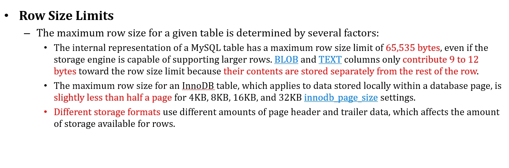
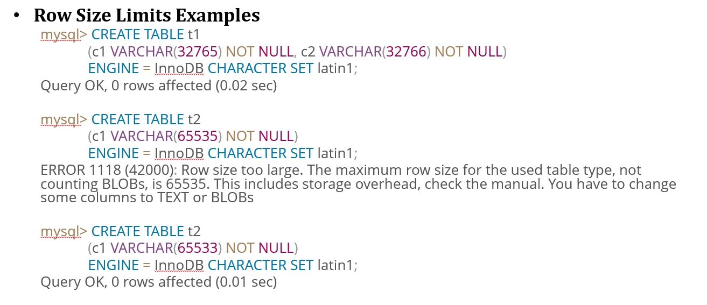
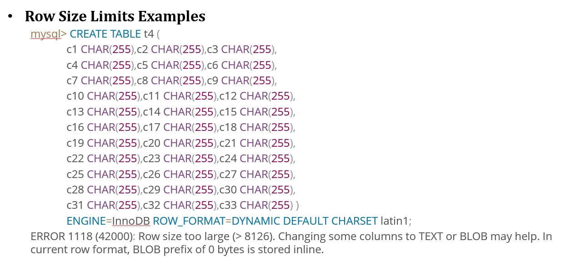
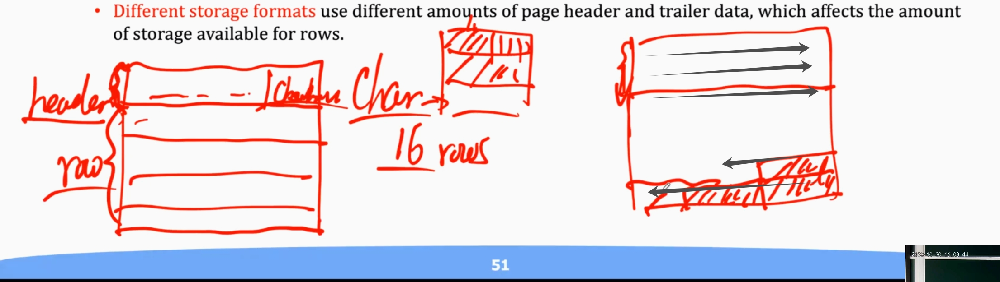

# 第11讲 MySQL优化1

> 没有资格说感性
但最高兴那刻 会现形
常在怀疑着 以后 是重重逆境
所以这样拼
这派对后 难道你知 在哪里有星
明年保了寿命 无法肯定
有力气有憧憬
明年的签证未过 温馨小店
或游人过剩
有风吕 跟暖酒
你就无谓 等雪溶才尽兴
完美在这夜擦肩 难道你可补领
还说下次做更好 谁料这刻是尾声
>——《东京人寿》 容祖儿


## 1. 优化

- 表结构是否合理，范式化？数据类型？
- 拆表？对于一张表中的数据，我们更希望是整张表中的数据全部被访问或者全部不被访问；若不然，就需要考虑拆表。
- varchar（可变长，便于压缩）和char还有text（存储一个指针，执行外部存储的原文）；char(N)占用的字节得看字符集，占用的是字符集中最长的字节数；
- 读取记录的时候，考虑到page的大小有限，如果一条记录的大小就占用了好几个page显然是不合理的，所以特别长的文本需要使用text类型，这样读取出来的text部分就是一个指针，性能更好。
- 什么样的索引科学？
- 什么样的存储引擎好？（注：MySQL其实分为两部分：Server层和存储引擎层，Server层的作用是跟客户端交互，解析SQL，进行查询优化，存储引擎层负责数据的存储和提取）
- 锁、隔离机制？所有的内存用到缓存合适吗？
- 当硬件赶不上业务的时候，该怎么调整服务器性能？
- 列最好直接设置为not null；否则，在存储的时候，在这一列上多占用一个bit，来表示是否为null，这样会浪费空间；同时，SQL在执行的时候还会多执行一句来判断你这一个字段到底是不是空的，浪费时间。解决方案：即使是空的，我也写一个特殊值进去，就不为空了。
- 能选数字就选数字，数字类型少很多字节，而不是选择字符类型，这样性能会更好。
- join的时候要注意：两个表里面的那两个列，首先数据类型最好一致；其次两个列的名称最好也是一致的，不要一个是“student-id”，一个是“student-number”。

下面介绍的优化方式有：
1. 索引
2. 聚簇索引
3. 复合索引
4. 前缀索引
5. Hash索引
6. Row format
7. 全文索引
8. 不常用的数据处理
9. blob优化
10. table_open_cache
11. innodb_page_size


## 2. 索引的建立优缺点

提高select性能最好的办法就是**在经常查询的列上面建立索引**。

索引条目充当指向表行的指针，允许查询快速确定哪些行符合WHERE子句中的条件，并检索这些行的其他列值。

索引尽可能建立在取值为**不为空**（否则请用一个特殊的值填充空值），而且值唯一（或者很少有重复的）列上面。
并不是索引建立的越多越好，不必要的索引建立会浪费时间来决定用什么索引搜索；同时索引本身占据空间！（我每建立一个索引，就相当于用这个key来建立了一棵B+树）
- 如果建立了一堆索引，对于数据更新的时候，索引改变需要调整，那么由于大量的索引建立，导致调整b+ tree需要消耗大量的时间（所以需要管理者权衡考虑！）
- 系统会自动在自增的主键建立索引（是聚簇索引，也即索引在叶子节点的指针指向的位置在磁盘上是连续的），这样最大的好处就是在join操作的时候，可以快速定位到目标。
- 当表格比较小的时候，建立索引很浪费，不如全表扫描。
- 获取要find all的时候，索引也很浪费，本来就是要把整个表数据读取出来，索引失去意义。


选择自增主键做索引的好处：
- 如果表内的某几列都很重要，但是拿不准哪几列做索引的时候，不妨直接使用自增主键
- 自增主键的唯一性由数据库保证，更加可靠
- 同时这个主键作为外键也比较方便
- 因为索引是要把这列复制出来的，因此结构简单的话，生成的索引比较小，同时生成的B+树的效率也比较高

## 3. 聚簇索引

定义：
- **索引的顺序和数据存储的顺序完全一致的索引**叫做聚簇索引。InnoDB中，表数据文件本身就是按B+Tree组织的一个索引结构，聚簇索引一般就是按照每张表的主键构造一颗B+树，同时叶子节点中存放的就是整张表的行记录数据，也将聚集索引的叶子节点称为数据页。

为什么快：
- 索引记录的位置和存储的位置在顺序上是一样的，这样找起来就非常快。例如：某个节点有多个子节点，从第一个节点到最后一个节点排出来顺序是依次递增的时候，这样显然在查找一个范围的时候就非常快，可以按照**顺序来读取磁盘**。反之如果存储的地址顺序是乱的，在查找一个范围的时候就不能一次读取一片区域出来，效率就会变低，要读取多次。

## 4. 复合索引

- 根据多个列建立索引，会有不同列的优先级，比如姓名相同按照年龄排序，年龄相同安装学号排序。因此，**索引的顺序非常重要！**
- 最多16列，有数量限制。

建立三个单独的索引比建立一个复合的索引要浪费空间，B+树的叶子节点存储要索引的值还有一个指向硬盘的位置，而**建立三个单独的索引，就需要三个树**，叶子结点存储的同理，也就是说建立复合索引相对来说更好。而且调整一棵树的速度比调整三棵树的效率显然要快的。

所以复合索引的顺序非常的重要！

## 5. 前缀索引

索引长度一定是越短越好。这样一个block里面能读进来更多的索引项。

假如某些国家的人名非常长，达到了300个字符，在建立索引的时候可以只使用前N个字符；这样可以减少IO操作，单条记录的大小，然后增加每个page能够读取到记录的条目数量。

## 6. Hash索引

首先来看看B-Tree index的特点：
- A B-tree index can be used for column comparisons in expressions that use the =, >, >=, <, <=, or BETWEEN operators. 
- The index also can be used for LIKE comparisons if the argument to LIKE is a constant string that does not start with a wildcard character. 

在内存里面我们使用的是哈希索引；哈希查找只能做单值查找，和范围小于、大于、顺序这种都不行。

通过Hash算法（常见的Hash算法有直接定址法、平方取中法、折叠法、除数取余法、随机数法），将数据库字段数据转换成定长的Hash值，与这条数据的行指针一并存入Hash表的对应位置；如果发生Hash碰撞（两个不同关键字的Hash值相同）可以通过reHash一下，全部重新打乱，增加Hash值的长度，或者通过链表的方式往后面增加。

## 7. Row format

InnoDB存储引擎支持的row format有（默认是`DYNAMIC`）：

- `REDUNDANT`：有冗余，假如varchar(100)，实际写入20个字符，实际存储的时候占用100个字符（前缀索引长度可以达到767）。好处：所有行全部都是等长的，这样可以快速定位到某一行，不需要遍历。
- `COMPACT`：紧凑的，假如varchar(100)，实际写入20个字符，实际存储的时候占用20个字符（前缀索引长度可以达到767）
- `DYNAMIC`：动态的，假如varchar(100)，实际写入20个字符，20个字符都是完全一样的，实际存储的时候不压缩（前缀索引长度可以达到3072）
- `COMPRESSED`：压缩的，假如varchar(100)，实际写入20个字符，20个字符都是完全一样的，实际存储的时候会压缩一下（前缀索引长度可以达到3072）

## 8. 全文索引

参考elasticsearch那一章节。

## 9. 不常用的数据处理

如果一个表格里面的很多查询对于这个表都不包含一些列，怎么办？
- 考虑切开这个表，然后使用join连接，拆两个表，常用的放一个，不常用的放一个。
- 总结：对于一张表中的数据，我们更希望是整张表中的数据全部被访问或者全部不被访问；若不然，就需要考虑拆表。

数据库的block按照列存储，好处就是统计一列的总和，可能效率非常高，缺点是多次插入一个行的时候非常不适合。

## 10. blob优化——巨大的数据不直接存储在表格里

blob：big large object。

是一个二进制数组；不存储在表格里面，表格里面只存指针，通过指针关联到外部存储（比如你有一个巨大的文本，你存储成为varchar，超过一个block了，那你赶紧用blob优化）。

比如，书的简介，你就全部单独放在一个表里面，然后用blob来做优化。

如果要判断两个blob相等，没有必要把两个特别大的blob读取出来，可以通过计算hash值，如果hash不等数值，那肯定不相等。

## 11. table_open_cache

数值越大，可以同时打开的表格的数量就越多，这个cache存储的是打开文件的文件标识符。

- 假如有三个数据库连接，三个连接同时都在操作tableA，那么缓存中就会有三个这样的表，而不是一个表（显然你开的越多，性能是越好的）；（当然redo-undo log还是只有一份，所以不会有并发错误）
- 如果有200个并发的连接，table_open_cache的值应该设置为：200 * N,N就是执行查询的时候join表的最大数量。

1. 这个值并不是越大越好，服务器内存有限，此外到底能同时打开多少个表，还受到操作系统的限制（文件标识符受到限制）
2. 缓存满了怎么办？使用least recently used的方式，就会把这个文件描述符关掉，flush之后再加载其他表进来，也会触发落硬盘的操作！

问题：查看mysql的时候发现系统打开的表格数量好几百为什么呢？

1. 一个是因为系统表，有些执行操作的时候，需要用到系统表，所以打开了。
2. 假如有三个数据库连接，三个连接同时都在操作tableA，那么缓存中就会有三个这样的表，而不是一个表，这样也会增加一些open table数量。
3. 一些sql语句执行的时候，系统在优化之后执行可能会创建一些view或者临时表，因此就会发现打开的表数量很大。

## 12. innodb_page_size

数据库默认按照行存储的，如果存满了一个1 page就把这一页load到内存里面
行的尺寸和页的大小相关，每行的数据的大小应该是innodb_page_size的一半而且必须要小一点，因为有一些元数据在里面，需要占用空间
这就是mysql存储行的最大上限

**规则：一行里面最多放置65535个字节**




那么上图中，第二个插入为什么失败了？
因为一行的大小确实是65535上限，但是我们存储的是varchar，所以还需要存储一个长度，这个长度是2个字节，所以实际上是65533（因为65535十六进制是ffff，所以只能存储65533个字节），所以第三个插入时是成功的。

> In contrast to CHAR,VARCHAR values are stored as a 1-byte or 2-byte length prefix plus data. The length prefix indicates the number of bytes in the value column uses one length byte if values require no more than 255 bytes, two length bytes if values may require more than 255 bytes. ——来自mysql官方




但是插入下面的表是成功的：

```sql
CREATE TABLE t (
    c1 VARCHAR(65530))
    ROW_FORMAT=DYNAMIC DEFAULT CHARSET=lantin1;
```

如何理解60000+的成功了，8000+的失败？

我们在做的时候，innodb的page size是16kb，那么这一行的大小就是比一半稍微小一点，就是8192，这里它告诉我们说不能大于8126；那存varchar的时候，它是这样存的：存前缀，剩下的部分存到其他地方去了。当然如果存的下，就不用一个指针指到外面去了，直接存表里面完事。

所以这也就引出了一个新的问题：**varchar和char各自是如何在表里面存储的**？

首先：CHAR最多到255，VARCHAR可以更大。
然后我们来看结构：



- char：开始一个头header，后面一行一行因为每一行长度是定长的（char是，其他定长的数据类型也是），所以能推算出来长度，直接挨个放
- varchar：这个比较tricky，header从头往后写，varchar从后往前加，直到两个遇上为止