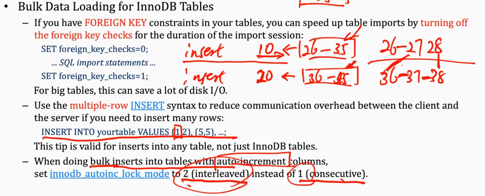

# 第12章 mysql优化2

> 寂寞攀附在等过的门
地板裂缝在时间的河
爱与恨总是一线之隔
这样下去也不是不可
我们 一路停停走走
越来越不知道自己要的是什么
我们我们 谁也不肯承认
捂住了耳朵 听见的笑声 是假的
> ——《可以了》 陈奕迅

## 1. AutoCommit

- 含义为是否自动提交事务。
- 默认的AutoCommit=1，也就是假如建立一个数据库链接，我想数据库发送sql语句，发10条语句，这每一条语句都是会开启一个事务，也就是会说开启了10个事务，这浪费性能，所以最好建议关掉，然后手动声明开启事务，这样就可以提高性能。

## 2. buffer

- buffer_pool：缓冲池，放数据的缓冲池，这个适度增大可以让数据读写硬盘的次数减少
- innodb_change_buffering=all，以便除了插入操作外，还有更新和删除操作都会用到缓冲buffering
- 把大型的事务分成几个小型的事务，不要把一个执行插入特大的大量数据的事务运行，这样会特别消耗性能。
- READ_ONLY事务：在只读事务里面出现write就会报错；只读的事务效率就会变高，数据load到buffer里；但是问题在于，别人如果改写了数据，就会出现不同步的问题；对于这种事务，如果我们希望它长期执行，可能的解决方案是提交之前刷新一下数据。

## 3. Optimize

每隔一段时间，将表在硬盘上连续分布，重建，数据和索引都发生改变，类似windows磁盘碎片整理的感觉。
整个索引在这个过程中也是会变的。

```sql
OPTIMIZE TABLE table_name;
```

## 4. 数据的导入导出加载

批量导入如何加快性能？
- 导入数据（导入本质就是很多insert）时，可以关闭自动提交（不然一句话一个事务很低效），还有例如UNIQUE检查（每次插入一条，和以前的比较是不是unique）、外键检查（导入订单表，关联了另外一张表book，那个表里面有没有这本书？没有就是错误的！）等；可以使用多行INSERT。当然因为关闭了这些检查，因此出错还是有可能的。

## 5. 自增模式

when doing bulk inserts into tables with auto-increment columns:
- set innodb autoinc lock mode to 2(interleaved) instead of 1(consecutive)

（不一定是主键自增，每一列都可以设置为自增的）

假设说有两个线程都在执行insert，第一个线程插入10条，第二个线程插入20条；假设说现在数据库里面key现在最大是25，那我就直接分配一批26-35给thread1，36-55分配给thread2。这就是interleaved（交错）。整体性能就会提高。



## 6. 优化磁盘IO

- buffer_pool的大小开的太小的话，频繁落盘；开的太大的话，对内存占用变多，同时脏页也会变多
- 多个线程负责buffer的落盘（当buffer中脏页达到了一定比例时，会触发落盘）

## 7. other tricks

- newly read blocks are inserted into the middle of lru list，这样只用一次的数据能更快的被替换出去
- 把表删成空表用TRUNCATE TABLE快
- 10G才是16 * 128M的整数倍


- 实例最多开64个；最少开1G的内存（上面就开了16个实例）