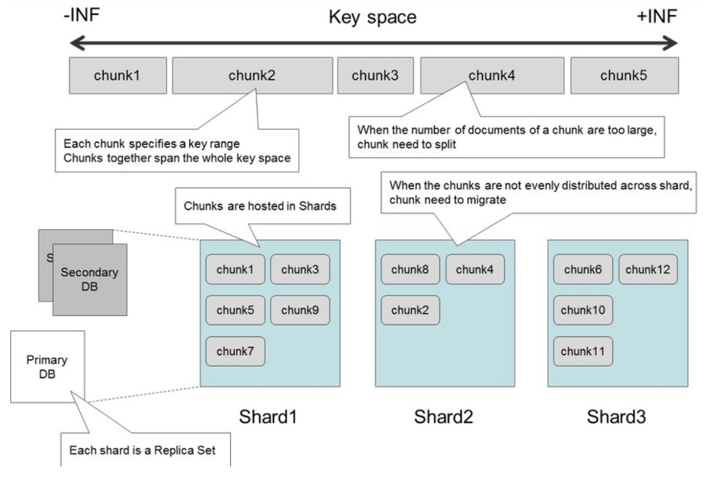

# 第15讲 MongoDB

2023.12.21 冬至前夕

> 差不多冬至一早一晚还是有雨
当初的坚持现已令你很怀疑
很怀疑 你最尾等到 只有这枯枝
苦恋几多次悉心栽种 全力灌注
所得竟不如别个后辈 收成时
这一次 你真的很介意
但见旁人谈情何引诱
问到何时葡萄先熟透
你要静候 再静候
就算失收始终要守
> ——《葡萄成熟时》 陈奕迅

## 1. NoSQL

- Big Data: NoSQL
  - 只要数据分布式存储，需要增加可靠性，就需要副本replication
  - 分布式存储，使用关系型行不行？我们在分区的时候讲到了，如果一张表数据量很大，我就要拆，然后这种操作可能又需要加锁。
  
NoSQL是指**Not Only** SQL。

举例：
- **Neo4j**：存储的是图数据，图数据库比较适合查找一个节点附近的相关的节点，比如查找距离为2（条边）的节点；（如果用SQL的话，就需要连两次表，效率比较低）
- **Influxdb**：存储时序数据，比如有一个温度传感器，他就会根据传感器数据进行记录。数据非常简单由时间戳和数据组成；

MongoDB数据的结构化程度不太好，在SQL的数据里面可以画出二维的表格；当数据结构性不好的时候，就需要MongoDB类似的非结构化数据库。

## 2. DAO和Repository差异

- 一般来说，一个Repository对应的一个类型的数据库里面的一个表
- **DAO的任务是需要屏蔽不同数据库差异，让服务层的眼里只有一个一个的对象**。比如对于“用户”，用户的头像可能存在MongoDB，其他的用户名邮箱存在SQL里面，DAO就要完成组装。

## 3. MongoDB

### 3.1 基本概念
- document：文档，MongoDB的基本单元，类似于关系型数据库的一行
- collection：集合，类似于关系型数据库的一张表
- database：数据库，类似于关系型数据库的一个数据库

所有的内容都是json的对象，key-value对。

特点：
- 支持Map Reduce
- collection是模式自由（schema free）的
- 权限控制（就不同的人可以访问不同的数据库），每个数据库存储在单独的文件
- 支持地理空间索引

> 这个一个 collection 里面可以放不同的document，它是 schema free 的，那是不是理论上我所有的数据扔到一个 collection ？当然是可以的，我们在关键数据库里为什么会有不同的表？那是因为不同的表有不同的结构，你往里面放的那记录去表示人和表示这个订单的或者书的数据，它就在不同的表里，它们的结构是不一样的，所以你把它拆开了。但是你这边是说document，也就是行，可以有不同的字段，那理论上确实可以把所有数据放到一个collection里面。
所以这个问题不是这么显然的，就在关系型数据库里，你可能觉得这很正常，但是在非关系数据库，就**像 MongoDB 这样的，他约束这么松的话，你为什么还需要多个表**？
> - Keeping different kinds of documents in the same collection can be a nightmare for developers and admins
> - It is much faster to get a list of collections than to extract a list of the types in a collection.
> - Grouping documents of the same kind together in the same collection allows for data locality.
> - We begin to impose some structure on our documents when we create indexes.

### 3.2 Auto Sharding 自动分片

- Sharding指的是分片，MongoDB支持自动分片；假如一个collection比较大，他就会把collection切成几个shard，shard其实还有更小的单位就是chunk，把这些chunk分布到多台机器上面存储
- 此外MongoDB会自动保证不同的机器之间，chunk的数量差异小于等于2
- 分区之后，还有一些配置的元数据需要记录，在config配置服务器存储，它相当于一个路由器，针对访问的请求结合元数据，把请求转发到对应的分片存储的数据服务器来获得结果
- 这样的好处就是存储的压力比较平衡，当然也支持人工的管理，因为有时候数据的冷热有差别，数据访问的频率有差别，这种情况就会手动分片，把一些经常访问的数据均衡放置，因此这种情况下，可能某一台机器存储的大小比较大，不同机器之间chunk数量的差距可能超过了2（为什么有时候也需要人工管理sharding分片）

### 3.3 shard的依据

需要选择一列，作为一个key，这个key就叫做shard key
- 例如A-F开头学生姓名作为一个分片
- 例如G-P开头学生姓名作为一个分片
- 例如Q-Z开头学生姓名作为一个分片

### 3.4 什么时候sharding

通常情况下默认不会是sharding的
- 当前计算机上的磁盘空间已用完。
- 希望写入数据的速度快于单个mongodb所能处理的速度。（比如大量的传感器往数据库1s可能要写入1GB的数据，如果来不及写，就需要多个MongoDB来写入）
- 希望在内存中保留更大比例的数据以提高性能，分布式缓存

### 3.5 超容量处理
如下图所示：

- 假设开始的时候分片，每个chunk代表的是某一个范围的数据，chunk就会被分布式的存储在shard服务器里面。
- 当往一个chunk里面不断插入数据的时候，这个chunk可能就会分裂，分裂成多个chunk。
- 考虑到前面所说的不同的shard服务器之间chunk的数量差异不能超过2个，那么一旦分裂之后数量违反了这个规定，MongoDB就会自动的调整chunk在服务器之间的位置，保证均衡。