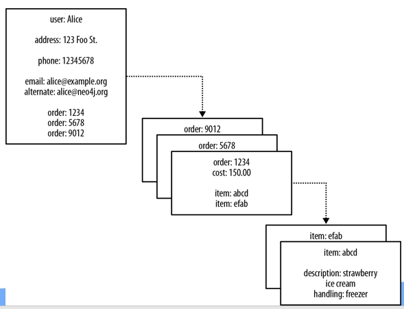
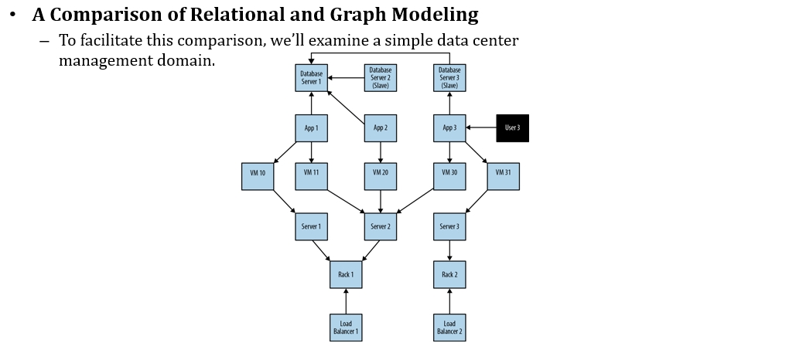
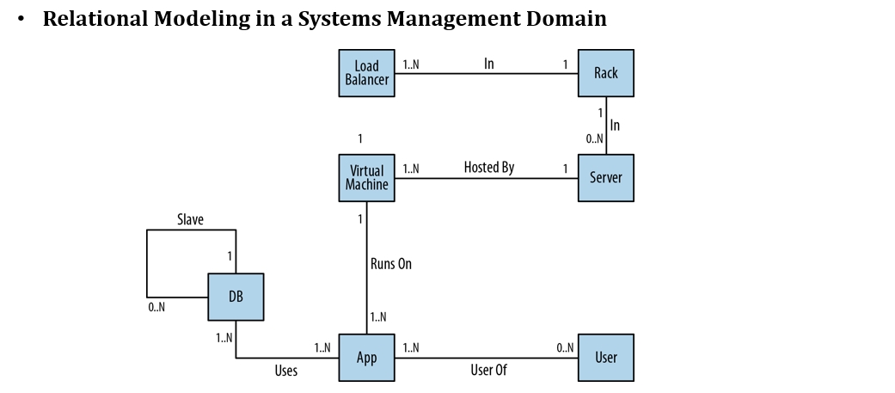
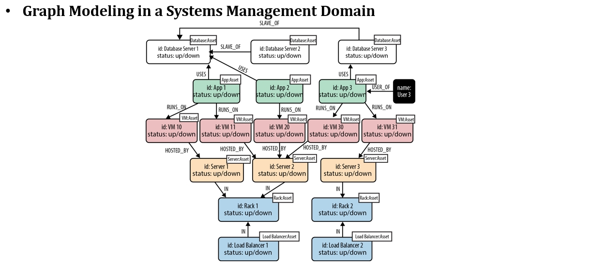
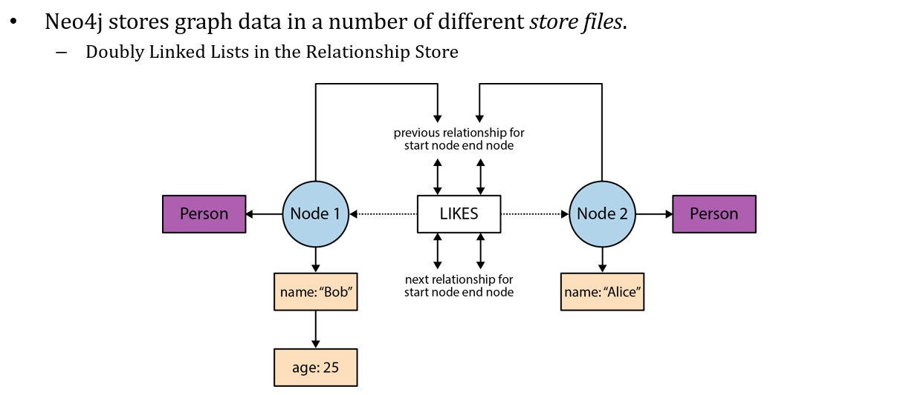
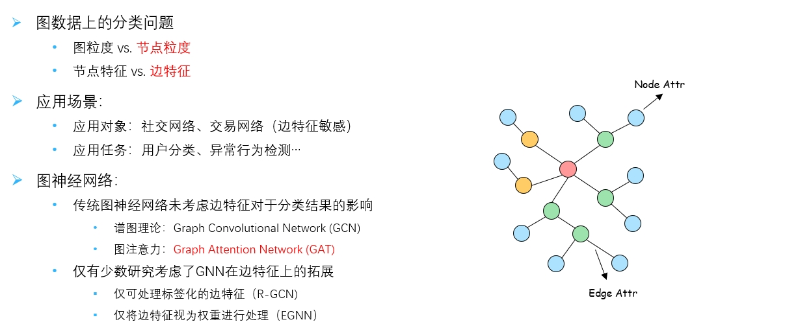

# 第16讲 图数据库

2023.12.23

> 雨点不清楚 你已抛低我
仍共疾风东奔西走地找你
仿佛不知不再会有结果
你永不清楚 你那天经过
留下万千追忆一生封锁我
今天可否会想起我
> ——《蓝雨》 张学友

## 1. 基本概念

图数据库是啥？它就是用一种特定的方法去存储图数据，就不再是我们在关系型数据库里看到的这样的一张一张的表，然后表和表之间有外键的关联，也不是 MongoDB里边说它是一个的 JSON 文档。它既能表示一种节点和边的拓扑，然后它又能够在上面做一些特定的搜索。所以它提供的这种搜索引擎跟我们前面看到的是不一样的，它也提供了一种查询语言，它就不叫SQL，它名字叫做Cypher。

说穿了，它就在解决关系型数据库，必须要建立在结构化非常良好的这种数据上，因而通过外界关联去找数据或者存储数据的这样一个方式——由于这种“关系”太强，导致不能直接表达数据的自然结构，这就是图数据库想要解决的问题。

### 1.1 Pros 优点

**使用图数据库的理由**：
- 比如存储一个好友的关系，如果用mysql存储的话，在查找一个人好友的好友的好友需要经过多次join连接操作（要先做笛卡尔积，然后根据某个条件进行进一步筛选），这种在复杂的查询的情况下，mysql的查询的效率就非常低。
- 但是用图数据库，就可以直接用一个图来存储好友的关系，根据图找到一个用户的关系网，代价比mysql低得多，适合距离在一定范围的好友，非常时候做用户推荐。

即便是MongoDB那样的文档型数据库，在那种关系比较复杂的关系存储的时候，查询的代价也会非常大。比如**查询谁买的东西有哪些很容易，但是反过来查询就很困难**。在关系型数据库里面这个地方是要有一个外键关联的，而在 Mongo DB 里面这其实只是存了他的ID，那你说这个 1234 在这个里面能不能具体找到？他不做这个强制性的约束，或者说mongoDB不去做这个检查，那所以就是看起来它比较简单了，那就是说我没有这个 join 这个动作，我搜出来这些之后到 order 里面去遍历，不需要做笛卡尔积，但遍历这件事情开销还是不小的。



所以选择图数据就很好。

### 1.2 使用图进行数据建模



比如说有一个互联网的公司，然后我对里面所有的资产做了一个描述。用户会去用我们开发的APP，这些 APP 会用到一些数据库服务器，数据库服务器他们互相之间还是主从备份。
这些应用它是要跑在一些虚拟机里，这些虚拟机会运行在一些物理机上，然后这个机架它上面就会有一个 load balance，就在做负载均衡，要把这个机架上所有的服务器的压力要给它均衡。然后这时候有一个人上来说他去用了这个APP3，然后他发现出了问题，能不能把所有可能出故障的资产找出？

使用图数据库建模，理论上一个 user 经过 5 跳，它能到达的这些节点就是你这张图里有可能包含的所有出错的节点。





```cypher
MATCH (user:User)-[*1..5]-(asset:Asset)
WHERE user.name = 'User 3' AND asset.status = 'down' RETURN DISTINCT asset 
```

上面的语句实际上就能找出下面的关系：

```cypher
(user)-[:USER_OF]->(app)
(user)-[:USER_OF]->(app)-[:USES]->(database) 
(user)-[:USER_OF]->(app)-[:USES]->(database)-[:SLAVE_OF]->(another-database) 
(user)-[:USER_OF]->(app)-[:RUNS_ON]->(vm) 
(user)-[:USER_OF]->(app)-[:RUNS_ON]->(vm)-[:HOSTED_BY]->(server) 
(user)-[:USER_OF]->(app)-[:RUNS_ON]->(vm)-[:HOSTED_BY]->(server)-[:IN]->(rack) 
(user)-[:USER_OF]->(app)-[:RUNS_ON]->(vm)-[:HOSTED_BY]->(server)-[:IN]->
        (rack) <-[:IN]-(load-balancer) 
```

## 2. 运行

- 运行可以以单独运行，就像我们的数据库单独作为一个进程跑；
- 运行也可以用嵌入，也就是说比如和Tomcat服务器嵌入，一起作为一个进程运行；
- 运行也可以集群化部署，会重复的存储一些边缘的节点（因而把子图拼接起来的时候，边缘能够重新连接起来）。每个机器存储图的一个部分，然后最终构成一个完整的大图。

## 3. 存储原理

节点和边是分开存储的：
- 节点的存储占用15byte：第一个位是一个标志位，是否有关联的边是否正在使用，然后（偏移量1）是存储下一个边的ID关系，然后存储下一个属性的id，然后存储labels，最后存储其他的内容
- 边的存储占用34byte，第一个位是一个标志位，存储是否正在使用；之后存储这个关系的起始节点是谁，终止节点是谁、关系的类型；然后存储第一个节点（边的起始节点）的前一个关系是谁，后一个关系是谁，第二个节点的前一个关系是谁，后一个关系是谁，后面就是保留字段
- 是通过链表连起来的



## 4. 图计算概论

