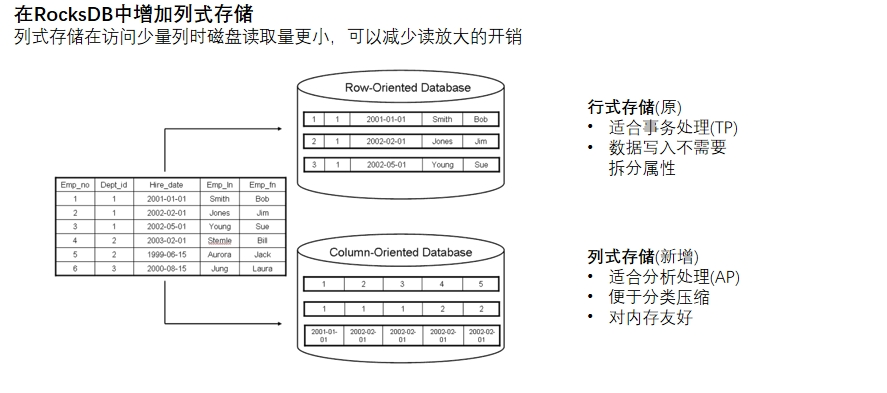
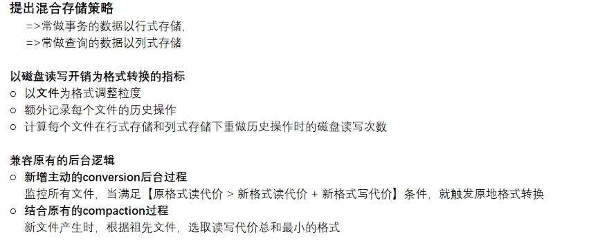
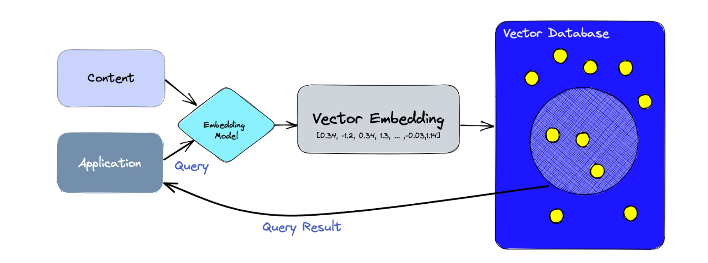

# 第17讲 Log Structured Database & Vector Database

2023.12.21

> 嫌弃你想再会 被丢低想反悔
> 谁叫我要靠别人待薄才配
> 熟悉的想讲再会 陌生的都很匹配
> 难怪我永远怀念飞灰
> 如果一呼气一吸气代表相爱
> 或者淹死我 会更发现你存在
> ——《黑夜不再来》 陈奕迅

## 1. 作业讲评

### 1.1 Redis

第一个问题就是， Redis，我看了大家都做了有增删改查的 4 个动作，你都做，那为什么会去做呢？因为你考虑到我在下订单的时候，我会去把这个 book 的它的库存给改一下。那从这个角度去说，我们上课就讲了啥样的数据应该放到Redis，如果你频繁的去改在 Redis 里一个东西，那你还不如不要用它，因为你用它的话，你的前提就是我要先改Redis，再去改数据库，或者先改数据库，再改Redis，那我性能肯定不如我，压根就不放到里面，我就直接就到数据库里去改就算了，因为反正你每一次都要改数据库，为什么要额外多出这一个动作了？那你说放在 Redis 里是什么呢？我们说应该大量的是只读的数据，你修改的次数是很少的。那么从这个意义上来说，如果真想把 book 放进去，那么这个数据它不应该在 book 这张表里，你的 book 里面应该放的是有关它的，不会去修改的。

就我们说的一些静态数据，它所有的动态数据就像我们看到的stock，或者它有一些书评，这些东西反正会根据它的还有这个价格，或者根据它的这个，不同的时候，它**会变化的这些东西就我们可以管它叫一个动态的，那它应该在另外一张表里，然后两个表之间做一个外键的关联**，然后你把静态的东西放进去，它应该是只读的，它不应该是经常写的，如果经常写的东西放到 Redis 里一定不合理。

Redis 和你的数据库里头，你要把它们是同步的，那怎么做？绝大多数同学就说那我先去改写Redis，再去改写数据库，然后就结束了。
那如果是这样做，那你会看到这样一个问题，就是首先这两个改写的动作它肯定要在一个 **transaction** 里，就是你要保证他一个成功了，另外一个也得成功，否则你状态就不一致了。那么在 transaction 里面问题就又出来了， transaction 到底在管理啥？那我上课时候说过，他要管理的是那种资源性的，这种管理器能够管的东西包括数据库，邮件服务器、 GMS 服务器，那么你这个东西在内存里行不行？那你就要考虑了，你即使用了transaction，你也可能这个 Redis 里的这种事物的这种处理需要你去自己去处理的，要去写的，那就是说在事务开始之前，你要先去记住 Redis 状态结束之后，把它之前的状态就更新掉了，**如果没有成功回滚，你要把之前状态要恢复出来**，这是要自己去做的，这是一个问题，就是你必须要保证在一个事物里去执行。

### 1.2 Web Socket

Web SOCKET 很多同学写的代码是对的，就是我在这个时刻才建立连接，当拿到这个结束的这个结果之后，这个 Web SOCKET 我就给它断掉，就这样的话不会让服务器端一直维护着大量的 Web SOCKET，就是把它断掉。嗯，先说就是在目前大家写的这个例子里面，这么做是可以的，但是你仔细去想一下，**建立 Web SOCKET 是需要双方要握手，是有一个开销的**。那如果你这个消息推送实际上是非常的频繁，而且不是说像这种应答式的这种方式，那么你这种实现就有点问题，你看你的实现是啥？是说我要发订单的时候，我 Web SOCKET 去跟服务器端接一下，通了等我，当我得到消息之后，我就把它断掉。

那你说你是不是失去了 Web SOCKET 的一半的功能？ Web SOCKET 我们当时讲是说在你客户端不发任何请求的时候，我也可以把数据推给你，你收到了你就断掉了，那我想给你推出，我怎么推？所以你貌似很正确，就是说我节约资源嘛，所以我收到之后我就把它关掉了。

那我只能说在这一个请求里面，在这个下订单
请求里面，也许看起来是合理的，但实际上你就没有用到 Web socket 的它的一个本质的一个特点。那你如果只是这样 HTTP 就可以了，因为你看整个的流程是你客户端发起，最后关掉。你本来是说我要在服务器端，在你没有客户端，没有发起任何请求的时候，我服务器端就能推一个来，那像这种设计里面你是实现不了的。所以**在绝大多数的情况下，你做 Websocket 的时候，你不应该把它给断掉**，否则的话你就用 HTTP 行了。所以**Web SOCKET 的本质上是说我要全双工，所谓全双工就是说你给我主动发也行，我给你主动发也行，你把它关掉就不存在主动发了**。那你说我们上课举的例子是说你要看这个股票，比如说啊，有个走势，那这个走势数据是服务器端不断的往客户端推的，你都把它给关掉了，我怎么推给你？所以就是说你有些东西你要反复思考一下，就是关掉，貌似节约了资源，但实际上那你就不要用 Web SOCKET 了，你就直接 HTTP 就行了。

## 2. Log Structured Database

### 2.1 LSM-Tree

- 是一种分层、有序、面向磁盘的数据结构，其核心思想是充分利用磁盘批量顺序写性能远高于随机写性能的特点。

**Log**：
- Log以Append的模式追加写入，不存在删除和修改
- 这种结构虽然大大提升了数据的写入能力，却是以牺牲部分读取性能为代价，故此这种结构通常适合于写多读少的场景

**优点**
- 大幅度提高插入（修改、删除）性能
- 空间放大率降低
- 访问新数据更快，适合时序、实时存储
- 数据热度分布和level相关；显然读新数据会更快

> 那你说它适合于什么场景？双 11 就是一个非常典型的场景，就是订单。但是订单里面我们看你又有两种分类。
> 第一个你在双十一那天不断的下单，这就是一个所谓的**OLTP（online transaction processing，在线事务处理）**，OLTP 本质上是什么呢？你在按行操作，我是在不断的插记录插这个订单进去。新插入的行就在上层，老的就在下面。
> 但还有一种情况是我想统计一下我双 11 总共卖了多少钱，所谓的**OLAP（online analytical processing，在线分析处理）**。那这个是在做分析，那它和上面的区别是什么呢？就是我是冲着一列去的，就是你这个表里面订单里面你有很多的字段，其中有一个字段可能是最后这个总价，其实我就是要把所有的字段的这一个列拿出来去做了个sum，我就知道今天卖了多少钱，我只关心这一列的所有的值，我并不关心这一行里面其他的值。
> 正常的数据库我们看到的都是按行去存储，那他对这个 OLTP 就是我插入一行，删除一行。但是对这个 ORAP 就不太友好，我要定位到每一行，还得定位到我要找的那一列，其实我读了很多根本就没有意义的这个列出来了。解决方法是数据不能按行存，要按列存。
> 但是你可能按行存和按列存都需要，因为你既有事务性的操作，也有分析类型的操作，这时候就是出现了一个问题，就是我们这是个混合类型的负载，我要求你能不能对混合类型的负载做支撑，就是既是在线事务处理，又能做在线分析。
> 我们来看一下两边：
> - **在线分析处理**：对列操作，而且一般是对大量订单的列操作，需要读大量数据。只有管理员做这种操作，高延迟、低并发，大量数据。
> - **在线事务处理**：对一行操作，大量做插入一行，删除一行，读取一行的这种操作。大量客户产生订单，要求高并发，低延迟，订单本身数据量是小的。
>
> **解决方案**
> 1. 干脆我让每一张表有这两种存储，然后你来了请求之后，我分析一下那个请求应该是在这一边还是在这一边，这样不挺好吗？缺陷是保持数据一致性，额外开销。
> 2. 就一种存储，但是我会去分析一下你这些操作的特性，我看他们在数据上做什么操作，我在两个存储之间切换，并且我也不是说所有的数据都要做，比如说 0- 1000 我按列存储， 1001- 2000 我按行存，这就是你看到的现在的数据库里面它都有这样的技术。

**缺点**
- 牺牲了读性能（一次可能访问多个层）
- 读、写放大率提升

### 2.2 SSTable(Sorted String Table)

**SSTable的特点**
- 存储的是<键,值>格式的字节数据 
- 字节数据的长度随意，没有限制 
- 数据顺序写入
- 键可以重复，键值对不需要对齐 
- 随机读取操作非常高效 

**SSTable的限制**
- 一旦SSTable写入硬盘后，就是不可变的，因为插入或者删除需要对SSTable文件进行大量的I/O操作 
- 不适合随机读取和写入，因为效率很低，原因同上一条

### 2.3 写阻塞问题

写入的时候可能有个阻塞问题，为啥？因为它写入的时候它有可能需要去做这个合并，比如 L0 层满了之后，它要往 L1 层去落，那么我刚才讲了一个极端情况是 L1 层你落下来之后也满了，又要往 L2 层落，以此类推，每一层可能都会满。
碰到这种情况怎么办？他就说这样在做 compaction 的时候，把内存里的落下来这个动作直接做了以后，如果触发了从 L 0 到 L1 层的这个动作，就转移到后台去做异步的写入硬盘就不要在前台，就是说它只要落下来马上就给用，就可以去变成一个可写的一个内存表，马上就可以接收新的请求进去，后面就放到这里面，这就所谓的写阻塞，就是说你在写的过程当中就很容易不断的往下落，然后就看到这个放大就很严重，就这一次其操作其实执行了很多写的动作，然后还有可能成为这个瓶颈，这样就**阻碍了这个事物的处理的可用性**。

### 2.4 读放大问题

那读呢？是存在这么一个问题，就是我在找一个数据的时候，我先到内存表里；找不到，我再到这个 L0 层找，找不到我也不能说这数据不存在，有可能它太老，它落到底下去了，于是我一层层找，极有可能就是最后你在很找了很多层你才找到。而且你在不同的层里面可能还存着不同的版本。因为我们刚才说了，它的改写是通过追加得到的，那也就是说你如果有老版本的话，它会在更低的层里面，如果没有经过compaction，这个数据还是在的，只有 compact 才有一次机会可能把它给删掉。**限制了AP查询的性能**。

**解决方案**

## 3. Vector Database：Pinecone

我会有一个，比如说训练的样本，我给了这个一个 embedding 的模型， embedding 的 model 就是刚才我们看到的一张图，本来是 200 * 300 再乘以 3 这样的数据构成的，那它是怎么变成这个模型的输入呢？我是把它全部拆开来变成一维的，那这个模型的作用就是在把它产生对这个神经网络的这个输入，他要做这样的一个事情。
那这个不一定像我刚才说这么简单，我就直接把它拆开了。比如说我还可以做一个你，你是这个颜色 RGB 是 0 到 255 的吗？那我也可以把它多放一些，缩到 0 到 1 之间，就还可以做一些预处理。那我还可以说我是不是在里面做一些差值，或者说我过滤一下，反正就是总的来说你会有这么一个模型，就产生了这个 content 的一个向量的一个表达方式，然后它就在数据库里存储的时候，向量就是 n 维空间，它你就可以想象为是在 n 维空间里面实际上就是一个点。然后当你的应用来了之后，你会查给他一个query，这个 query 就会在这个数据库里面，这个 n 维的向量空间里面去找最相似的。比如说你这一个 query 表达的那个概念就是在这里的，像刚才我输入的 0.10.20.3 就是在这里面的某一个点，那他就会在一定范围内按照你的要求，比如说TOP50，他去找出来离他最近的。相似度的计算方式允许你自己设定。

> 找一个最接近你描述的这个场景出来，或者你说我在设计一个下棋的这样一个模型，当你下了一步棋之后，我用一个向量去表示当前的棋盘，我就在我收集到的所有的棋谱里面去找跟它最接近的那一个棋，然后我就知道该怎么下，因为那个棋盘它也是按时序的，第一步谁第二步谁放到一起，我就到里面去找所有的棋盘里面所有的步数下完以后的样子，看他跟谁最接近，然后看那个棋盘里面要想赢下一步应该在哪里下，我就下那一步棋。