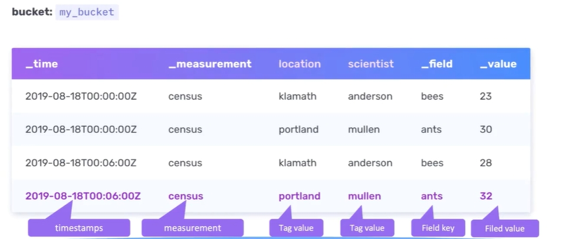
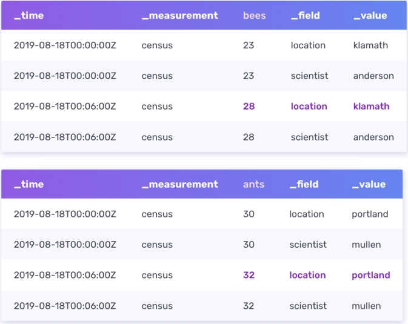
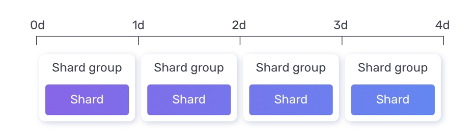

# 第18讲 influxDB 时序数据库

2023.12.21

> 看我脸上的苍白 看到记忆慢下来
> 过去甜蜜在倒带 只是感觉已经不在
> 过去你给的期待 被我一次次摔坏
> 已经碎成太多块 要怎么拼凑跟重来
> ——《倒带》 周杰伦

## 1. 概念
时间序列数据库（TSDB）是针对时间戳或时间序列数据而优化的数据库。

> 时序数据：比如说一个地图，我这是一个，比如说一个花园，我在里面布了很多的传感器，这些传感器就是它的温度和湿度，我来做这个自动浇灌，然后他们就会源源不断的产生数据，我要把它存起来，那可以看到它们源源不断产生数据，于是我们看到这数据有几个特征。
>- 第一个：这个数据只要你往上发，它一定**带一个时间戳**，我要知道你这个数据是什么时间发上来？这是第一个问题。
>- 第二个：你一定会有大量的这种传感器在传数据，所以它必须要支持这种**高并发**，就**吞吐量要大**，这种吞吐量必须要大才能支持高并发。
>- 第三个：你说传感器如果他在报数据，他偶尔丢掉一两个或者一两个不太准，它会不会影响你的这个数据整体的效果？
>就是他如果说每一秒钟都报一个数据，在某一秒他突然丢了一个数据，它会不会影响你做统计的效果？就理论上来说，它里面的**数据允许少量的不准确或者是缺失**，也就是说它的数据和那种 transaction 的数据就形成了鲜明的对比。
>- 第四个：就是其实我们**对单点的数据是不感兴趣**的，你说我要知道某一个时间点，这里面每一秒都要发数据，我要知道在某一秒的数据，这个肯定你不太关心，你关心的是**一个时间区间内**，比如说在一小时内它的数据什么样的，我要去求和。所以在持续数据库里，他对单点数据的访问不会特别多，他经常做的是对一块数据，尤其是时间片划分出来的一段数据，他要去做一个访问。

1. 整体的存放是用了类似lsm日志结构合并树的结构；时序数据库的生命周期一般比较短，比如一个传感器，可能我们只关心最近一周的或者一个月的数据，超过的时间的数据就可以删除（比如当掉到L0以下，我们就将其压缩，甚至删除）。（类比关系型数据库的订单数据，订单数据必须要持久化保存，但是这种时序数据库可以**通过摘要压缩一下，或者直接删掉**）
2. 不太可能会建立索引，例如记录温度随时间的变化，一般不会有必要建立索引（比如建个温度在时间的索引，这没有意义）
3. 对于时序数据库接受的数据的特点：更多的数据点，更多的数据源，更多的监控，更多的控制

> **Telegraf & InfluxDB**
> InfluxDB是数据库；Telegraf是数据采集器，可以采集各种各样的数据，然后把数据写入到InfluxDB里面去。

## 2. 优化

- 可以不记录时间戳：如果传输来的数据比较稳定的话，例如每秒1个数据，我可以记录某一个特定数据（比如开始的数据的时间戳）然后后面每秒记录一个数据就好。
- 可以记录数据的增量：比如记录温度，变化比较小。我就记录相比上一个数据增加或者减少了多少度。这样存储的数据的空间得以节省了，所以可以存更多的数据。

## 3. InfluxDB

### 3.1 基本概念

- Bucket就是类似于关系型数据库中“表”的概念；没有库的概念，因为不像关系型数据库中有外键关联的概念。
- 带有_开头的，都是系统保留的字段，也就是一定会有的一个列，反之都是用户自定义的字段。
- _time：时间戳，数据对应的时间，因为可能同一个时间会接收到很多数据，所以很可能同一个时间接收到很多数据，所以时间戳不能唯一的标识。时间戳非常准确，精确到纳秒级别。
- _measurement：起一个名字，一个统称，这个表格在干啥。census就是调查种群数量。这里我们发现它是共享的，所以存储的时候会优化，只存储一次。
- _field：存储的是key，比如下表里面存储的就是某个物种的名字；和_value构成键值对。Field可以作为筛选的依据，得到一个Field Set。
- _value：存储的是value，类型可以是strings, floats, integers, or booleans，之所以不能是别的，是因为如果是复杂的数据类型转换会耽误时间，效率降低，所以就只能存这些基础的数据类型。

### 3.2 Schema优化

上图中，location和scientist都是tag，_field和_value都是field。
- **Fields不参与索引**，必须扫描全表；如果经常被访问，不适合以这种形式存储，就应该以tag的形式存储。
- **Tags参与索引**，当然查询起来就会更快。当然索引本身是有开销的，并且如果你进行写操作，索引也会更新，带来更多开销。

If our sample census data grew to millions of rows, to optimize your query, you could rearrange your schema so the fields (bees and ants) becomes tags and the tags (location and scientist) become fields:

influx的数据都是以append的方式往里加（类比lsm，但是实际上叫做时间序列合并树）。

### 3.3 influx中的其他基本概念

- Series：measurement, tag set, 和field key都相同的点集合。
- Point：一个数据点，带有时间戳的数据点。
E.x. `2019-08-18T00:00:00Z census ants 30 portland mullen`
- Bucket：存储桶，归属于一个组织，存储相对应的数据点集合。
- Organization：组织，里面有一组用户，里面有若干个bucket。

### 3.4 InfluxDB设计原则：何以支持时序数据？

- **严格按照时间组织**，按照时间顺序递增追加append，不会出现说我突然插入一个以前的时间戳
- **严格限制update和delete**。首先本来就是传感器送过来的数据，你改它干吗？而且，你明明一直在追加，你说我往里面去改写，那它就不是顺序读了，它要做一次随机读，它效率就降低了。改一下有可能尺寸会发生变化，要么留下空洞，要么它存不下后面东西所有都要往后挪，所以它就严格限制你不能这么做。所以他认为时序数据主要就是新数据，他们是从来不会发生变更的。
- **数据的读写优先**。你说这个是什么意思？你数据库里就是读和写，然后你说他们优先，那还有啥东西？就是我们的数据库 InfluxDB，那它也许会是分布式处存储的，那它可能一主两从，那你这些中间是不是就会有同步的问题？这是一个动作，这是他内部要去实现的，但是他就告诉你，如果你现在有这个读和写，就指的是用户发送过来的读和写的要求的话，必须优先处理，哪怕你没同步好也要处理。它实现的是最终一致性，而不是实时一致性。因为它认为系统的实时性比较重要——开始我们讲过了，我们是允许时序数据中一些小小的错误的。
- **幂等性**。应用场景里面就是大量的传感器，会把大量的数据通过不可靠的或者不那么可靠的网络传递过来，那我就不能保证它没有被发送多次，但是它发送多次它也不能对我的数据库产生影响，我只存一个（根据时间戳）。比如除了value之外的部分数据都是相同的，这样的数据提交了三次，不会像mysql一样插入三行相同的数据，InluxDB会用最新的一个数据存储。
- **没有传统意义上的id**。因为数据集比单个点更重要，所以InfluxDB实现了强大的工具来聚合数据和处理大型数据集。点通过时间戳和序列来区分，因此没有传统意义上的ID。

### 3.5 Storage Engine 存储引擎

整体是TSM（Time Structured Merge Tree）结构，类似于LSM的结构。

落到比较下面的层就按照列压缩。为什么按照列存？我们关心的是给定时间段内列的value，按照列存，这些讯息就可以连续存储了。

### 3.6 Shard 

数据量大了，mongoDB中就是把数据压成很多shard，neo4j也是。时序数据库是最简单的线性表，因为并不存在什么诡异的外键关联这种，直接切就完事了。

1 个 bucket 可以分成若干个 shard group，这个 shard group 里面又分成若干个shard。意义？首先是我们可以做分布式存储。还有，类比我们在关系型数据库里看到那个partition，就是我如果要查某一天的数据，你不用去做全表扫描，或者建一个全表的索引去做处理，我就定位到这个 shard group里去查找。如果跨越几天，我就查符合的两个三个shard group。

