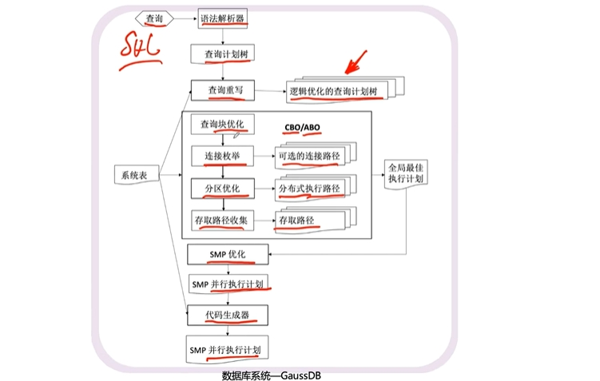
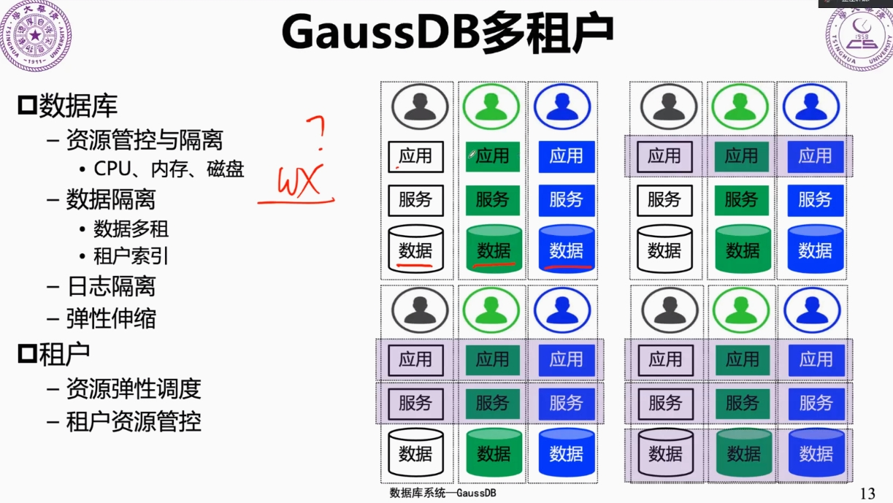

# 第19讲 GaussDB

2023.11.20-11.22

> 若是我记得你 亦是无须紧记
习惯一个人没有伤悲
而无论旧时说爱多美
再过半天你便记不起
> 若是我要等你 亦是无须等你
遗留下这个世界向着前飞
纵爱理不理纵隔千里
谁预知将来或再一起再恋上你
> ——《一个人飞》 李克勤

## 1. 课前review：MongoDB什么时候使用？

为什么我们需要mongoDB？这个一定要从它是**schema free**的这一点来出发。

三星和苹果的手机，就它俩的属性不完全一样，也就是说大家是 schema free 的，就你有你的属性，我有我的属性，在这种情况下，那我把它存到一起都在这个 mobile 这个 collection 里。

你如果用三星里面它特有的，比如说它价格比较便宜，用它特有的价格去搜索，尽管 apple 里面没有 price 这一个属性，你这个搜索的语句一定能搜出来符合要求的东西。所以你是在 schema free 的这样一个数据库上去存了大家不一样的数据，然后我的搜索还可以按照不一样的属性去给它找出来，不是说大家都要有相同的这个属性，所以这个场合才是mongoDB很有用的地方。

还有什么是 schema free 的？其实有一个东西是，就是如果我对书有一些评论。那是不是就是树形的？就是说这本书还有一个评论，它还可以有跟帖，它的跟帖还可以有跟帖，它的跟帖可能有好几个，跟帖的跟帖也可以继续下去。然后另外一本书它也有，但是它到底有几层？然后每一层的跟帖有多少个？这是不一定了。

就大家这个是没有什么说，大家的跟帖最多到三层，每一层最多 5 个，然后我就做了个表，没有的，那这时候你看到你要从这种书评的话，那它确实就是 schema free 的，然后你就可以把这些东西就存成一本书的某一个属性往里面去追加。 那如果你要在 MySQL 里去存，那它最带来的最大问题就是，那你要去找这个书评的时候，你这么这么多层，你怎么去处理？你是把列转成行存呢？还是说你怎么用其他的方法？反正就比较麻烦，所以这个是想给大家解释一下，就是你要用 mongoDB，你千万别觉得他只是拿来存图片用的。

## 2. 云数据库

GaussDB是一个分布式的数据库。

分布式的困难？一个关系型数据库，要想做分布式就很恶心了，就困难在你把数据怎么存储才能让这个数据库它的性能会比较高，比如说要做一个查询，正好这个查询涉及到数据全部存在不同的节点上，那你要把数据全部的汇聚到一个地方，这就很恶心。

### 2.1 云数据库的概念和特点

什么是云原生？和本地数据库的差异是什么呢？

云数据库的一个最大的特点是什么？比如说在华为的机房里有很多很多的服务器拿出来去给你用了，然后你也别管它有多少物理服务器，你就说我需要一台虚拟机，那理论上就是这个机房里所有的机器全部可以给你拿来用（比如支持在线弹性伸缩），你只要有钱就可以——对你来说就是你不要管这个机房里有多少机器，**你眼睛里看到的是一台超级计算机**。我把所有的硬盘合到一起，形成了一个网络文件系统，我再把机器上运行的这些 CPU 通过网络合在一起，形成了一个超级CPU。

然后我所有的任务来了之后，就在这些 CPU 上去调度，利用底下所有的硬盘合起来构成的网络文件系统去存储数据，这就是存储和计算的分离。

这就和大家看到的本地的计算机不一样，甚至跟你本地搞了 5 台计算机，大家建一个集群也不一样。集群的目的是做主从备份——一主四从，做读写均负载均衡，但是你部署为一个云的话，在我眼里看到的不是五台机器，是一台机器，所有的任务可以在这上面去进行调度，这跟你五台机器彼此之间隔离，然后大家互相之间去做备份是不一样的。所以他这里就讲了我们是一个分布式的共享存储。

为什么是共享存储？就刚才讲它是一个超大的一个存储，一个网盘，然后在这个基础之上要做高可用的容灾，就是我所有的服务器有可能会出错，一旦出错马上就有其他的顶上来，然后我任务和数据就做一次迁移。

### 2.2 GaussDB的分布式优化器

你写了一个 SQL 的查询，他就先做语法和解析，就看你要干啥，然后生成一棵查询计划树。它的执行效率就可能不高，所以就根据我预先定义好的一些规则去优化。

优化的东西有包括什么呢？比如在分布式场景下，比如说我有两张表去连接，那你可以T1 连接T2， T2 可以连接T1。

所以经过这一系列的东西，最后你会发现你写的这个 SQL 语句，你可能压根都没想过数据是分布的，然后还有什么将来能并行的。但是经过这一系列的处理，最后它产生的是在多个机器上，而且是并行去执行的，这样的逻辑就跟你写的不一样了，中间经过了一系列的优化，就在防止你写的东西很烂。

### 2.3 GaussDB多租户

如果存的时候每一个数据库都是所有人各自独占，完全不一样，那么带来的一个问题是我这个很难去维护。微信小程序它的一个基本的原理是：它要用到微信本身自己提供的那些服务去开发他自己的东西。那么如果我要是看到所有的这些小程序，他们都有各自完全不同的数据结构去存储，然后还要我对他们去进行支撑，我就一个数据库，我如何为所有的小程序服务？

换句话说，**你有一个数据库服务器的实例，你的东西去给不同的租户，他们每一个人都在上面可以存他们的数据，但是他们彼此之间都认为自己是有一个独占的数据库**。

设我现在有两个应用，一个应用说我这个数据库里面这个表，它就一张表，他说我的字段分别是a、b、c、d、e。那有另外一个用户，他说我的字段是这样的：a、b、c、d、f。如何服务这两个用户？

- 第一种方法：single table，我只有一张表，没有个性化的东西，最后表有个表示oid（owner id），用这个标识来区分数据是谁的，我们就可以直接隔离了。缺点：schema要求是一样的，不支持个性化了，事务的管理也会比较复杂，并发量高，访问性能就会下降。

- 第二种方法：不是一张表。第一张表比如我存abcd+oid，第二张表存oid+主键（关联到第一张表）+扩展key+扩展value。这里其实就是把自己特有的列转为了行来存储。

- 第三种方法：算了，大家还是别存在一起了。第一个应用有自己的表，第二个应用有自己的表，但是大家还是放在一个db里面。

- 第四种方法：干脆一个人一个db，彻底分开。（最不好，最浪费资源的方法）。

站在数据库的角度来看：
1. schema 如果有一些可以共享，那么我这个数据库就好管理，我既可以支持你有这个共同的东西，也可以支持你个性化东西。
2. 硬件的资源要隔离开，某一个租户挂了不会影响其他人。

### 2.4 openGauss的查询优化

openGauss是GaussDB的单机架构。

<!-- TODO 增加zzq的笔记 -->