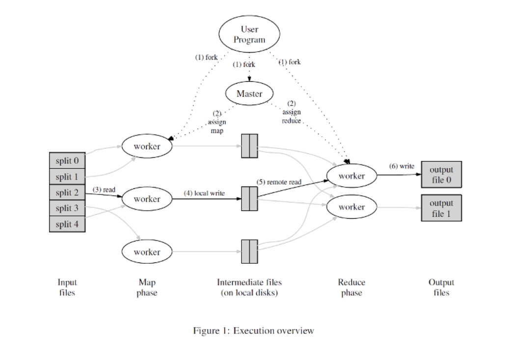
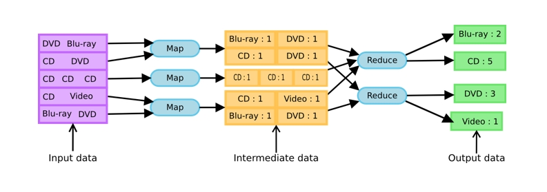
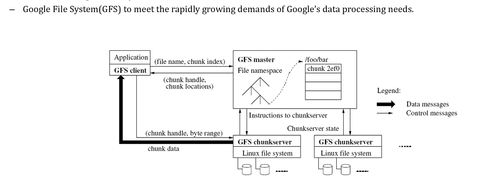
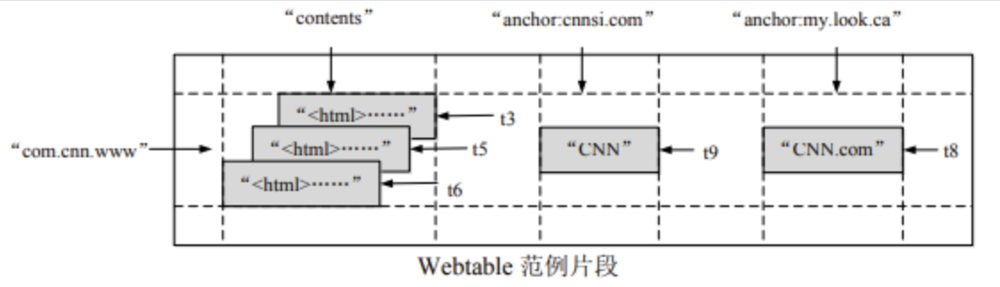
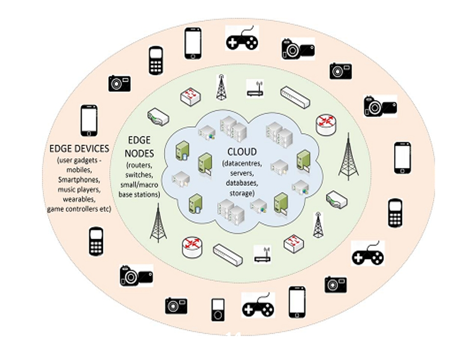

# 2 Cloud Computing

2023.11.30

> 倒不如这样
> 我们回到拥抱的现场
> 证明感情总是善良
> 残忍的是人会成长
> ——《不如这样》 陈奕迅

## 1. overview

- cloud computing 云计算
- edge computing 边缘计算

## 2. cloud computing 云计算

### 2.1 基本概念

云计算：把所有东西变成互联网上面能够访问的服务，暴露出来。

云这个词至少代表了两个概念：
- 第一是它很远
- 第二是它是不透明的，比如你使用阿里云，你是否关心它在华东、华北跑你的虚拟机？你不关心。

云里面就强调了虚拟化，因为不同的人的需求是不同的，有人想要windows，有人想要linux，所以用虚拟机而不是物理机。

云的一些特征：
1. 定价灵活：短期租用、长期租用……
2. 弹性：当你觉得容量不够，可以较为轻松地实现扩容
3. 虚拟化：如果不虚拟化，共享的粒度就变成了物理机了，但是物理机本身一般就比较强了，很多人用不到，虚拟化就可以避免资源的浪费；另外就是前面提到的，用户使用环境差异非常大。

### 2.2 云计算的核心技术

在讲数据湖的时候，我们提到了说数据分为两类：批处理和流处理（batch processing & stream processing）。

下面这些玩意都是批处理的。Storm是流处理的。Spark是内存处理，也是批处理的。Spark Streaming是流处理的。

#### 2.2.1 MapReduce

MapReduce就是一个典型的批处理的方式：每台机器现在就像原来的单机中的一个core一样（整个MapReduce其实有点点类似单机的Job Scheduling）。

我们写一个用户程序，比如我们要统计红楼梦里面，出现过多少个人物？假设我们有120回，太多了，我将其分成很多split（最适合是split大小是多少？就是你分布式文件系统的block大小！参考cse里面的gfs）；假设我们切出来100个split。

一个人统计太慢了，我找了3个人，每个人处理一个部分（当然分东西是动态的，master会做好调度）。如何处理呢？我会写好Map的逻辑，我读到了一次贾宝玉，我就产生一个键值对：{贾宝玉:1}。

> master 在这去做调度，那么大家一起做的时候，就会可能会出现最后一个情况，就是说这个 worker 前两个 worker 都做完了，最后这个 worker 处理第 100 块一直没处理完，那这时候我怎么办？我有一个逻辑，就是我说这样吧，上面这个同学既然做完了没事干，来我把 100 给你，你也去处理。因为我在判断这个 100 始终做不完成，两种情况，一种是你挂了，一种是这个 100 相当难处理。反正我就让另外空闲的人也去做，只要有人做完就好了；假设你没死，那也不耽误事儿。

然后它们写完的东西就会发到intermediate files中间文件，这些东西存放在本地的硬盘上；然后reduce再去做处理——我最后就要把相同名字的键值对加起来。然后我们发现reduce phase还有两个worker：最后统计的时候，人物可能会很多，我们说：以A-N结尾的，放到某些文件里面，后面给到1号worker，剩余的放到另一个地方，后面给到2号worker。然后每个worker都会统计一下，最后把结果汇总起来，生成了output file，将所有人生成的输出文件汇总，就得到了最后的输出文件。

注：
- 由于频繁读写硬盘，这里效率是偏低的；所以解决方案是写到内存里面，我们就需要一些很不错的数据结构来支持内存中的存储，这就是spark在做的事情。

总结：
- 如何理解“批”的概念呢？注意到，reduce开展工作之前，所有的统计工作是都必须完成的，否则就会出错。而不是说来一点处理一点，所有的数据在这里是成批流动的。流式处理就是数据来了我就处理，甚至他没处理完，新的数据就来了，源源不断的来。
- Map Reduce中的Map定义是：把输入映射成输出，每个机器不会管别的输入，只会管自己的输入部分，把输入结果产生中间结果。Reduce负责合并的部分，把所有的中间结果合并，得到最终的输出。

#### 2.2.2 Distributed Google File System

利用现有的文件系统实现文件管理，在上面再加一层，实现分布式。

把文件切成很多的chunk。

#### 2.2.3 Google BigTable: KV数据库的鼻祖

1. 首先和mongoDB一样，不存在什么乱七八糟的外键关联。
2. Column Family 列族：像二级分类一样，比如你有十个字段，我们分为3+3+4，3，3，4就分别成为列族。后面结构也可以比较自由地变化，没有那么严格的schema。
3. TimeStamp：基于时间戳的数据存储。上图中展示出了一个立体的结构。

总结：数据量非常大、schema没那么严格、希望存储多个版本。

#### 2.2.4 Hadoop

Hadoop就是前面那么一大坨玩意的开源实现。

## 3. edge computing 边缘计算

我们现在的设备都是在网络的边缘。

定义：在网络的边缘，临近数据源的地方，来进行数据的处理，是一种优化云计算系统的方式。

主要考虑到的就是：
1. 网络连接可能不是持续稳定的，你的数据未必都能发到云里面去，到达核心的云服务器
2. 通信的带宽可能是受限的，如果大家同时发送，可能很快都占满了

计算迁移：把计算从云端迁移到边缘端。（cloud offloading）