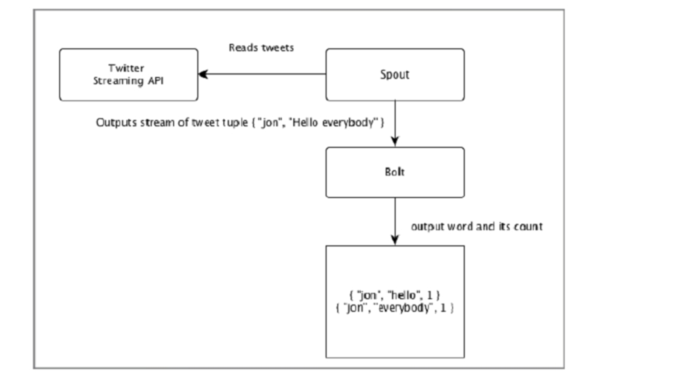

# 7 Storm

2023.12.15

> 短暂的相遇 却念念不忘
> 多少恍惚的的时候 仿佛看见你在人海川流
> 隐约中你已浮现
> 一转眼又不见
> 当天边那颗星出现 你可知我又开始想念
> 有多少爱恋 今生无处安放
> 冥冥中什么已改变
> 月光如春风拂面
> ——《假如爱有天意》 李健

参考资料：
1. https://www.w3schools.cn/apache_storm/apache_storm_introduction.html

## 1. Storm 简介

做流数据处理。推特发明的。比如说如果有人发一张照片——恶意地发一组 20 MB的高清照片上去，你如果不做处理，页面的加载就非常慢。推特做的事情，比如说对推文理照片，它叫分成不同尺寸，也就压缩成200K，然后当你点它看原图的时候，它再就把 20 MB拿出来。这就是两个动作，它不用在一开始加载整个推文的时候就把这个数据数据加载，那所以他要做类似很多这样的一个处理。而这些推文都是源源不断的在不断的发，是为“流处理”。

Hadoop 和 Storm 框架基本上用于分析大数据。 两者相辅相成，在某些方面有所不同。 Apache Storm 完成了除持久性之外的所有操作，而 Hadoop 擅长一切，但在实时计算方面滞后。 下表比较了 Storm 和 Hadoop 的属性。

| **Storm** | **Hadoop** |
| --- | --- |
| 实时流处理 | 批处理 |
| 无状态 | 有状态 |
|具有基于 ZooKeeper 协调的主/从架构。 主节点称为nimbus，从节点称为supervisors。| 具有/不具有基于 ZooKeeper 的协调的主从架构。 主节点是job tracker，从节点是task tracker。 |
|Storm 流式处理可以在集群上每秒访问数万条消息。	|Hadoop 分布式文件系统 (HDFS) 使用 MapReduce 框架来处理需要数分钟或数小时的海量数据。|
| Storm topology 会一直运行，直到用户关闭或发生不可恢复的意外故障。|	MapReduce 作业按顺序执行并最终完成。|
| **两者都是分布式和容错的。**||
|如果 nimbus / supervisor 死了，重新启动会使其从停止的地方继续，因此不会受到任何影响。|	如果 JobTracker 死掉，所有正在运行的作业都将丢失。|

## 2. Architecture

### 2.1 Basic Concepts

| 组件 | 说明 |
| --- | --- |
|Tuple |	元组是 Storm 中的主要数据结构。 它是有序元素的列表。 默认情况下，元组支持所有数据类型。 通常，它被建模为一组逗号分隔值并传递给 Storm 集群。|
| Stream |	Stream 是一个无序、unbounded的元组序列。 |
| Spouts |	流的来源。 一般来说，Storm 接受来自原始数据源的输入数据，如 Twitter Streaming API、Apache Kafka 队列、Kestrel 队列等。否则，您可以编写 spout 从数据源读取数据。 "ISpout"是实现spout的核心接口，具体接口有IRichSpout、BaseRichSpout、KafkaSpout等。|
| Bolts |	Bolts 是逻辑处理单元。 Spout 将数据传递给 bolts 和 bolts 进程并产生一个新的输出流。 Bolts 可以执行过滤、聚合、连接、与数据源和数据库交互的操作。 Bolt 接收数据并发送到一个或多个 Bolt。 "IBolt"是实现bolt的核心接口。 一些常用的接口有 IRichBolt、IBasicBolt 等。|

"Twitter 分析"的输入来自 Twitter 流 API。 Spout 将使用 Twitter 流 API 读取用户的推文，并以元组流的形式输出。 来自 spout 的单个元组将具有 twitter 用户名和单个 tweet 作为逗号分隔值。 然后，这组元组将被转发到 Bolt，Bolt 会将推文拆分为单个单词，计算字数，并将信息保存到配置的数据源中。 现在，我们可以通过查询数据源轻松获得结果。

> **微观上是批处理，宏观上是流处理。**
> 什么意思呢？我发过来的是一个一个的tuple，但tuple本身发过来是源源不断的。

### 2.2 topology
Spout 和 bolts 连接在一起并形成 topology 。 实时应用程序逻辑在 Storm topology 中指定。 简单来说，topology 是一个有向图，其中顶点是计算，边是数据流。

一个简单的 topology 结构从 spout 开始。 Spout 将数据发送到一个或多个bolt。 Bolt 表示 topology 中具有最小处理逻辑的节点，并且可以将一个 Bolt 的输出作为输入发送到另一个 Bolt。

Storm 保持 topology 始终运行，直到人为终止 topology 。 Apache Storm 的主要工作是运行 topology ，并将在给定时间运行任意数量的 topology 。

### 2.3 任务

现在你对 spout 和 bolts 有了一个基本的了解。 它们是 topology 的最小逻辑单元，topology 是使用单个 spout 和一组bolt构建的。 它们应该以特定顺序正确执行，以使 topology 成功运行。 Storm 对每个 spout 和 bolt 的执行称为"任务"。 简单来说，一个任务要么是执行一个 spout，要么是一个 bolt。 在给定的时间，每个 spout 和 bolt 可以有多个实例在多个单独的线程中运行。

## 3. Apache ZooKeeper

zookeeper 在帮你在管理一个集群，它做了一个中间的一个协调服务。他就是说他要在一个集群里面，达成这种大家的这种共识这样一致的看法。

然后整个这个集群的管理，当这个集群里面的master死了之后怎么选取新的？就像是那个docker 里的 Kubernetes。