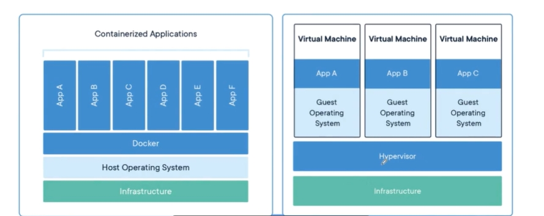

# 第24讲 Docker

2023.12.04

> 早知解散后 各自有际遇作导游
奇就奇在 接受了 各自有路走
却没人像你让我 眼泪背着流
严重似情侣 讲分手
>——《最佳损友》 陈奕迅

## 1. Docker 

### 1.1 Docker 是什么？

Containerization（容器化）是一种虚拟化技术，**它将应用程序及其依赖项打包到容器中，以便可以在任何环境中运行**（也就是为你的应用提供了一个环境）。容器化软件的一个重要好处是，它们与其运行的环境隔离，因此可以在任何地方运行。

Docker 是一种容器化技术，它使用操作系统级虚拟化来提供独立的软件容器。与虚拟机不同，容器不需要虚拟化硬件，因为它们直接在操作系统内核上运行。这使得容器更轻量级、更易于部署和更快速。

跑 100 个Docker，那他们的机器每一个看起来都像是个完整的 Linux 的文件系统，那实际上你知道文件系统在这个宿主机上它也有一个文件系统，它就是用 c group 和 name space 这种方式去把你这些文件系统一个隔开。

在硬件上面是做了一个资源的分片，容器和容器之间的资源是完全隔离的，互相之间就不会产生干扰。

### 1.2 Image

Docker 镜像是一个只读的模板，它是用来创建 Docker 容器的。Docker 镜像是一个特殊的文件系统，除了提供容器运行时所需的程序、库、资源、配置等文件外，还包含了一些为运行时准备的一些配置参数（如匿名卷、环境变量、用户等）。

镜像不包含任何动态数据，其内容在构建之后也不会被改变。

**layer 的概念**：镜像是由多层文件系统联合组成，每一层镜像都是在前一层镜像的基础上进行的修改，每一层镜像都可以看作是一个 Docker 镜像。
1. 可重用性和分发：由于层的存在，可以轻松地重用和共享部分镜像。如果两个镜像共享相同的层，它们只需要存储这些层的一个副本，而不是两个。
2. 容器之间的共享层：当多个容器共享相同的基础镜像时，它们会共享那些相同的层，这节省了存储空间。

### 1.3 virtual machine vs docker

虚拟机：自身是一个进程，但是包含了一个完整的os；比如我跑了三个linux虚拟机，我们觉得这太浪费了（当然如果跑了一个windows，一个mac os，一个linux那当我没说）。如果大家都是linux的，我们就把你们各自不同的特有的东西给你放到你的自己的这个 image 里，就你的运行环境，其他凡是依赖于操作系统的，那么我就通过 Docker 去给你转入。



左图中，最上层的app全都是对linux系统产生调用，docker负责把这些linux系统调用转为windows的系统调用。在这种情况下，因为所有人都用linux，我们就不用每个人都装一个完整的操作系统。

更具备可移植性、更高效：我迁移底层系统，windows换为mac os，我只需要把docker这一层换掉就行了。

## 2. Docker Architecture


image在registry中，registry是一个集中的存储和分发image的地方，可以理解为一个image的仓库。registry中的image可以通过pull命令下载到本地，也可以通过push命令上传到registry中。

build是说我们可以通过Dockerfile来build一个image，这个image可以是我们自己的，也可以是别人的，比如我们可以build一个nginx的image，然后把我们自己的网站放到这个image中，这样我们就可以通过这个image来部署我们的网站了。

run是说我们可以通过image来run一个container，这个container就是一个运行的实例，我们可以通过这个container来访问我们的网站。

image又是分层的，我们下载的时候也未必是下载完整的image，是下你本地没有的。

> **what is kubernetes?**
> 所谓 K8S 就是你要去观察你所有的物理机上面的一些docker的运行状态，然后去调度它。比如说我要去做负载均衡，这个物理机比较多，上面跑的容器比较多，我就要迁移一些到另外一个地方，但是整个这件事情对用户要屏蔽。


## 3. Dockerfile

要实现容器化部署（build an image），你需要写一个dockerfile。

```dockerfile
# syntax=docker/dockerfile:1

FROM node:18-alpine
WORKDIR /app
COPY . .
RUN yarn install --production
CMD ["node", "src/index.js"]
EXPOSE 3000
```

注：实际上在写spring boot的时候，你其实是不需要写dockerfile的。

第一行是说我写的这个应用本身是不能跑的，大家可以看到它这个里面就是有一堆的 js 的脚本。那我们之前就知道了，你 js 脚本一定要在某一个 Web 服务器里面，就是一个 HTTP 的 Server 里面才能跑，就相当于我们当时在开发这个前端的时候，实际上你跑了一个 HTTP 前端的Server，它在 3000 这个端口，然后它跑起来之后你的应用才能够被服务。那所以你这个 Docker 上跑起来必须要用到 node js ，他用的是 18 这个版本。

所以他就说在这个容器里要跑一下 NODE 去运行这个 source 这个目录，就我们把它下载下来，这个source，这个目录里面那个 index.js，这是我们看到的这个js。然后跑起来之后你要暴露在 3000 这个端口上。

build的含义就是把你的代码打包成一个镜像，然后这个镜像就可以被部署到任何一个地方。注意科学上网。

```bash
docker build -t getting-started .
```

image打好了，我要改里面的内容怎么办？重新打包、编译。所以有没有简便的方法？就是volume。

我们先来再看另外一个问题，就是持久化问题。

1. When a container runs, it uses the various layers from an image for its filesystem. 
2. Each container also gets its own “scratch space” to create/update/remove files. 
3. Any changes won’t be seen in another container, even if they are using the same image.

那一个容器我起来以后，我写了一些东西，以后我把这个容器销毁了，我希望这些修改保存到image中去了，应该如何做到这种持久化？

## 4. Volume 容器的卷

> 这个说穿了这次cse里面我们已经用过了，就是把主机上的一个目录映射到docker里面去。

这时候就要用到容器的卷，那么容器的卷分两种，一种是由 Docker 统一管理的卷，就是 name 的value。

还有一种是你可以自己去指定的一个卷，就它脱离 Docker 的管理，我指定它在硬盘的某一个位置。

volume就是在你的这个机器启动以后，它可以连接到一个特定的目录里头。我把硬盘上的一个目录直接连到你这个容器里面的一个文件系统的某一个位置上，就好像是我给你外挂了一个这样的一个volume一样。所以将来你在容器里去操作这个特殊的路径的时候，实际上就在操作我在宿主机上的那个文件系统里面的某一个文件，那个文件在存的时候，在宿主机上来说就是一个文件，这个文件放到这个容器里就变成了它的一个外挂卷。

这样的话就相当于我一个 image 起来的时候，我要到机器上去捞这个外挂的卷，捞出来之后挂到我们的这个系统里，那所以 image 不动， image 里对文件系统的写字、写入这些动作我全部都存在volume里，volume是存在宿主机上的，所以即使你这个容器没有了，这个卷本身还在，下次你根据这个 image 重启一个容器，再把这个卷挂回来就可以了。

### 4.1 Named volumes

volume 实际上就是一个存放数据的一个桶，它的物理位置是存在硬盘上的，这个物理位置是你不用管的，是 Docker 它会去维护的。你只需要记住它的 name 是啥就行了。

然后我启动这个 container 的时候挂一个卷。每一次新启动这个容器的时候，你只要指定这个 volume 到，就能帮你把它找到挂进去。

> 说穿了就是我只给了它一个名字，其余它具体存在哪里，都不用你管，docker来负责。

### 4.2 Bind mounts

这次cse的chfs就是这么干的。也就是我们可以自己决定这个卷在宿主机上的哪个位置。

所以volume的意义就是，我经常需要去改那个代码，我就不需要每次去撸一个新的容器出来，我的项目代码挂载进去，每次我改了代码，直接就能反映出来。这就是所谓的“开发用的容器”。

## 5. Multi-container apps 多容器应用

我经常可能跑起来需要两个容器。我们在面向对象编程的时候，就知道职责要单一，那每一个容器尽量它的职责也单一，这样有助于万一哪一个崩了，另外一个还好。就是我们的应用在一个容器里面，我们的 MySQL 应该在另外一个容器里面跑。

先看第一点，就是这两个容器怎么通信？就是要靠网络，他们必须在同一个网络里。所以就两步：创建网络、运行。

但是这么跑还是两个容器分别在跑；有没有一步到位的方法？

### 5.1 Docker Compose 一次性启动多个容器

说白了就是一个脚本，把你的这些容器的启动命令都写在这个脚本里面，然后你一次性启动这个脚本，它就会把这些容器都启动起来。