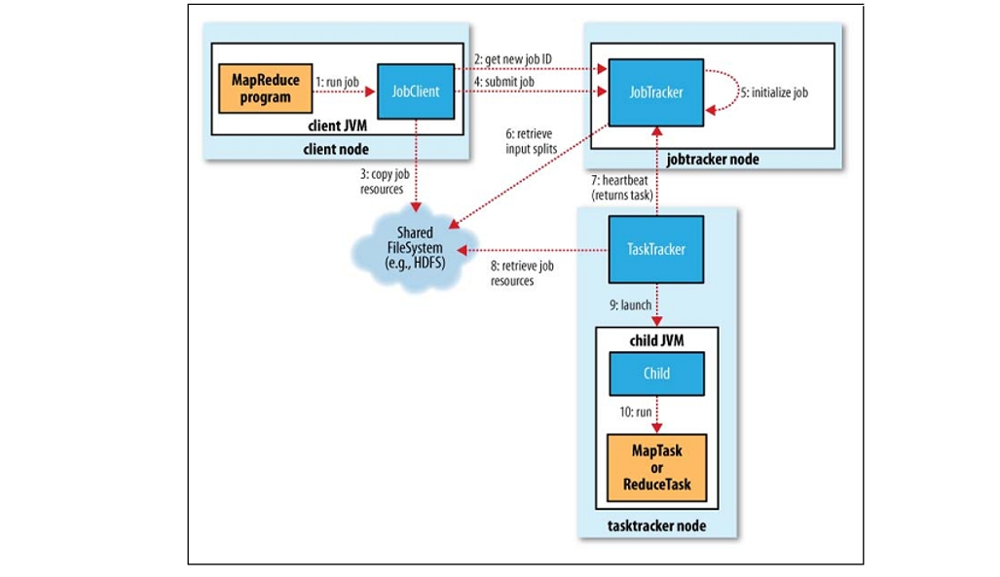

# 第25讲 Hadoop

2023.12.06

> 和你也许不会再拥抱 待你我都苍老
散半里的步 前尘就似轻于鸿毛
提及心底苦恼 如像自言自语说他人是非 多么好
从来未爱你 绵绵
可惜我爱怀念 尤其是代我伤心的唱片
> ——《绵绵》 陈奕迅

## 1. Contents

- Hadoop: Basic Concepts
  - Hadoop Common: 内核
  - HDFS: 分布式文件系统
  - YARN: 资源管理
  - MapReduce: 分布式计算；MapReduce并行处理的时候会出现一个问题，就是单一故障节点，可能导致整个系统崩了，或者成为bottleneck，所以要有YARN。

针对大数据批处理请求，设计基于MapReduce/YARN的并行处理方案。

## 2. 从MapReduce到YARN

### 2.1 Deeper into MapReduce

我们有一堆的能够执行任务的节点—— task Tracker NODE，构成了一个集群。

- client NODE是你的客户端；比如你写的统计红楼梦的代码就是这个黄颜色的（MapReduce Program）。
- 程序在跑的时候，JobClient会从JobTracker那里得到一个JobID，然后JobClient指定输入输出目录（和HDFS交互），然后提交这个作业。
- JobTracker就开始做调度；到文件系统把你的输入文件拿出来（已经被切成了split），就启动若干个任务节点来操作；每个任务节点都有一个TaskTracker，会去文件系统获得任务所需要的资源。然后我就在我这个节点上创建一个新的JVM，是它的子进程，在这个子进程里就执行黄色的MapReduce Program。
- 执行的过程中，TaskTracker不断发心跳给JobTracker。

问题：
- 为什么需要TaskTracker？因为一台机器上可能执行了多个MapReduce Program。
- JobTracker的职责是什么？
  - 第一个分配资源，就是我怎么会知道要让哪一些节点去执行这个 task 呢？
  - 第二个，他在跟踪这个 tracker 的执行情况。
  - 那你说是不是他就很重量级，他要管的事情非常多，而且一旦他崩溃，整个系统崩溃。你再重启，你会发现所有的job全没了，这些 tracker 都不知道向谁汇报，这不是我们希望得到的。
- **所以我们就有了YARN。它就是希望将这两个职责分开**。

**Reducer的数目？**
  - $ number.of.nodes * number.of.max.containers.per.node * {0.95 or 1.75} $，注意不是范围，只有两个值
- 如果是0.95，比如说有 5 台机器，每个上面可以跑 5 个容器，那 5 * 5 是25。如果我乘0.95，比如说是24，那我起 24 个reduce，因为你能跑 25 个容器，所有的 reduce 就一起跑起来。那如果乘1.75，就是说我可能会有 35 个这样的reduce，那我在 25 上不能同时跑，我先跑 25 个，中间有跑完的，就让他从这里面继续拿。就像我刚才说的，三个同学处理 12 分，怎么处理每一个先跑一个，跑完告诉我再给他分一个。
- 那你说这两个有什么优点和缺点？先看上面的，这个是说你的 reduce 的数量一定小于你运行的这个能力，那所有的 reduce 就同时并发的就开始跑。缺点，万一某一个 reduce 特别慢，就是因为数据的原因，比如它那个集合里面的值特别多，那于是你就变成了有 0.05% 的容器在那闲着，在有一个巨忙的。然后底下这个就相当于我把这个任务切碎一点，我先跑 25 个，大家都很少有一些在那等，但是因为每一个任务都很小，所以他们很快就执行完了，在这里面再去捞，速度会快一点，那所以你就会看到上面那个负载均衡不好，就有的可能很忙，有的就闲着，但是它任务调度就会变得简单，因为我一次性的就把所有的 reduce 就在一起跑，底下这个负载一定是均衡的，大家都挺忙的，同时忙，大家一起玩完，就结束。但是需要做任务的来回的调度，带来额外的开销。
- 那到底选哪个？我觉得其实就是你的一个权衡，你觉得这些任务本身已经很平均了，那我们就用 0.95 就可以，如果你认为确实存在比较大的倾斜，有的这个及格里面可能就 10 个，有的有10K，那你还是用底下这种方式可能更好一点。

### 2.2 YARN

资源管理器还是只有一个,是全局的;但是那个Job
 Tracker 分开一个任务/一个应用一个。