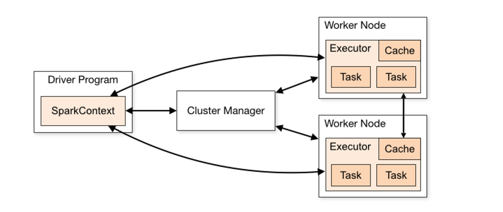
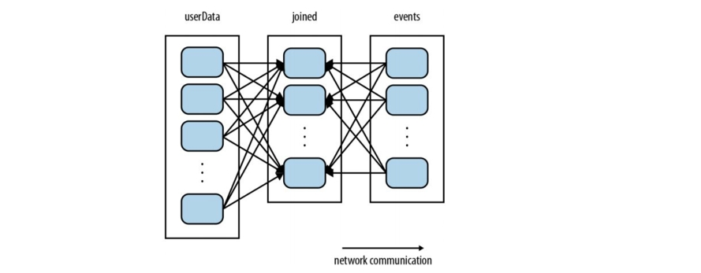
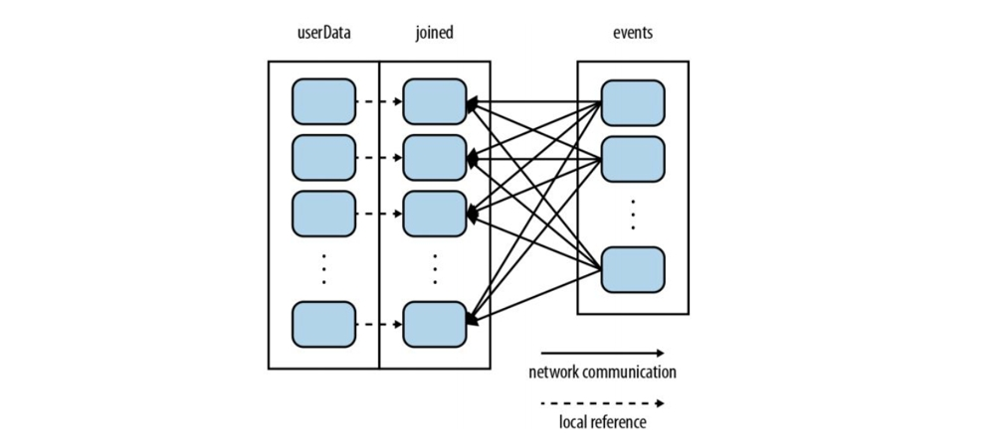
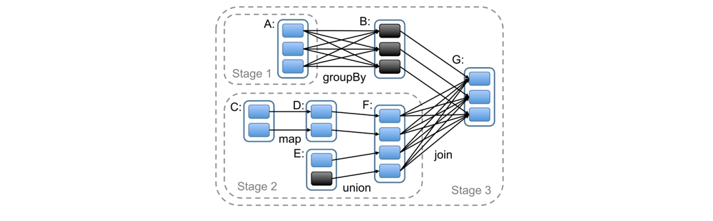

# 第26讲 Spark

> 我把幸福看得太简单了点
你有多用心我却没有发觉
谢谢你的照顾你的离开
让我对爱有更多了解
现在才说也许太晚了一点
失去过的人会更珍惜一点
> ——《谢谢》 陈奕迅

参考资料：
1. https://www.hadoopdoc.com/spark/spark-intro
2. https://www.cntofu.com/book/198/notes/Spark_RDD.md

## 1. Spark基本概念

### 1.1 简介

- 相对于 MapReduce 的批处理计算，Spark 可以带来上百倍的性能提升，因此它成为继 MapReduce 之后，最为广泛使用的分布式计算框架。
- 和Hadoop的差异是，是用内存做计算的，可以构建于Hadoop之上。
- 能做数据科学、机器学习等任务
- 可以做批处理，也可以做流处理（数据是源源不断的）
- 可以在单点做，也可以在集群做。

> **再说批和流**
> 比如这个教室里，放置一个传感器sensor，然后它就可以不断的去往服务器server去发数据。那这个数据就是只要这个传感器不坏，它就一直在发，是为“流”。这是第一点。
> 第二点，他发出去，你去处理。例如，他不断过来发的是这个温度，那这个温度过来之后，服务器在这一端他就要去判断这个温度，来决定这个空调它到底要不要开。
但是你可以看到它这个接口走什么，如果你走http就有问题了。http是什么呢？是请求-响应模式的。那是不是意味着我在这一边发过来一个数据，你就必须得响应？你得告诉我开还是不开？然后在响应没有回来之前，我可能这边是不能发了，这个设计显然就不对。 
HTTP 这个协议你要不断的发，你不要管我处理没处理过来。比如说你一秒钟发一次，连着发了 10 秒就有 10 个数据了，也许我服务器端呢？还没有那么强的这个处理能力，当你发第 11 个数据之后，第一个数据才处理完。
如果是这样的话，就意味着你在这个客户端就像这个sensor一样，它实际上在发这个数据的时候压根就没有得到响应的情况下，他就发了第二个数据，这是你看和批处理存在一个很大的差异，那你说那怎么办？他发快了，处理的慢怎么办？那我们在讲消息中间件的时候就在处理这个事——kafka！就是你要通过一个消息队列把它给收下来，然后你到后面慢慢去处理，你也可以来了 10 个，我忽略掉其中 9 个，每 10 个我处理一个，这都是我服务器端的它的一个逻辑。但是我就不能是请求响应式了，不能说你发 10 个数据过来，我就要产生 10 个响应，我可能就产生一个响应。而中间做这件事情必须有一个像kafka这样的东西，在中间做一个像过渡一样的东西，这就我们看到流式数据和批式数据的一个非常大的一个差异，除了这个数据它源源不断，而且它是来一点处理一点；和批次处理，说我一批处理完它能进入下一个阶段不一样之外，更重要的是他没有说一定是个请求响应模式，这是很大的一个区别。

### 1.2 内存！

Hadoop做mapreduce是利用分布式文件系统，磁盘来做中间结果的汇聚，很多的磁盘io操作，所以慢。你读了一个block进来，你把结果spill到硬盘上（io+1）；所有spills全部出来之后，要做shuffle，sort，放到不同的地方（io+1），然后reduce去读，处理完再写（io+2）。

Spark的逻辑是，基本上还是在HDFS来做处理，但是我一旦从分布式文件系统里面把数据读出来，我就做内存计算了。内存不够怎么办？本来应该是要换到硬盘上，所以我用cache，让它在内存里占住，不让它被换出swap到硬盘上。

Spark 里面告诉你 cache 这件事情，就跟你在 cpp 里面你定义那个变量和 register 一样，你定义一个变量是register，它真的是在寄存器里面吗？取决于编译器他认不认对不对？你定义 cpp 里面你定义一个变量说它是register，那编译器完全有可能会把它放到内存里，它不是在寄存器里，它要根据实际情况去判断的，那就跟这道理类似的，开始只是你一种表达，你一个愿望， Spark 到底做不做这件事？不一定，那至少你他有足够的内存空间的情况下，会优先考虑你这个愿望。

## 2. Spark Components

| Term 术语 | Meaning 含义 |
| --- | --- |
| Application | Spark 应用程序，由集群上的一个 Driver 节点和多个 Executor 节点组成。 |
| Driver program | 主运用程序，该进程运行应用的 main() 方法并且创建 SparkContext |
| Cluster manager | 集群资源管理器，Spark 可以运行在多种集群管理器上，包括 Hadoop YARN、Apache Mesos、Standalone。 |
| Worker node | 执行计算任务的工作节点 |
| Executor | 位于工作节点上的应用进程，负责执行计算任务并且将输出数据保存到内存或者磁盘中 |
| Task | 被发送到 Executor 中的工作单元 |
| Job | 多个并行执行的Task，合起来就叫做一个Job |

执行过程：
- 用户程序创建 SparkContext 后，它会连接到集群资源管理器，集群资源管理器会为用户程序分配计算资源，并启动 Executor；
  - SparkContext是Spark应用程序执行的入口，任何Spark应用程序最重要的一个步骤就是生成SparkContext对象。SparkContext允许Spark应用程序通过资源管理器访问Spark集群。
- Driver 将计算程序划分为不同的执行阶段和多个 Task，之后将 Task 发送给 Executor；
- Executor 负责执行 Task，并将执行状态汇报给 Driver，同时也会将当前节点资源的使用情况汇报给集群资源管理器。

## 3. Spark RDD(Resilient Distributed Dataset) 弹性分布式数据集

Spark的基础数据结构，RDD具有**不可修改的特性**（就不会涉及到复杂的内存操作，比如删除，所有后面的元素要往前移动），并且会在集群的不同节点运行计算。Spark RDD里面的数据集会被逻辑分成若干个分区，这些分区是分布在集群的不同节点的，基于这样的特性，RDD才能在集群不同节点并行计算。

- Resilient（弹性）：RDD之间会形成有向无环图（DAG），如果RDD丢失了或者失效了，可以从父RDD重新计算得到。即容错性。
- Distributed（分布式）：RDD的数据是以逻辑分区的形式分布在集群的不同节点的。
- Dataset（数据集）：即RDD存储的数据记录，可以从外部数据生成RDD，例如Json文件，CSV文件，文本文件，数据库等。

### 3.1 RDD操作

RDD操作分为两类：**transformation**和**action**。

- transformation：对RDD进行转换，返回一个新的RDD，但是不会立即执行，只有遇到action操作时才会执行。举例：map就是典型的transformation操作。
- action：对RDD进行计算，返回一个结果或者将结果保存到外部存储系统中。举例：reduce就是典型的action操作。

spark中，**所有的transformation操作都是lazy的**，也就是说，只有当action操作发生时，才会触发transformation操作的执行。

why？我们刚才说 RDD 是不能修改的，是只读的。transformation 的结果是一个新的RDD，那就是说你在执行这个 transformation 之后，一定会生成新的RDD，它就会占内存。但是这个 RDD 什么时候被会被用到？不知道，因为你的 driver 最后一定是想得到一个值，那既然不知道，你为什么先让他把内存先占着，你应该一直到最后他要做一个action，要得到一个值的时候，这时候才要迫不得已往前去推，他是经历了哪些 transformation 得到了，再把前面的 transformation 都做一遍，这样的话我可以最节省的去使用内存。所以他就想了这么一个办法。

这里的方法还是构建有向无环图DAG。

### 3.2 分区 Partition

一旦外部文件读进来，或者说像你在内存里一个数组给你做了一个这样的一个并行化，得到了一个 RDD 之后，紧跟着他就要去做分区，就是他要把你这个 data set 要切成若干块放到不同的机器上去。因为如果只在一台机器上就不能并行了；他要看你worker node 的数量来做这个切分，然后 RDD 已经切分好了，现在可以在上面就可以去做这个相应的操作了。

分区好处？

- 假设程序在内存中持有一个非常大的用户信息表 (UserID，UserInfo) ，其中UserInfo 包含用户订阅的主题列表
- 有一个很小的表，记录过去5分钟里在网页上点击过链接的事件，键值对为(UserID, LinkInfo)
- 程序周期性地将这两个表合并、查询

中间生成的joined是分好块的，比如a-g一块，h-m一块，n-z一块。

如果没有partition，你其实是不知道数据集中的主键是如何分布的；一块在一台机器上面存，我们这儿是分布式存储。如果我们知道A的userData只存在某台机器上面，A的events只存在某台机器上，我们只要join这两部分数据就行了。但是实际上我们现在做不到这一点。

这里userData是几乎不发生变化的，events是及时更新的数据；但是我们还是需要周期性地做hash和shuffle userData。这里网络通信开销就很大，有点像机器学习中的全连接层。

所以我们提出来，加载用户信息的时候，把用户分解为100块。event是按照时间顺序不断增加的，这是乱的没办法，但我们userData已经分好了。

### 3.3 Dependency 依赖

joined这些RDD是依赖于userData和events的。

- Narrow Dependency：每个父RDD的partition最多被子RDD的一个partition使用，这种依赖关系称为窄依赖。窄依赖的RDD可以并行计算，不需要shuffle。

- Wide Dependency：每个父RDD的partition可能被子RDD的多个partition使用，这种依赖关系称为宽依赖。宽依赖的RDD需要shuffle操作。

**窄依赖的好处**
- 窄依赖只需计算丢失RDD的父分区，不同节点间可以并行计算，能更有效地进行节点的恢复。
- 宽依赖中，重算的子RDD分区往往来源自多个父RDD分区，其中只有一部分数据用于恢复，造成了不必要的冗余，甚至需要整体重新计算。
- 宽依赖做完了一般需要缓存，因为比较复杂，好不容易做完了，存下来。

**概念：Stage**

Spark怎样划分任务阶段（stage）的例子：实线方框表示RDD，实心矩形表示分区（黑色表示该分区被缓存）。要在RDD G上执行一个动作，调度器根据宽依赖创建一组stage，并在每个stage内部将具有窄依赖的转换流水线化（pipeline）。 本例不用再执行stage 1，因为B已经存在于缓存中了，所以只需要运行stage2和3。

- 每个阶段stage内部尽可能多地包含一组具有窄依赖关系的transformations操作；以便将它们流水线并行化（pipeline）（到最后一次性并行地做，不用占据内存空间，效率高）
- 边界有两种情况：一是宽依赖上的Shuffle操作；二是已缓存分区（碰到边界，这个stage就要真正执行了，执行完了这个stage结束）

这样的好处就是只有在 f 要被使用的那一刻，而且需要被宽依赖的使用的那一刻，我们才去创建f。在此之前无论是cdef四个当中哪一个都在内存里是不存在，那所以你就省空间。

