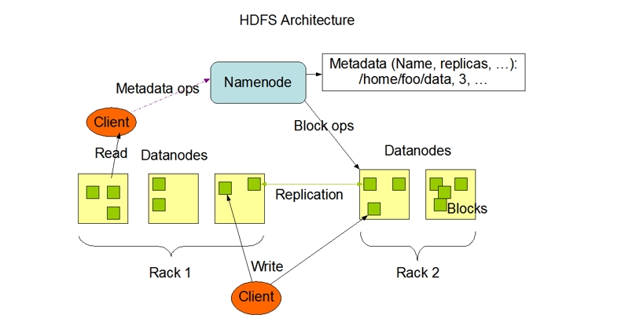
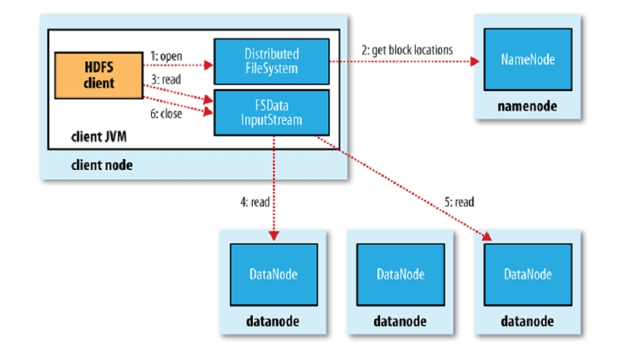
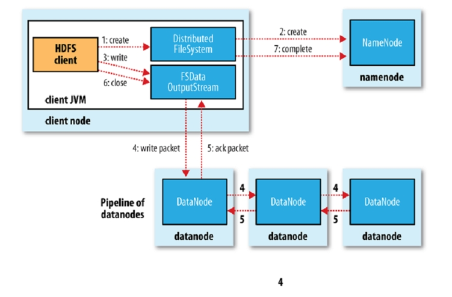

# 第28讲 HDFS

2023.12.20

> 你记起吗
> 任性固执的那幕 无聊事互相反驳
> 不知道 不知道 你已不知道
> 开心过 争执过 温馨过 挑剔过
> 糊涂地陪着你 追忆 追忆 追忆
> 模糊地追忆 虽则我 只得我
> ——《失魂记》 李克勤

## 1. HDFS使用场景

适合于：
- **适用于非常大的文件**；小于100MB的这种文件，效率反而非常差
- **流式数据访问**；一般来说，数据往里面写只写一次，读要读很多次；需要频繁修改的数据，不适合放在HDFS里面。时序数据，比如influxDB，就比较符合我们这里的设定。
- Commodity Hardware：**用一大堆廉价的硬件**，并不需要非常昂贵的、高可靠的硬件。所以你要拿一堆小的拼一个大的，本来小的机器就没那么可靠，机器多了挂的概率又变大，所以要用空间换可靠性——比如三个副本。为了保证Consistency，如果write开销又很大，所以又回到了第二条。

不适合：
- **低延时的数据访问**：主要是做高吞吐，而不是低延时；就是有大量用户来给我一次性可以从 100 台机器里面同时读数据出来，但是你单独去考察我一个数据访问，发请求到 HDFS 系统，再到得到响应，数据读回来，他没有你现在用的 linux 文件系统效率高。比如我一个巨大的文件，分为1000个block，存放在1000台dataserver上，我同时去读，效率就很高。但是如果一个小文件，就一个block，在一个dataserver上，读起来效率就……
- **很多的小文件**。文件很小，不需要分布到多台dataserver存储，就没意义了。meta data server的文件分区表本身也就会非常大，难以维护。
- **多个写者，任意的、随心所欲的修改方式（比如我们原来定义只能做append，现在说中间任意的修改也可以了）**。consistency是一个挑战。如果有多个写操作进来，我们就让它们串行——single writer。写也只在文件的最后append。

## 2. HDFS架构

整个的逻辑还是master-slave。master也就是namenode/meta data server，slave也就是datanode。

master里面只存储元数据，也就是存储的文件名，有多少副本，每个副本都在哪个dataserver上？它有很多个block，每个block都在哪个dataserver上？这些信息都在master里面。

读数据：

所以客户端client（hdfs的客户端程序，不是你写的程序）每次都是先和master打交道，我要读什么文件？然后master告诉我这个文件有多少个block，每个block在哪个dataserver上，然后我client就可以直接去dataserver上读了——注意，meta只是告诉你数据在哪儿，client去相应的data server把数据读出来；而不是meta dataserver直接帮你去找data server，这样它就累死了。这个逻辑和nginx是很像的。

> 再说多一点：比如数据库里面，就是在分布式的系统里面，你所有的东西如果都能做下推，你的效率就会提高很多，因为他们就会充分利用这些是各自节点的计算的能力，而且在这些节点和主节点之间传递数据量会明显减少，这就我们看到的下推的意义。

client的读写都是直接和datanode打交道。namenode对datanode的要求就是，你要不断给我发送心跳告诉我你还活着，我可以往你这里存储数据。datanode本身其实并不需要知道任何的额外信息。这样来看，整个系统可扩展性是很好的。

写数据：

当然，这里namenode就成为了单一故障节点——挂了整个系统就挂了。再看看，重要的其实是namenode上的数据；所以这个数据也可以做replica。

## 3. Master

### 3.1 Log

第一个就是他要管的是你对整个文件系统这个名字空间，比如说我增加了文件或者增加目录，删除了等等，所有的变化或者产生变化的操作全部要记录。它记在哪？它有一个log，就像我们讲 MySQL 所有操作的 log 一样，它也有log；为什么会有log？因为这些操作他也在考能提高性能，从你设计一个系统角度来说，你提高性能，是不是说那我未必，你做的 change 马上就要落盘，可以体现在内存里，隔一段时间再去做硬盘，那所以log就很有用。
当你在内存里还没有去落硬盘的时候，系统崩了，我就把你记下来，下次系统恢复的时候就可以把落的内容重新执行一遍，所以所有的变化都会记到一个 log 里。

### 3.2 Safemode 安全模式

就是在整个你的 HDFS 在启动的时候，这个 name node 是进入一个叫做安全模式的阶段。这个阶段它是不发生任何写操作的。现在大家都别动，安全模式起来，我先去根据你们这些 data node 给我汇报心跳和这个 block report 数据，我name node 先去做一个统计。因为你这个 block report 里面已经列出来所有每个这个数据节点 data block 的这个列表，所以他拿出来之后他就去统计了一下，看看每一个 block 是不是都已经达到了要求的replica的数量，如果达到了，我们认为这个检查就通过了。

如果不够，我就要执行复制，一直要复制到这些 replica 数量满足要求。

> 之前block第一次被写的时候不是已经写了满足要求的副本数目了，为什么现在启动了还要做这个检查？

你在上一次启动的时候也许是有 10 个 data note，然后你现在你看是你起了 data note 之后，或许只有 9 个，它不能保证那 10 个 slave 都起来；甚至还有可能是有一些离开的或者加入一些新的节点。因此根本不能够保证相同的slave起来了。

## 4. Replica

每个文件的replica的数量都是可以指定的，那他有一个极大的问题，就是他告诉你在任何时刻只能有一个writer；raplica 它的数量如果变多，就意味着我这个 write 在执行一次写操作的时候花的时间会越长，就意味着我失败的概率可能越大，而且会造成其他的写操作的堵塞，所以这个 replica 的数量不能设太大，你设太大了，一次写操作要花费太长时间；而它又严格要求只有一个writer，那你这个效率就太低了。

那所以你要分两个方法来解决问题：
- 第一，replica 它数量不要太大；
- 第二，数据最好只写一次，以后不要频繁的写了。

> HDFS里面，存订单行不行？存book行不行？

订单实际上是可以的，订单是你生成之后不会改， book 行不行取决于你的设计。有些同学在里面是设计了一个叫做 stock 的字段，是说这是库存，那你说你把它放到 HDFS 里面去存，是不是他要经常变？那你说我如果把它剥离出来，这 stock 放内存里，这是可以的，所以行不行不能一概而论。

### 4.1 Heart Beat 心跳包的设计

第一个，心跳到底是个啥？心跳就是我周期性发的一些信息，告诉别人我还活着。但问题是心跳里面包含啥？你说心跳就是我ping一下，然后那个说收到pong，这没任何意义，白占带宽，你去想想心跳你要发是不是通过 TCP IP 协议再跟在一个网络里发？那你至少应该填满一个 TCP 的包，让他发成比较合适，对吧？那 TCP 的包也不是那么小，你就发个ping我还活着，太浪费了。所以你应该去设计这个心跳里包含的数据包，最好正好能填满一个 TCP 的数据包。那你填啥呢？就填我们这里看到这个 block report（注：A Blockreport contains a list of all blocks on a DataNode），那是一个 TCP 的包的整数倍，比如一倍、两倍、三倍，这样发心跳是最合适的。所以这地方就说明了第一个问题是到底啥是心跳？**心跳实际上里面是可以带一些你的状态数据的**，状态数据是你来定的。

第二个问题就是，我多长时间发个心跳？这个东西取决于你这个系统，你想多长时间去发现一个节点崩了？比如说我 10 分钟之内，只要发现崩了就行，那所以我定为 3 分钟发一次，你说不是 10 分钟吗，你为什么定 3 分钟？那我要考虑是不是因为网络的原因所以到不了？我给他宽限一点，十分钟我收不到一次心跳我才会认为它挂了。

第三个问题就是心跳怎么发出来？心跳不能是**专门的一个线程**，固定时期，到点以后这个线程发一个心跳出去，这是假的心跳。**真正的心跳应该是在你的主线程里面**，主线程是一个不断的循环，在它的某一步发心跳，这样才能保证你的主线程是一直活着的。如果是单独的一个心跳线程的话，主线程崩了，这个线程一直好，就出事情了。