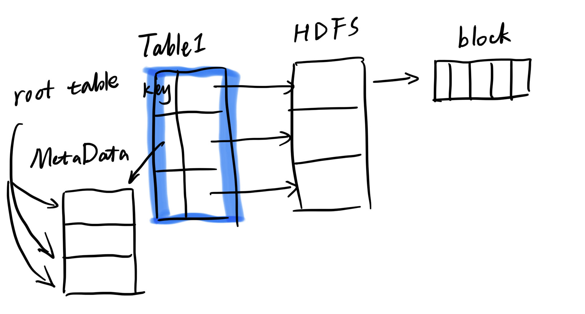
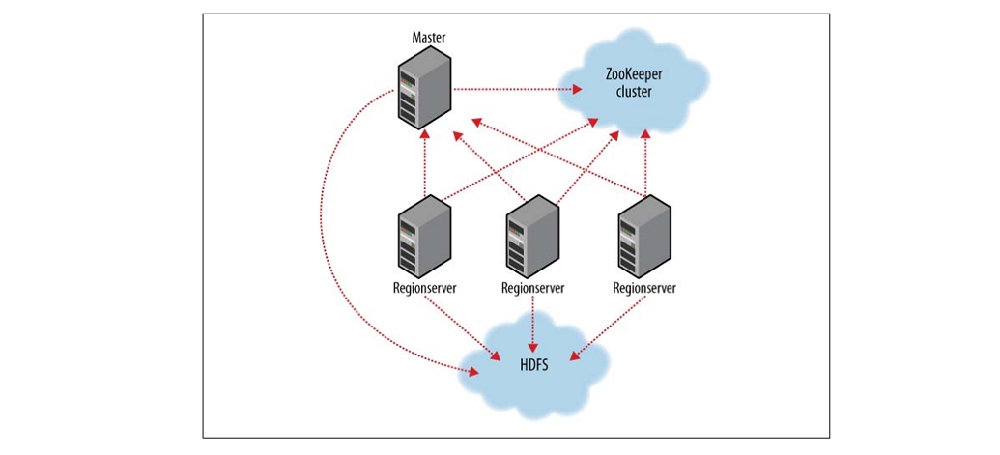
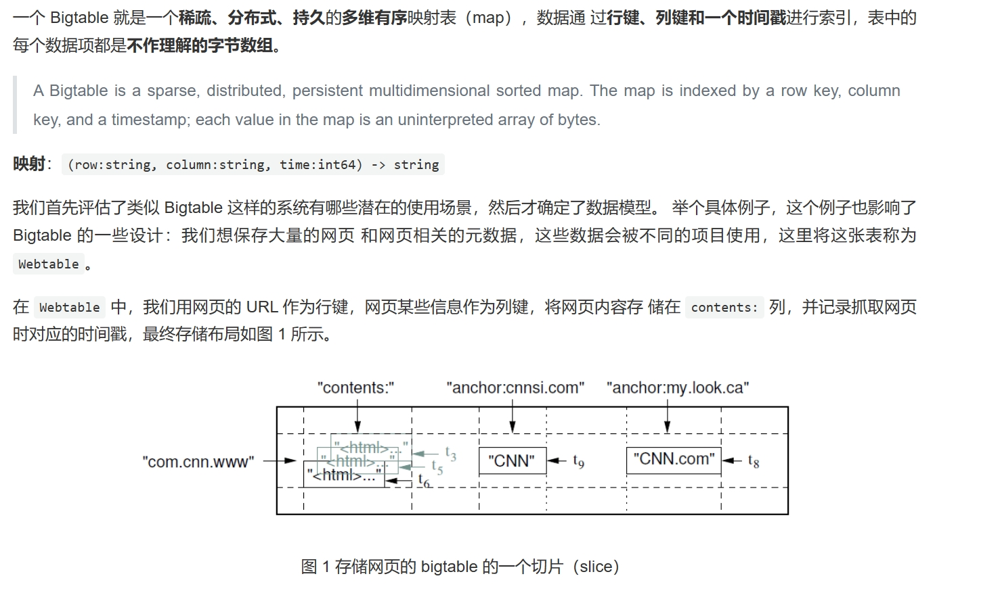
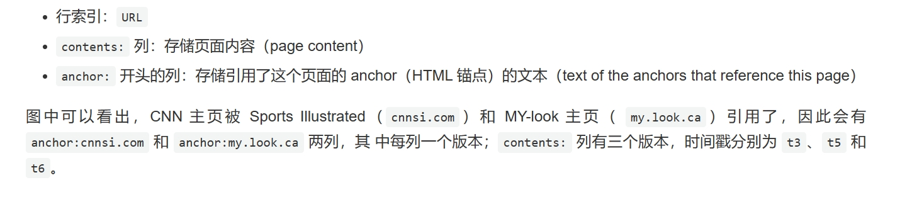

# 第29讲 HBase (Google Big Table)

> 仍然能拥有梦想跟前途
仍然能拥有自尊跟自豪
仍然明知许多女伴 一转身会遇到
为何感到 这不算最好
明明从不信天荒跟地老
明明从不会后悔得不到
明明从新掌握去做 我总可以做到
为何今晚我不懂如何 告别烦恼
—— 《寂寞的男人》 张学友

参考资料：
1. http://arthurchiao.art/blog/google-bigtable-zh/

## 1. HBase

如果我们把Hadoop当作一个云上的操作系统：
1. map reduce就是作业调度
2. hdfs就是文件系统
3. hbase就是**数据库**（google的big table的开源版本）

- 数据库的特点：大数据来的时候，结构化的数据是少量的，大量的是半结构化和非结构化的数据。还有一个特点是“大尺寸”，所以我们必然想到的是分布式。

关系型做分布式的问题是，有两个巨大的表，如果我们没有外键关联，那无所谓；但是如果存在了外键关联，如何划分就是一个大问题——否则如果切分得不好，你在做join的时候，某台机器可能要和很多其他机器通信，就很慢。

- 尽管数据量很大，HBase可以做近乎实时的、随机访问的读写。
- 现在我们只有一张表，只有一张大表，这张表里面不存在跟其他表的关联，所以我可以**任意的在某个位置水平切割**，它存到不同的节点上就可以，所以它是一个线性的模块化的这个可扩展性。

## 2. 数据模型

### 2.1 基本概念

- **按列存；建立在HDFS之上**。

如果我有一个巨大的表，在HBase眼里，我先将其切成三块，比如每块100G，这些信息会记录到meta元数据那边去。

然后它们落到HDFS里面，每块继续切，切成block。

所以实际上我们可以看到这里是两层；第一层的原因是为了加速搜索，比如我有一个key，我按照key的范围做了一个分解：1-1000，1001-2000，2001-inf，这样我就可以快速定位到这个key在哪个块里面，然后再去找这个块里面的数据。

当然元数据的表可能也会变得很大，所以也需要切。所以用户查找就变成了：
1. 先去root表里面找到这个表的元数据在哪个region里面（region就是你对表水平分区产生的结果，开始的时候一个表只有一个region，后来会慢慢变多）
2. 然后去这个region里面找到这个key在哪个region里面
3. 然后去这个region里面找到这个key在哪个block里面

- **带版本的**。就刚才讲到如果我把这个数据表只是把外键关联去掉，那我带来了一个问题，是它的数据表达能力会变弱，那于是怎么办？ hbase 就说我让你有几点可以变得跟关型数据库不一样，你的表达能力会变强。其中有一点就是我在这个维度上就像三维的一样，我在这个维度上允许你做多个版本的存储，比如有一行。对一个字段，可以记 5 个不同时间版本的值，就相当于是一个三维立体的结构。这个就是以关系型数据库不能去表达的。那而且它支持这个 cell 可以说有五个版本，旁边的这个 cell 就只有两个版本。而且大家的版本是靠时间戳来的，所以是可以对齐的。也就是说我想去看一下某一个时间戳下这个数据是什么样，我们就去找每一个 cell 在靠近这个时间戳的时候它的值是什么。尽管你又5个时间戳，你有2个时间戳，我找最靠近你这个时间戳，我就只能知道整个这张表所有的 cell 在这一个时间戳上它的值是什么。

- **所有操作必须全部用主键来**。这里的键必须十个有意义的键，而不是随便的一个东西。比如下面的主键是url。
- 所有的行都是按照主键排序的（存的是字节码，按照字节排序）。
- **列族**：多个列键（column keys）可以组织成 column families（列族）。 column family 是访问控制（access control）的基本单位。列键的格式：family:qualifier，其中 family 必须为可打印的（printable）字 符串，但 qualifier（修饰符）可以为任意字符串。例如，Webtable 中有一个 column family 是语言（language），用来标记每个网页分别是用什么语言写的。在这个 column family 中我们只用了一个列键，其中存储的是每种语言的 ID。 Webtable 中的另一个 column family 是 anchor，在这个 family 中每一个列键都表示一 个独立的 anchor，如图 1 所示，其中的修饰符（qualifier）是引用这个网页的 anchor 名字，对应的数据项内容是链接的文本（link text）。列族也满足连续存储，一个列族里面的列放在一起。

> 这样写那分为列族，它的好处是啥？就是列族那个就相当于把这些列就做了个群组，然后就告诉你在 Hbase 里面，首先你建立一张表，就先要说有哪些列族，你得说我有一个temperature，然后我就开始记录这个温度，比如我现在又两个列键最高温度、最低温度，我记录了 10 天之后说不对，这个列组里面要新增加一例是他的这个湿度，那么在关系型数据库里面这个操作几乎是不行的，但是在这个 h base 里就是很容易，那关系数据库为什么不可以呢？那你已经记录了 10 天了，那你说对这十天的数据，应该是多少呢？你说我就让他默认值是0，那也就是意味着你这个湿度“就是”0，湿度是 0 的话，这是有可能是一个正常的一个湿度值，那你就不好处理了，要么你就是让这个值变成是可以为空的。但在 Hbase 里根本就没有这么复杂，你想做你就做吧，你就插入，之前的值没有就是没有。为什么？就还是我们刚才讲到它是列存的，列存的就这一列存在一起，你前面的没有，没有就算了呗，我就没有。将来你在取这一行数据的时候，你是在不同的列里面取，那在这一列里取不到这一列里，它没有这一列的值，他就这么做了。
所以我们看到的分列族，里面包含列，这可以动态的增加，这在关联数据库里是不可能实现的。

### 2.2 Web Table

为什么把url倒过来存？因为这样可以让同一个域名的网页存储在一起，这样可以提高访问效率。