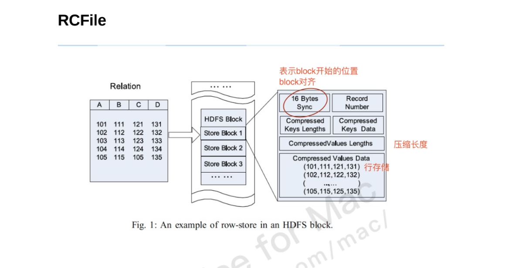
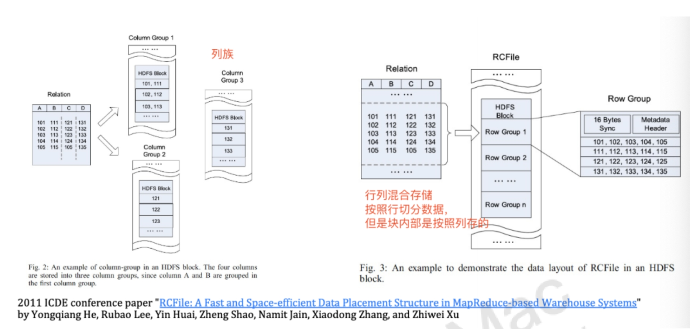

# 第30讲 Hive

2023.12.25

> 明日灯饰必须拆下 换到欢呼声不过一刹
> 明晨遇到 亦记不到
> 和谁在醉酒中偷偷拥抱
> 仍然在傻笑 但你哪知道我想哭
> 和谁撞到 亦怕生保
> 宁愿在醉酒中辛苦呕吐
> 仍然在头痛 合唱的诗歌听不到
> ——《Lonely Christmas》 陈奕迅

Reference
- 林舒怀学姐的笔记

## 1. Hive简介

Hive是基于Hadoop的一个数据仓库工具，可以**将结构化的数据文件映射为一张数据库表**，并提供类SQL查询功能。

其本质是将SQL转换为MapReduce/Spark的任务进行运算，底层由HDFS来提供数据的存储，说白了hive可以理解为一个将SQL转换为MapReduce/Spark的任务的工具，甚至更进一步可以说hive就是一个MapReduce/Spark Sql的客户端

为什么要使用hive ?

主要的原因有以下几点:
- 学习MapReduce的成本比较高, 项目周期要求太短, MapReduce如果要实现复杂的查询逻辑开发的难度是比较大的。
- 而如果使用hive, hive采用操作接口类似SQL语法, 提高快速开发的能力. 避免去书写MapReduce,减少学习成本, 而且提供了功能的扩展

hive的特点:
- 可扩展 :  Hive可以自由的扩展集群的规模，一般情况下不需要重启服务。
- 延展性 :  Hive支持用户自定义函数，用户可以根据自己的需求来实现自己的函数。
- 容错 :  良好的容错性，节点出现问题SQL仍可完成执行。


## 2. 基本概念

### 2.1 ETL

当使用Hive时，ETL指的是数据的抽取（Extract）、转换（Transform）和加载（Load）过程。这是一种用于从源系统中提取数据、进行必要的转换，然后加载到目标数据仓库或数据库中的流程。ETL是数据仓库和大数据处理中常见的一种数据集成过程。

具体在Hive中，ETL过程可以包括以下步骤：

1. **数据抽取（Extract）：**
   从不同的数据源（如关系型数据库、日志文件、其他数据存储系统）中提取数据。这可能涉及到连接到外部系统、读取文件、或使用Sqoop等工具来获取数据。

2. **数据转换（Transform）：**
   在Hive中，数据转换通常指的是对原始数据进行处理、清洗、筛选、聚合或其他变换操作，以使其符合目标数据仓库的格式和结构。这可能包括使用Hive的SQL查询语言执行一系列转换操作。

3. **数据加载（Load）：**
   将经过转换的数据加载到Hive表中。这可以通过将数据插入到Hive表中，也可以通过外部表或分区表等机制来加载数据。加载的数据通常是经过转换和处理的，使其适应于目标分析或查询。

在Hive中，用户可以使用HiveQL（类似于SQL的查询语言）来执行这些操作。Hive提供了强大的查询引擎，允许用户定义和执行复杂的ETL逻辑。ETL过程在Hive中通常用于准备数据，以便进行分析、报告和其他数据驱动的任务。

### 2.2 Metadata Store 到底存了啥

> A Hive table is logically made up of the data being stored and the associated metadata describing the layout of the data in the table. 


一般我们用 Hive 时候，肯定不是创建了表之后，把数据一条一条发进去，都是我有一个很大的文件，然后我把这个文件导入到了某一个表，就是要这样去做的，那比如说这个文件里就有你记录下来的大量的这种传感器传过来的温度数据或者是湿度数据，那就会很多，那比如说这里面就会有这个 10 万条数据，那我一次性就可以把它给导入到这张表里。

不同格式的文件都可以导入到 Hive 里头来，于是他就需要一个 Meta data store 去存储。比如说他会说这个 CSV 文件里包含了 5 个列，每个列的类型都是什么？包括我有哪些文件？就这种元数据它要存起来。

从文件中向Hive中加载数据：

```
hive> LOAD DATA LOCAL INPATH '/home/hadoop/data/emp.txt' 
OVERWRITE INTO TABLE emp;
```

注意，这里的意思是，从txt文件里面读进来了所有的东西，放到表格里了吗？并不是的！**这个地方只是在告诉 Hive focus 的内容来自于这个文件，并没有做ETL的动作**。这样想，如果你让我加载这个文件，我就把它读进来，然后去做解析，就一行一行做解析，插入到表里面，这个文件如果巨大，花了二十分钟才搞定ETL，但是说不定我隔了几个小时或者好几天都用不到这些数据！当我真正去在表上面执行HQL操作的时候，我再把数据拉进来也不迟。好处是你这个load你会发生发现非常快就结束，比如说我复制过来就结束，但是你会发现以后再执行 HQL 的时候就比较慢，但是他觉得这又不是一个大问题，首先来说我没有写操作，刚才我们一上来就说数据仓库其实没有写操作（**数据仓库一次写入多次读，因为不是原始数据，改没有意义**），都是分析操作，而且你是大量数据，你本来就需要大量时间去进行这个处理。

### 2.3 File Formats and Compression 支持的文件格式

- TextFile
- SequenceFile
- RCFile：row columnar file
- ORCFile：optimised row columnar file
- Avro File
- **Parquet**：它现在事实上是一种标准，这已经成为一个阿帕奇的单独的一个项目，那么他就在告诉你所有的数据，比如说我们现在有 a 类型的数据库和 b 类型数据库，大家如果想交互，可以全部都转成它是一种格式。



上图中，我们可以发现是按照行来存储并且压缩的——其实这样做压缩是不合理的，比如第一行101，111，121，131，你看他就是公差为10的等差数列，好像也可以啊，真实情况下，比如说 a 是数据， b 是字符串， c 是可能表示奇葩的东西，那可能就寄了。


> **恶趣味：考试无关向**
> 细致分析一下这篇论文。
>
> 为什么要进一步压缩文件让文件变得很小呢？注意看这篇论文的题目——是在map reduce的数据仓库里面搞事情！map reduce的问题是什么？就是大量的磁盘io，这也是spark出现的原因。那么既然频繁disk io，我就让文件小一点，速度就能提高。

## 3. 和传统数据库的对比

**Schema on read**
- 就是这个数据在 load 的时候（我把一个文件要load到一张表里）没有去直接做 ETL 这种，它是等到当你要去执行一个 HQL 的时候，它才去做这个文本的校验，去做ETL，去做这个文本的抽取、转换、加载等等。

**Schema on write**
- 对于MySQL，输入在插入/load的时候就必须要做校验（schema on write），因为在传统数据库里面，它可能数据量没有像 Hive 这么大。Hive 实际上它是个 data Warehouse，它是一个这个数据仓库，它不是一个数据表。也就是，本质上你在MySQL里面，你存储了订单、书籍信息，还有用户信息，然后你把订单的数据导入到data warehouse里面，然后我要去做在线分析，比如我有很多家电子书店，统计总共卖书的情况？

换句话说：
- MySQL这种是**面向事务**的，一定要求数据的一致性、完整性；
- Hive 为什么要 schema on read？因为大量的数据过来，如果我一开始就要去做这个校验，大量的时间就在前面就花掉了，那么我这个花掉这个时间值不值也不知道，因为我还不知道什么时候会去做这一步分析这个动作。

所以，严禁把Hive拿过来当作电子书店的数据库来用！数据仓库总的来说就是他要把各种各样的数据，比如说我们班上 100 个同学开发各自的电子书店，我要把大家的数据全部都拿过来去做汇总，我就拷贝100个文件在那里。至于你要在上面去做订单总数的统计，还是订单价格总额的这个汇总，那是等到你执行一个 HQL 的时候我再去做分析；这个时候load就非常快。大家用的数据库也各不相同，MySQL，MongoDB，都无所谓，我支持你用统一的一条语句查询，而且我支持用mapreduce方式在多个机器上面同时对这100个文件来做查询。

其实它已经具备了数据湖的能力；数据湖里面强调，数据未必都要按把它们转成某种特殊的格式，就按他们原始格式放在这里就行。一些数据湖事实上就是在Hive的基础上面改造的。

**目前数据湖和数据仓库的三种关系**
1. 数据湖存所有的数据原始文件，作为数据仓库的数据源，在数据仓库做高级操作时直接从数据湖找数据
2. 数据仓库里的数据是文件格式区别的，数据湖可以翻译不同格式的数据，就是直接把数据湖作为数据仓库，都可以用SQL方式访问数据湖
3. 介于前两种之间，当数据的使用高于一定频率时移动到数据仓库里，即热数据存在数据仓库里，可以提高处理这些数据时的效率，这种关系也称湖仓一体 (lakehouse) ，是hive的前身