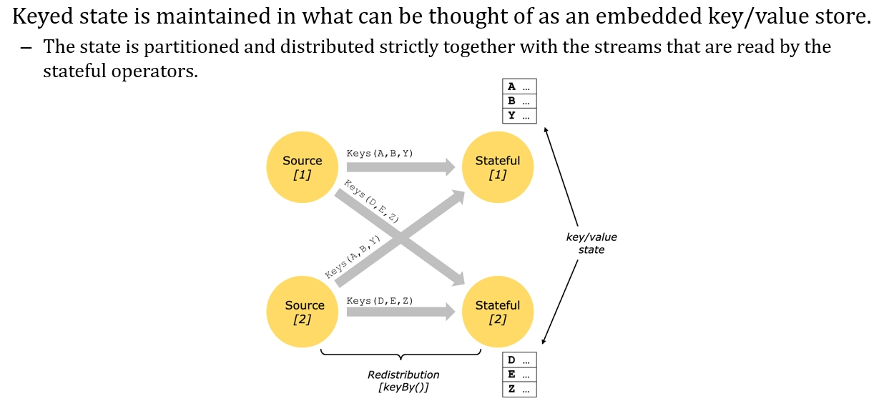
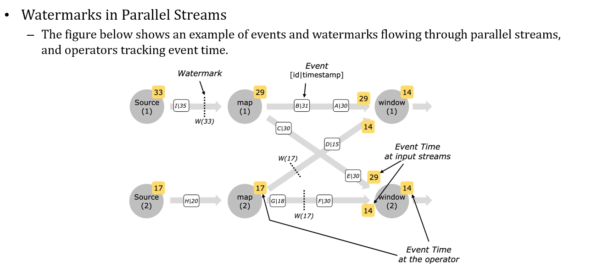
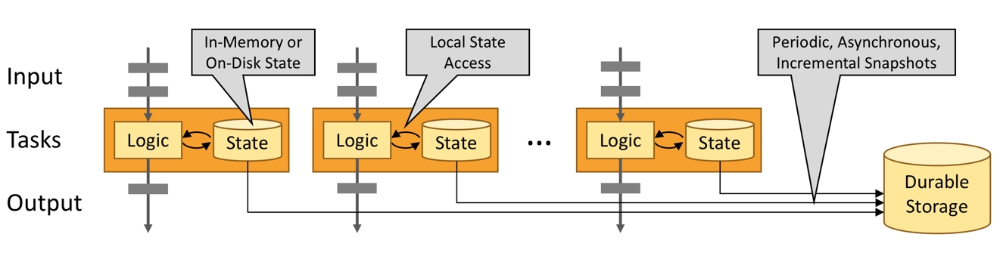

# 第31讲 flink

2023.12.27

> 出发啦不要问那路在哪
> 迎风向前 是唯一的方法
> 出发啦不想问那路在哪
> 运命哎呀 什么关卡
> 当车声隆隆 梦开始阵痛
> 它卷起了风重新雕塑每个面孔
> 夜雾那么浓 开阔也汹涌
> 有一种预感路的终点是迷宫
> ——《亡命之徒》 纵贯线

## 1. 基本概念

Flink要处理流式数据。所谓的流式数据，就是我们看到有很多的事件，然后试卷它在发生的时候，它会一个一个的产生，然后他们就进入到了这个流失数据的这个处理系统里面。

> Apache Flink is a framework and distributed processing engine for stateful computations over unbounded and bounded data streams.
> 
> **Streams:**
> - bounded and unbounded streams
> - real-time and recorded streams 所谓recorded，比如我处理速度没有那么快，我就在flink前面加一层kafka消息队列，存在topic里面。

Flink要做的事情：
1. 如果多个处理器，如何分区？也即数据如何按照一定的规则，放到不同的节点上面去执行；
2. 一旦这样做，可能产生乱序。如果不是按照时间产生的顺序进入系统，何如？例如每到整点处理一次，九点钟开始处理八点到九点数据，但九点十五还有八点到九点的数据被发过来；
3. 我们现在有两个产生事件的源；它们要隔离开来，也即这两个源在处理的时候，我要知道它们的上一个事件，要与之关联。也即所有操作必须时有状态的，类似session的那套逻辑。要记住状态这件事情是我们前面在讲Hadoop、 Spark、 storm 里面都没有了，我们都是给这三个东西提交了一个作业，这个作业对于Hadoop和这种批处理来说，那就这一块数据，你现在让我执行的这一块跟上一块之间是没有任何关系，反正我就每一块来一块处理一块，那 storm 的这个流的处理也是一样的，你让我处理我就处理，至于他跟之前的事件什么关系，我也不知道，我也不用去管理他。

### 1.1. State?

所谓的状态，就是你一个对象，你里面会有很多的数据成员，不同的对象的这些数据成员可能是不一样的——例如购物车，里面有很多kv pairs，那么不同的人的购物车里面的键值对都是不同的。

> 比如我想要知道一个人在网上的访问模式，必须把这个人的所有的点击动作要把它关联起来，那么它当前已点击到哪里，它上一次点击到哪里，这就是他的一个状态了。
>
> Flink 里头，他说我在处理这个事件流的时候，总会产生一些中间结果，我把它存到一些变量，这些就是状态，这些状态必须在这一堆的事件前后，我们必须要去做关联。

我们第一节课讲的状态是讲的是，实际上每一个对象（每一个用户）都维护了单独的状态，所以每个对象的状态都要保存，当我在内存里不够的时候，我要把它写到硬盘上去，然后当用到它的时候我再把它给拉回来，就防止这个状态太多之后把内存给消耗完了，所以它有换进换出这样的动作。这里的话，状态也要考虑这个问题，可以写在rocksdb里面，做到可插拔，就直接重启以后去数据库恢复就好，经常去做checkpoint，来容错。

- 周期性的去做这个snapshot，然后他这个周期性的做他还会考虑到几点，就第一个不能影响到现在的这个事件的处理的这个流，所以他要去异步的做，就是比如说隔一段时间做一下，而且就是你前端正在改修改，后端慢慢去往里写，不一定说我要前端停一下，让他先到后端，写完之后再说。你前端继续执行前端一端执行他的状态，一边去做这个备份。
- 然后它是增量，肯定不能做全量，而是增量的，我每一次做 snapshot 时候就把这一段时间内变化的值给写过来，这样的话可以靠最小的这个开销就可以来实现这个做这个状态的这个持久化。

这里kv，保证的是key一样的事件，都会到某台机器上处理，所以它的状态得以维护，这里engine X里面的ip哈希是类似的逻辑。

### 1.2 Watermarks 水位线：解决少量数据的延迟到达问题

我们真正关心的是按照事件产生的时间去处理，但是一旦乱序，怎么办？所以引入了“**水位线**”的概念（watermarks）。

如果我是 8 点到 9 点的数据，一个时间窗去处理， 9 点到 10 点一个时间窗去处理，但是在这个 9 点零二分的时候来了一个 9 点的数据，因为网络传输延迟。最简单的解决方案就是**提供一个你可以接受的延迟时间**，比如我定义九点零五分为ddl，他在他九点零二分来的，那他仍然可以当成这个时间窗户数据处理。你说那不对，那如果他要是九点零六分来这种都属于确实超出了我的容忍范围，那我就几种不同的选择，第一种就把它放到下一个时间窗处理，第二就把它扔了，那反正事件不断的拦，就是这是你一个选择的问题而已。

我们来看一下这个比较复杂的计算图。这里面灰色的就是若干算子，黄色的就是每一个算子的时间戳。注意分布式的时钟是不同步的。

举个例子，这个 source 上面当前的时间它走到了33，然后它就会说它会发出一个他已经走过 33 的一个水位线的一个数据出来，水位线数据会和所有的事件混在一起往前走。map2的时间戳应该是14，写错了。

在接收多个流的数据过来的时候，取较小的这个流作为我当前这个算子的时间，这算自以这个时间为基准，在它产生的事件上去打时间戳，并且发这种我们看到这个水位线的数据出来。

**窗口机制**

- 窗口机制有两种，一种是上面这个时间窗口，比如说每 30 秒我处理一下这个窗口里的所有的数据，还有一个是数据驱动，就是我数个数，每 3 个事件我就处理一下。
- 总的来说就是我们拿窗口里的数据去做批处理，每一个批处理完之后紧跟着处理下一批。从宏观上看，于是它就是流式的数据处理了。

> 总结：我们是要靠这种时间戳加水位线的这种方式在告诉每一个算子过来的事件，它们的先后顺序什么样，你应该怎么把它组织到你这样的一个时间窗里面，在这个时间窗里激发对所有的时间的处理。

## 2. Architecture

它的状态是要频繁的使用内存的，而且他这个就是我们刚刚看到的，就是所谓的状态，是指你在每一次你的逻辑在处理这个事件的时候，在拿到事件的信息之后，你这个逻辑程序还要去读一下状态，才能知道怎么处理这个事件，而这个状态就在内存或硬盘上。

