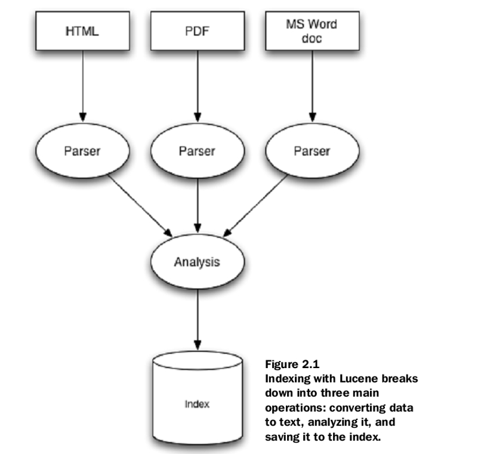

# 第8章 全文搜索

2023.09.23

## 1. 概览

- **Lucene**（重点；读音：鲁-sing）：Java开发的全文搜索引擎工具包，提供了完整的查询引擎和索引引擎，部分功能如分词、排序、过滤等。

后面两部分简单过一下：
- Solr：基于Lucene的全文搜索服务器，提供了完善的web界面，方便用户使用。
- Elasticsearch：基于Lucene的全文搜索服务器，提供了完善的web界面，方便用户使用。

## 2. 什么是全文搜索

Lucene做的事情：
1. 建立索引（如果不建立索引，每次都要扫描所有的文件，效率太低）
2. 搜索

类似百度的网站，用户搜索一个关键词，根据建立的索引，查找包括关键词的相关的**非结构化的数据**里面有哪些包含目标关键词。

> 所谓的结构化，比如数据库，所有数据是schema的，数据有字段，像表格，是有结构的；但这里比如我给你一个html，或者一段txt，这种东西是没有结构可寻的。
> - 结构化数据建立索引的方式：B+树就可以
> - 那非结构化数据怎么办呢？比如有一个dir目录，里面有一大堆.txt，和html文件，我要问这个目录里面包含关键词java的文件有哪些？
> 


## 3. 建立索引

- 如果我搜索java，你要告诉我java出现在哪些行，以及具体的位置？

1. 用某一种tokenizer处理源文件
2. preprocess，比如把所有的大写字母都变成小写，相同的单词都合并到一起（比如有些单词是take、took、taken都是take的不同形式）
3. 反向索引：为什么叫反向索引呢，因为不是每一行映射到几个单词，而是某一个关键词映射到哪几行的哪几个位置。

> **正向索引（Forward Index）和反向索引（Inverted Index）** 是两种不同的文本索引技术，用于管理和加速文本数据的检索。它们在搜索引擎和信息检索系统中起着关键作用，并在不同的方面具有不同的优势和用途。
> **1. 正向索引（Forward Index）：**
> 
> - 正向索引是一种按文档来组织和存储文本数据的索引方式。每个文档都有一个对应的索引项，这个索引项包含了文档中的所有信息，通常以文档的标识符（如文档ID）为索引的键。
>  - 正向索引适合于需要按文档进行检索的场景，例如在文档管理系统中查找特定文档或根据文档属性进行过滤和排序。
>  - 缺点是在处理大量文本数据时，正向索引可能需要大量的存储空间，因为每个文档都需要一个完整的索引项。
> 
> **2. 反向索引（Inverted Index）：**
>  - 反向索引是一种按单词或词组来组织和存储文本数据的索引方式。它**将文本数据中的每个单词或词组与包含它们的文档关联起来**，以及它们在文档中的位置。
>  - 反向索引适用于全文搜索和信息检索系统，因为它允许根据关键词快速查找包含这些关键词的文档。这种索引方式在搜索引擎中得到广泛应用。
>  - 反向索引通常占用相对较少的存储空间，因为它不需要存储完整的文档内容，只需存储单词或词组的位置信息和文档标识符。
> 
>**比较：**
>  - 正向索引适用于需要按文档检索的应用，例如文档管理系统或内容展示。
>  - 反向索引适用于需要**全文搜索和关键词检索的应用**，例如搜索引擎和信息检索系统。
>  - 正向索引需要更多的存储空间，但在访问特定文档时速度较快。
>  - 反向索引占用较少的存储空间，但在全文搜索和关键词检索时速度更快。
> 
> 通常，搜索引擎会结合使用正向索引和反向索引，以满足不同的检索需求，并提供高效的搜索体验。正向索引用于快速获取文档的详细信息，而反向索引用于高效地找到包含查询关键词的文档。

## 4. Core Indexing Classes 核心索引类

### 4.1 Brief Overview 简要概述

- **IndexWriter：** 
  - `IndexWriter` 是索引创建和维护的核心类。它负责将文档添加到索引、更新索引、删除文档以及优化索引等操作。`IndexWriter` 是在索引建立和更新过程中的主要接口之一。

- **Directory：** 
  - `Directory` 是索引文件的存储和管理抽象。它定义了索引文件的位置和访问方式，可以是基于文件系统的目录，也可以是内存中的数据结构。`Directory` 提供了对索引文件的读写操作，使得索引可以被持久化存储和检索。

- **Analyzer：** 
  - `Analyzer` 是文本分析的关键组件。它定义了如何将文本数据分割成单词或词组，进行词干化、去除停用词等文本处理操作。正确选择和配置适当的分析器对于索引的质量和性能至关重要。

- **Document：** 
  - `Document` 表示索引中的一个文档。文档通常由一组字段（`Field`）组成，每个字段包含了文档的一部分信息，如标题、正文、作者等。`Document` 用于将文本数据添加到索引。

- **Field：** 
  - `Field` 是文档中的一个字段或属性。它包含了字段的名称、值以及用于指定如何处理该字段的配置选项。字段可以是文本、数字、日期等不同类型的数据，根据需要进行索引和检索。

这些核心索引类是构建文本搜索引擎和信息检索系统的基础，它们协同工作以创建、管理和查询索引，以便用户能够高效地检索和获取相关文档。


### 4.2 Field

每个字段对应于在搜索期间根据索引查询或从索引检索的一段数据。

```java
public abstract class BaseIndexTestCase extends TestCase {
    protected String[] keywords = {"1","2"};
    protected String[] unindexed = {"Netherlands","Italy"};
    protected String[] unstored = {
    "Amsterdam has lots of bridges",
    "Venice has lots of canals"
    };
    protected String[] text = {"Amsterdam","Venice"};
    protected Directory dir;

    ...
}
```

- `Keyword`：关键字不被分析（就是不会被拆开），而是被索引并逐字存储在索引中。
- `UnIndexed`：既不分析也不索引，但其值按原样存储在索引中。也就是说一旦假如通过keyword查询到了，要把unindex的部分的内容要带出来，但是这部分不索引。（你不需要把荷兰和意大利做索引，我希望的是我查出来1和2，你把荷兰和意大利的内容带出来）
- `UnStored`：此字段类型被分析和索引，**要放到索引里去建，但不存储在索引中**。当然有一些停用词列表，比如一些非常常用的词，这些东西就被忽略。一般是正文，非常长不应该存在索引里面，非常浪费。（比如这里我们把Amsterdam,bridge,Venice,canal来放入索引，你按照bridge查是可以查到这个文件的，但是你索引里面没有存储整个完整的内容，因为完整的内容可能很大，所以我们真的要取要读硬盘）
- `Text`：被分析并被索引，存储到索引里面。这意味着可以针对这种类型的字段进行搜索，但要注意字段大小。可以类比keyword，区别是**这个text会被分析一下，而keyword不会**（也就是text会被断开）
  
综上，以上field保证索引的大小！

再举一个例子：
写一个`javaDoc`文档，比如一个类一个`javaDoc`，应该怎么做呢？
- `keywords`：类名，这个就没必要断开了
- `unindexed`：带出来的内容，比如类的作者、编写日期、版本（单搜3.0版本没意义，很多类都是3.0版本的）
- `unstored`：code和comment，这个东西太大了，不应该存储在索引里面
- `text`：类的描述，类的功能描述，一段话，那我就希望断开来扔进索引。比如写的是“这个类是计算哈希值的”，那么我希望搜索“哈希”和“计算”的时候都能搜得到。

